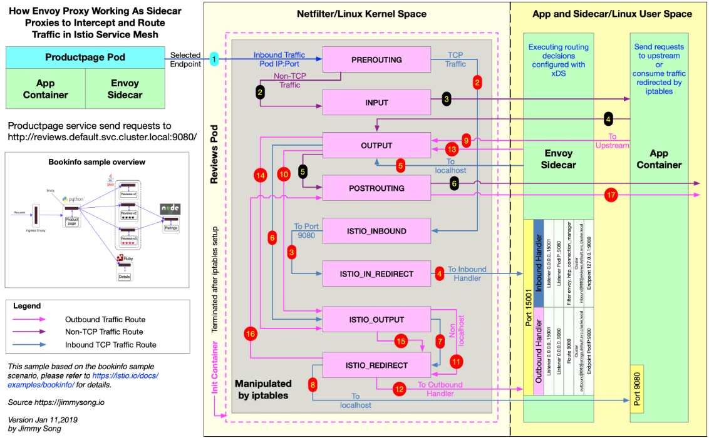

# 流量拦截机制

下图展示的是 productpage 服务请求访问 http://reviews.default.svc.cluster.local:9080/，当流量进入 reviews 服务内部时，reviews 服务内部的 Envoy Sidecar 是如何做流量拦截和路由转发的。

Init 容器启动时命令行参数中指定了 REDIRECT 模式，因此只创建了 NAT 表规则，下面是查看 nat 表中的规则，其中链的名字中包含 ISTIO 前缀的是由 Init 容器注入的，规则匹配是根据下面显示的顺序来执行的，其中会有多次跳转。



```CLI
$ iptables -t nat -L -v
# PREROUTING 链：用于目标地址转换（DNAT），将所有入站 TCP 流量跳转到 ISTIO_INBOUND 链上
Chain PREROUTING (policy ACCEPT 0 packets, 0 bytes)
 pkts bytes target         prot opt in     out     source               destination
    2   120 ISTIO_INBOUND  tcp  --  any    any     anywhere             anywhere

# INPUT 链：处理输入数据包，非 TCP 流量将继续 OUTPUT 链
Chain INPUT (policy ACCEPT 2 packets, 120 bytes)
 pkts bytes target     prot opt in     out     source               destination

# OUTPUT 链：将所有出站数据包跳转到 ISTIO_OUTPUT 链上
Chain OUTPUT (policy ACCEPT 41146 packets, 3845K bytes)
 pkts bytes target        prot opt in     out     source               destination
   93  5580 ISTIO_OUTPUT  tcp  --  any    any     anywhere             anywhere

# POSTROUTING 链：所有数据包流出网卡时都要先进入POSTROUTING 链，内核根据数据包目的地判断是否需要转发出去，我们看到此处未做任何处理
Chain POSTROUTING (policy ACCEPT 41199 packets, 3848K bytes)
 pkts bytes target     prot opt in     out     source               destination

# ISTIO_INBOUND 链：将所有目的地为 9080 端口的入站流量重定向到 ISTIO_IN_REDIRECT 链上
Chain ISTIO_INBOUND (1 references)
 pkts bytes target             prot opt in     out     source               destination
    2   120 ISTIO_IN_REDIRECT  tcp  --  any    any     anywhere             anywhere             tcp dpt:9080

# ISTIO_IN_REDIRECT 链：将所有的入站流量跳转到本地的 15001 端口，至此成功的拦截了流量到 Envoy 
Chain ISTIO_IN_REDIRECT (1 references)
 pkts bytes target     prot opt in     out     source               destination
    2   120 REDIRECT   tcp  --  any    any     anywhere             anywhere             redir ports 15001

# ISTIO_OUTPUT 链：选择需要重定向到 Envoy（即本地） 的出站流量，所有非 localhost 的流量全部转发到 ISTIO_REDIRECT。为了避免流量在该 Pod 中无限循环，所有到 istio-proxy 用户空间的流量都返回到它的调用点中的下一条规则，本例中即 OUTPUT 链，因为跳出 ISTIO_OUTPUT 规则之后就进入下一条链 POSTROUTING。如果目的地非 localhost 就跳转到 ISTIO_REDIRECT；如果流量是来自 istio-proxy 用户空间的，那么就跳出该链，返回它的调用链继续执行下一条规则（OUPT 的下一条规则，无需对流量进行处理）；所有的非 istio-proxy 用户空间的目的地是 localhost 的流量就跳转到 ISTIO_REDIRECT。
# 如果目的地非 localhost 就跳转到 ISTIO_REDIRECT 链
# 所有来自 istio-proxy 用户空间的非 localhost 流量跳转到它的调用点 OUTPUT 继续执行 OUTPUT 链的下一条规则，因为 OUTPUT 链中没有下一条规则了，所以会继续执行 POSTROUTING 链然后跳出 iptables，直接访问目的地
# 如果流量不是来自 istio-proxy 用户空间，又是对 localhost 的访问，那么就跳出 iptables，直接访问目的地
# 其它所有情况都跳转到 ISTIO_REDIRECT 链
Chain ISTIO_OUTPUT (1 references)
 pkts bytes target          prot opt in     out     source               destination
    0     0 ISTIO_REDIRECT  all  --  any    lo      anywhere            !localhost
   40  2400 RETURN          all  --  any    any     anywhere             anywhere             owner UID match istio-proxy
    0     0 RETURN          all  --  any    any     anywhere             anywhere             owner GID match istio-proxy    
    0     0 RETURN          all  --  any    any     anywhere             localhost
   53  3180 ISTIO_REDIRECT  all  --  any    any     anywhere             anywhere

# ISTIO_REDIRECT 链：将所有流量重定向到 Envoy（即本地） 的 15001 端口
Chain ISTIO_REDIRECT (2 references)
 pkts bytes target     prot opt in     out     source               destination
   53  3180 REDIRECT   tcp  --  any    any     anywhere             anywhere             redir ports 15001
```

# 理解 Inbound Handler

Inbound handler 的作用是将 iptables 拦截到的 downstream 的流量转交给 localhost，与 Pod 内的应用程序容器建立连接。

**1. 查看 reviews 的监听器的基本摘要**

```CLI
$ istioctl proxy-config listeners reviews-v1-76474f6fb7-pmglr

ADDRESS            PORT      TYPE 
172.33.3.3         9080      HTTP <--- 接收所有 Inbound HTTP 流量，该地址即为当前 Pod 的 IP 地址
10.254.0.1         443       TCP  <--+
10.254.4.253       80        TCP     |
10.254.4.253       8080      TCP     |
10.254.109.182     443       TCP     |
10.254.22.50       15011     TCP     |
10.254.22.50       853       TCP     |
10.254.79.114      443       TCP     | 
10.254.143.179     15011     TCP     |
10.254.0.2         53        TCP     | 接收与 0.0.0.0_15001 监听器配对的 Outbound 非 HTTP 流量
10.254.22.50       443       TCP     |
10.254.16.64       42422     TCP     |
10.254.127.202     16686     TCP     |
10.254.22.50       31400     TCP     |
10.254.22.50       8060      TCP     |
10.254.169.13      14267     TCP     |
10.254.169.13      14268     TCP     |
10.254.32.134      8443      TCP     |
10.254.118.196     443       TCP  <--+
0.0.0.0            15004     HTTP <--+
0.0.0.0            8080      HTTP    |
0.0.0.0            15010     HTTP    | 
0.0.0.0            8088      HTTP    |
0.0.0.0            15031     HTTP    |
0.0.0.0            9090      HTTP    | 
0.0.0.0            9411      HTTP    | 接收与 0.0.0.0_15001 配对的 Outbound HTTP 流量
0.0.0.0            80        HTTP    |
0.0.0.0            15030     HTTP    |
0.0.0.0            9080      HTTP    |
0.0.0.0            9093      HTTP    |
0.0.0.0            3000      HTTP    |
0.0.0.0            8060      HTTP    |
0.0.0.0            9091      HTTP <--+    
0.0.0.0            15001     TCP  <--- 接收所有经 iptables 拦截的 Inbound 和 Outbound 流量并转交给虚拟监听器处理
```

当来自 productpage 的流量抵达 reviews Pod 的时候已经，downstream 必须明确知道 Pod 的 IP 地址为 172.33.3.3 所以才会访问该 Pod，所以该请求是 172.33.3.3:9080。

从该 Pod 的 Listener 列表中可以看到，0.0.0.0:15001/TCP 的 Listener（其实际名字是 virtual）监听所有的 Inbound 流量，下面是该 Listener 的详细配置。

```JSON
{
    "name": "virtual",
    "address": {
        "socketAddress": {
            "address": "0.0.0.0",
            "portValue": 15001
        }
    },
    "filterChains": [
        {
            "filters": [
                {
                    "name": "envoy.tcp_proxy",
                    "config": {
                        "cluster": "BlackHoleCluster",
                        "stat_prefix": "BlackHoleCluster"
                    }
                }
            ]
        }
    ],
    "useOriginalDst": true
}
```

**2. virtual Listener**

UseOriginalDst：从配置中可以看出 useOriginalDst 配置指定为 true，这是一个布尔值，缺省为 false，使用 iptables 重定向连接时，proxy 接收的端口可能与原始目的地址的端口不一样，如此处 proxy 接收的端口为 15001，而原始目的地端口为 9080。当此标志设置为 true 时，Listener 将连接重定向到与原始目的地址关联的 Listener，此处为 172.33.3.3:9080。如果没有与原始目的地址关联的 Listener，则连接由接收它的 Listener 处理，即该 virtual Listener，经过 envoy.tcp_proxy 过滤器处理转发给 BlackHoleCluster，这个 Cluster 的作用正如它的名字，当 Envoy 找不到匹配的虚拟监听器时，就会将请求发送给它，并返回 404。这个将于下文提到的 Listener 中设置 bindToPort 相呼应。

```CLI
$ istioctl proxy-config listeners reviews-v1-76474f6fb7-pmglr --port 15001 -o json

[
    {
        "name": "virtual",    # 虚拟监听器
        "address": {
            "socketAddress": {
                "address": "0.0.0.0",
                "portValue": 15001
            }
        },
        "filterChains": [
            {
                "filters": [
                    {
                        "name": "envoy.tcp_proxy",
                        "config": {
                            "cluster": "BlackHoleCluster",
                            "stat_prefix": "BlackHoleCluster"
                        }
                    }
                ]
            }
        ],
        "useOriginalDst": true
    }
]
```

UseOriginalDst：从配置中可以看出 useOriginalDst 配置指定为 true，这是一个布尔值，缺省为 false，使用 iptables 重定向连接时，proxy 接收的端口可能与原始目的地址的端口不一样，如此处 proxy 接收的端口为 15001，而原始目的地端口为 9080。当此标志设置为 true 时，Listener 将连接重定向到与原始目的地址关联的 Listener，此处为 172.30.135.40:9080。如果没有与原始目的地址关联的 Listener，则连接由接收它的 Listener 处理，即该 virtual Listener，经过 envoy.tcp_proxy 过滤器处理转发给 BlackHoleCluster，这个 Cluster 的作用正如它的名字，当 Envoy 找不到匹配的虚拟监听器时，就会将请求发送给它，并返回 404。这个将于下文提到的 Listener 中设置 bindToPort 相呼应。

该参数将被废弃，请使用原始目的地址的 Listener filter 替代。该参数的主要用途是：Envoy 通过监听 15001 端口将 iptables 拦截的流量经由其他 Listener 处理而不是直接转发出去。

**3. Listener 172.33.3.3_9080**

上文说到进入 Inbound handler 的流量被 virtual Listener 转移到 172.33.3.3_9080 Listener，我们在查看下该 Listener 配置。

```CLI
$ istioctl pc listener reviews-v1-cb8655c75-b97zc --address 172.33.3.3 --port 9080 -o json

[{
    "name": "172.33.3.3_9080",
    "address": {
        "socketAddress": {
            "address": "172.33.3.3",
            "portValue": 9080
        }
    },
    "filterChains": [
        {
            "filterChainMatch": {
                "transportProtocol": "raw_buffer"
            },
            "filters": [
                {
                    "name": "envoy.http_connection_manager",
                    "config": {
                        ... 
                        "route_config": {
                            "name": "inbound|9080||reviews.default.svc.cluster.local",
                            "validate_clusters": false,
                            "virtual_hosts": [
                                {
                                    "domains": [
                                        "*"
                                    ],
                                    "name": "inbound|http|9080",
                                    "routes": [
                                        {
                                            ...
                                            "route": {
                                                "cluster": "inbound|9080||reviews.default.svc.cluster.local",
                                                "max_grpc_timeout": "0.000s",
                                                "timeout": "0.000s"
                                            }
                                        }
                                    ]
                                }
                            ]
                        },
                        "use_remote_address": false,
                        ...
                    }
                }
            ]，
            "deprecatedV1": {
                "bindToPort": false
            }
        ...
        },
        {
            "filterChainMatch": {
                "transportProtocol": "tls"
            },
            "tlsContext": {...
            },
            "filters": [...
            ]
        }
    ],
...
}]
```

bindToPort：注意其中有一个 bindToPort 的配置，其值为 false，该配置的缺省值为 true，表示将 Listener 绑定到端口上，此处设置为 false 则该 Listener 只能处理其他 Listener 转移过来的流量，即上文所说的 virtual Listener。

我们看其中的 filterChains.filters 中的 envoy.http_connection_manager 配置部分，该配置表示流量将转交给 Cluster inbound|9080||reviews.default.svc.cluster.local 处理。

**4. Cluster inbound|9080||reviews.default.svc.cluster.local**

```CLI
$ istioctl pc cluster reviews-v1-cb8655c75-b97zc --fqdn reviews.default.svc.cluster.local --direction inbound -o json

[
    {
        "name": "inbound|9080||reviews.default.svc.cluster.local",
        "connectTimeout": "1.000s",
        "hosts": [
            {
                "socketAddress": {
                    "address": "127.0.0.1",
                    "portValue": 9080
                }
            }
        ],
        "circuitBreakers": {
            "thresholds": [
                {}
            ]
        }
    }
]
```

可以看到该 Cluster 的 Endpoint 直接对应的就是 localhost，再经过 iptables 转发流量就被应用程序容器消费了。


# 理解 Outbound Handler

因为 reviews 会向 ratings 服务发送 HTTP 请求，请求的地址是：http://ratings.default.svc.cluster.local:9080/，Outbound handler 的作用是将 iptables 拦截到的本地应用程序发出的流量，经由 Envoy 判断如何路由到 upstream。

应用程序容器发出的请求为 Outbound 流量，被 iptables 劫持后转移给 Envoy Outbound handler 处理，然后经过 virtual Listener、0.0.0.0_9080 Listener，然后通过 Route 9080 找到 upstream 的 cluster，进而通过 EDS 找到 Endpoint 执行路由动作。

**1. 9080 Listener**

我们的请求是到 9080 端口的 HTTP 出站请求，这意味着它被切换到 0.0.0.0:9080 虚拟监听器。然后，此监听器在其配置的 RDS 中查找路由配置。

```CLI
$ istioctl proxy-config listeners reviews-v1-76474f6fb7-pmglr --address 0.0.0.0 --port 9080 -o json

...
"rds": {
    "config_source": {
        "ads": {}
    },
    "route_config_name": "9080"	   # route配置
}
...
```

**2. 9080 Route**

因为 Envoy 会根据 HTTP header 中的 domains 来匹配 VirtualHost，所以下面只列举了 ratings.default.svc.cluster.local:9080 这一个 VirtualHost。
```CLI
$ istioctl proxy-config routes reviews-v1-cb8655c75-b97zc --name 9080 -o json

[{
    "name": "ratings.default.svc.cluster.local:9080",
    "domains": [
        "ratings.default.svc.cluster.local",
        "ratings.default.svc.cluster.local:9080",
        "ratings",
        "ratings:9080",
        "ratings.default.svc.cluster",
        "ratings.default.svc.cluster:9080",
        "ratings.default.svc",
        "ratings.default.svc:9080",
        "ratings.default",
        "ratings.default:9080",
        "10.254.234.130",
        "10.254.234.130:9080"
    ],
    "routes": [
        {
            "match": {
                "prefix": "/"
            },
            "route": {
                "cluster": "outbound|9080||ratings.default.svc.cluster.local",
                "timeout": "0.000s",
                "maxGrpcTimeout": "0.000s"
            },
            "decorator": {
                "operation": "ratings.default.svc.cluster.local:9080/*"
            },
            "perFilterConfig": {...
            }
        }
    ]
},
..]
```

从该 Virtual Host 配置中可以看到将流量路由到 Cluster outbound|9080||ratings.default.svc.cluster.local。

**3. Endpoint  outbound|9080||ratings.default.svc.cluster.local**

Istio 1.1 以前版本不支持使用 istioctl 命令直接查询 Cluster 的 Endpoint，可以使用查询 Pilot 的 debug 端点的方式折中。

endpoints.json 文件中包含了所有 Cluster 的 Endpoint 信息，我们只选取其中的 outbound|9080||ratings.default.svc.cluster.local Cluster 的结果如下。

```CLI
$ kubectl exec reviews-v1-cb8655c75-b97zc -c istio-proxy curl http://istio-pilot.istio-system.svc.cluster.local:9093/debug/edsz > endpoints.json

{
  "clusterName": "outbound|9080||ratings.default.svc.cluster.local",
  "endpoints": [
    {
      "locality": {

      },
      "lbEndpoints": [						# endpoints列表
        {
          "endpoint": {
            "address": {
              "socketAddress": {
                "address": "172.33.100.2",
                "portValue": 9080
              }
            }
          },
          "metadata": {
            "filterMetadata": {
              "istio": {
                  "uid": "kubernetes://ratings-v1-8558d4458d-ns6lk.default"
                }
            }
          }
        }
      ]
    }
  ]
}
```

# 理解治理规则带来的变化

**1. 无治理规则的routes**

```CLI
[{
    "name": "ratings.default.svc.cluster.local:9080",
    "domains": [
        "ratings.default.svc.cluster.local",
        "ratings.default.svc.cluster.local:9080",
        "ratings",
        "ratings:9080",
        "ratings.default.svc.cluster",
        "ratings.default.svc.cluster:9080",
        "ratings.default.svc",
        "ratings.default.svc:9080",
        "ratings.default",
        "ratings.default:9080",
        "10.254.234.130",
        "10.254.234.130:9080"
    ],
    "routes": [
        {
            "match": {
                "prefix": "/"
            },
            "route": {
                "cluster": "outbound|9080||ratings.default.svc.cluster.local",
                "timeout": "0.000s",
                "maxGrpcTimeout": "0.000s"
            },
            "decorator": {
                "operation": "ratings.default.svc.cluster.local:9080/*"
            },
            "perFilterConfig": {...
            }
        }
    ]
},
..]
```

**2. 添加VirtualService**

```CLI
$ cat <<EOF | istioctl create -f -
apiVersion: networking.istio.io/v1alpha3
kind: VirtualService
metadata:
  name: reviews
spec:
  hosts:
    - reviews
  http:
  - route:
    - destination:
        host: reviews
        subset: v1			# 访问reviews都路由到v1版本
EOF
```

**3. 添加治理规则后的routes**

```CLI
[{
    "name": "ratings.default.svc.cluster.local:9080",
    "domains": [
        "ratings.default.svc.cluster.local",
        "ratings.default.svc.cluster.local:9080",
        "ratings",
        "ratings:9080",
        "ratings.default.svc.cluster",
        "ratings.default.svc.cluster:9080",
        "ratings.default.svc",
        "ratings.default.svc:9080",
        "ratings.default",
        "ratings.default:9080",
        "10.254.234.130",
        "10.254.234.130:9080"
    ],
    "routes": [
        {
            "match": {
                "prefix": "/"
            },
            "route": {
                "cluster": "outbound|9080|v1|ratings.default.svc.cluster.local",      # 增加的版本号
                "timeout": "0.000s",
                "maxGrpcTimeout": "0.000s"
            },
            "decorator": {
                "operation": "ratings.default.svc.cluster.local:9080/*"
            },
            "perFilterConfig": {...
            }
        }
    ]
},
..]
```

对比没创建 VirtualService 之前的路由，现在路由的 cluster 字段的值已经从之前的 outbound|9080|ratings.default.svc.cluster.local 变为 outbound|9080|v1|ratings.default.svc.cluster.local。

你可以尝试搜索一下有没有 outbound|9080|v1|ratings.default.svc.cluster.local 这个集群，如果不出意外，你将找不到 SUBSET=v1 的集群。

**4. 添加DestinationRule**

```CLI
$ cat <<EOF | istioctl create -f -
apiVersion: networking.istio.io/v1alpha3
kind: DestinationRule
metadata:
  name: ratings
spec:
  host: ratings
  subsets:
  - name: v1
    labels:
      version: v1
EOF
```

 其实 DestinationRule 映射到 Envoy 的配置文件中就是 Cluster。现在你应该能看到 SUBSET=v1 的 Cluster 了。
 
 **5. 查看Cluster**

```CLI
$ istioctl proxy-config clusters reviews-v1-76474f6fb7-pmglr --fqdn ratings.default.svc.cluster.local --subset=v1 -o json

[
    {
        "name": "outbound|9080|v1|ratings.default.svc.cluster.local",
        "type": "EDS",
        "edsClusterConfig": {
            "edsConfig": {
                "ads": {}
            },
            "serviceName": "outbound|9080|v1|ratings.default.svc.cluster.local"
        },
        "connectTimeout": "1.000s",
        "circuitBreakers": {
            "thresholds": [
                {}
            ]
        }
    }
]
```

到了这一步，一切皆明了，后面的事情就跟之前的套路一样了，具体的 Endpoint 对应打了标签 version=v1 的 Pod。


