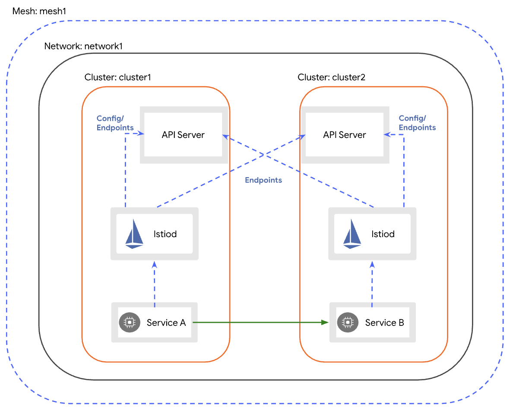
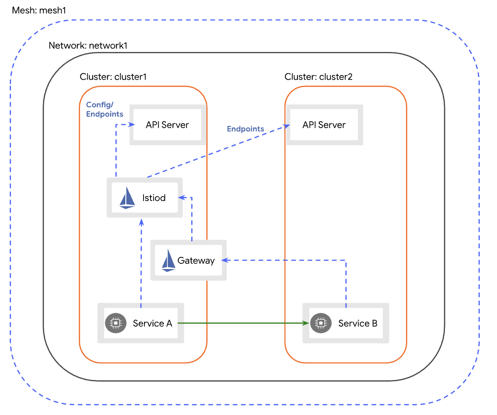
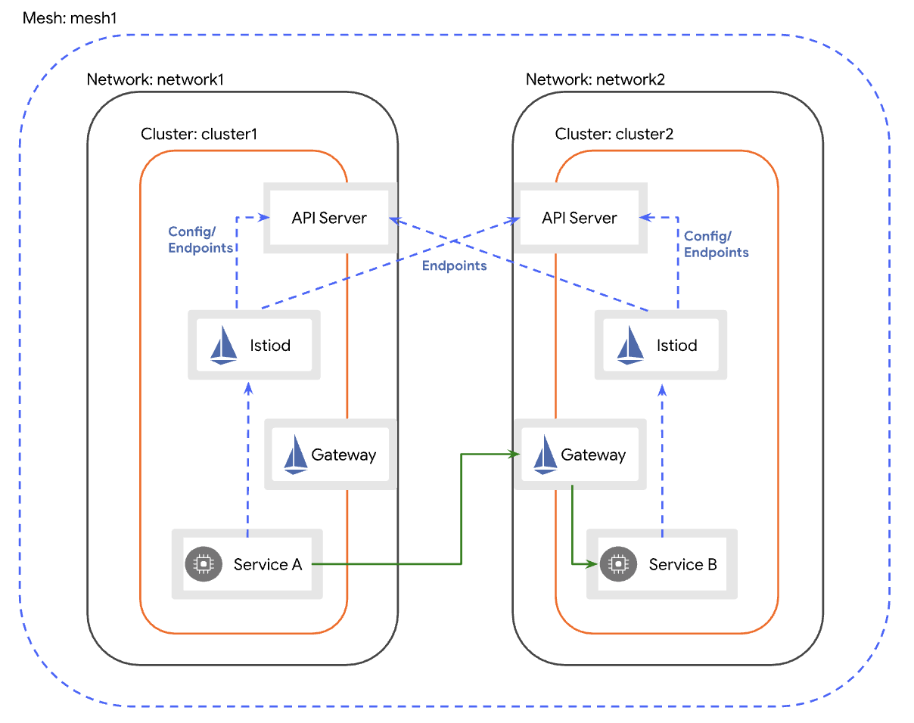

# 多主架构

在 `cluster1` 和 `cluster2` 两个集群上安装 Istio 控制平面， 将每一个集群都设置为主集群（primary cluster）。 两个集群都运行在网络 `network1` 上，所以两个集群中的 Pod 可以直接通信。

在此配置中，每一个控制平面都会监测两个集群 API 服务器的服务端点。

服务的工作负载（pod 到 pod）跨集群边界直接通讯。



## 将 `cluster1` 设为主集群

为 `cluster1` 创建 Istio 配置文件：

```
$ cat <<EOF > cluster1.yaml
apiVersion: install.istio.io/v1alpha1
kind: IstioOperator
spec:
  values:
    global:
      meshID: mesh1
      multiCluster:
        clusterName: cluster1
      network: network1
EOF
```

将配置文件应用到 `cluster1`：

```
$ istioctl install --context="${CTX_CLUSTER1}" -f cluster1.yaml
```

## 将 `cluster2` 设为主集群

为 `cluster2` 创建 Istio 配置文件：

```
$ cat <<EOF > cluster2.yaml
apiVersion: install.istio.io/v1alpha1
kind: IstioOperator
spec:
  values:
    global:
      meshID: mesh1
      multiCluster:
        clusterName: cluster2
      network: network1
EOF
```

将配置文件应用到 `cluster2`：

```
$ istioctl install --context="${CTX_CLUSTER2}" -f cluster2.yaml
```

## 开启端点发现

在 `cluster2` 中安装远程集群的 secret，该 secret 提供 `cluster1`’s API 服务器的访问权限。

```
$ istioctl x create-remote-secret \
    --context="${CTX_CLUSTER1}" \
    --name=cluster1 | \
    kubectl apply -f - --context="${CTX_CLUSTER2}"
```

在 `cluster1` 中安装远程集群的 secret，该 secret 提供 `cluster2`’s API 服务器的访问权限。

```
$ istioctl x create-remote-secret \
    --context="${CTX_CLUSTER2}" \
    --name=cluster2 | \
    kubectl apply -f - --context="${CTX_CLUSTER1}"
```

你已经成功地安装了跨多个主集群 Istio 网格！

# 主从架构

在 `cluster1` 主集群（primary cluster） 安装 Istio 控制平面， 并设置 `cluster2` 从集群（remote cluster）指向 `cluster1` 的控制平面。 两个集群都运行在 `network1` 网络上，所以两个集群的 Pod 之间，网络可直接连通。



## 将 `cluster1` 设为主集群

为 `cluster1` 创建 Istio 配置文件：

```
$ cat <<EOF > cluster1.yaml
apiVersion: install.istio.io/v1alpha1
kind: IstioOperator
spec:
  values:
    global:
      meshID: mesh1
      multiCluster:
        clusterName: cluster1
      network: network1
EOF
```

将配置文件应用到 `cluster1`：

```
$ istioctl install --context="${CTX_CLUSTER1}" -f cluster1.yaml
```

## 在 `cluster1` 安装东西向网关

在 `cluster1` 中安装东西向流量专用网关，默认情况下，此网关将被公开到互联网上。 生产环境可能需要增加额外的准入限制（即：通过防火墙规则）来防止外部攻击。

```
$ samples/multicluster/gen-eastwest-gateway.sh \
    --mesh mesh1 --cluster cluster1 --network network1 | \
    istioctl --context="${CTX_CLUSTER1}" install -y -f -
```

等待东西向网关获取外部 IP 地址：

```
$ kubectl --context="${CTX_CLUSTER1}" get svc istio-eastwestgateway -n istio-system

NAME                    TYPE           CLUSTER-IP    EXTERNAL-IP    PORT(S)   AGE
istio-eastwestgateway   LoadBalancer   10.80.6.124   34.75.71.237   ...       51s
```

## 在 `cluster1` 中开放控制平面

在安装 `cluster2` 之前，我们需要开放 `cluster1` 的控制平面， 以便 `cluster2` 中的服务能访问到服务发现：

```
$ kubectl apply --context="${CTX_CLUSTER1}" -f \
    samples/multicluster/expose-istiod.yaml
```

expose-istiod.yaml配置：

```
apiVersion: networking.istio.io/v1alpha3
kind: Gateway
metadata:
  name: istiod-gateway
spec:
  selector:
    istio: eastwestgateway
  servers:
    - port:
        name: tls-istiod
        number: 15012
        protocol: tls
      tls:
        mode: PASSTHROUGH        
      hosts:
        - "*"
    - port:
        name: tls-istiodwebhook
        number: 15017
        protocol: tls
      tls:
        mode: PASSTHROUGH          
      hosts:
        - "*"
---
apiVersion: networking.istio.io/v1alpha3
kind: VirtualService
metadata:
  name: istiod-vs
spec:
  hosts:
  - "*"
  gateways:
  - istiod-gateway
  tls:
  - match:
    - port: 15012
      sniHosts:
      - "*"
    route:
    - destination:
        host: istiod.istio-system.svc.cluster.local
        port:
          number: 15012
  - match:
    - port: 15017
      sniHosts:
      - "*"
    route:
    - destination:
        host: istiod.istio-system.svc.cluster.local
        port:
          number: 443
```

## 启用 API Server 访问 `cluster2` 配置

在配置从集群之前，我们必须先授予 `cluster1` 控制平面到 `cluster2` API Server 的访问权限。 这将执行以下操作：

- 开启控制平面的身份认证功能，以验证 `cluster2` 中工作负载的连接请求。如果没有 API Server 的访问权限，控制平面将会拒绝该请求。
- 在 `cluster2` 的服务端点开启服务发现。

为了能够访问 `cluster2` API Server，我们要生成一个从集群的 Secret，并把它应用到 `cluster1`。

```
$ istioctl x create-remote-secret \
    --context="${CTX_CLUSTER2}" \
    --name=cluster2 | \
    kubectl apply -f - --context="${CTX_CLUSTER1}"
```

## 将 `cluster2` 设为从集群

保存 `cluster1` 东西向网关的地址。

```
$ export DISCOVERY_ADDRESS=$(kubectl \
    --context="${CTX_CLUSTER1}" \
    -n istio-system get svc istio-eastwestgateway \
    -o jsonpath='{.status.loadBalancer.ingress[0].ip}')
```

现在，为 `cluster2` 创建一个从集群配置：

```
$ cat <<EOF > cluster2.yaml
apiVersion: install.istio.io/v1alpha1
kind: IstioOperator
spec:
  profile: remote
  values:
    global:
      meshID: mesh1
      multiCluster:
        clusterName: cluster2
      network: network1
      remotePilotAddress: ${DISCOVERY_ADDRESS}
EOF
```

将此配置应用到 `cluster2`

```
$ istioctl install --context="${CTX_CLUSTER2}" -f cluster2.yaml
```

你已经成功地安装了跨主-从集群的 Istio 网格！

# 跨网络多主架构

在 `cluster1` 和 `cluster2` 两个集群上，安装 Istio 控制平面， 且将两者均设置为主集群（primary cluster）。 集群 `cluster1` 在 `network1` 网络上，而集群 `cluster2` 在 `network2` 网络上。 这意味着这些跨集群边界的 Pod 之间，网络不能直接连通。

在此配置中，`cluster1` 和 `cluster2` 均监测两个集群 API Server 的服务端点。

跨集群边界的服务负载，通过专用的[东西向](https://en.wikipedia.org/wiki/East-west_traffic)网关，以间接的方式通讯。每个集群中的网关在其他集群必须可以访问。



## 为 `cluster1` 设置缺省网络

创建命名空间 istio-system 之后，我们需要设置集群的网络：

```
$ kubectl --context="${CTX_CLUSTER1}" get namespace istio-system && \
  kubectl --context="${CTX_CLUSTER1}" label namespace istio-system topology.istio.io/network=network1
```

## 将 `cluster1` 设为主集群

为 `cluster1` 创建 Istio 配置文件：

```
$ cat <<EOF > cluster1.yaml
apiVersion: install.istio.io/v1alpha1
kind: IstioOperator
spec:
  values:
    global:
      meshID: mesh1
      multiCluster:
        clusterName: cluster1
      network: network1
EOF
```

将配置文件应用到 `cluster1`：

```
$ istioctl install --context="${CTX_CLUSTER1}" -f cluster1.yaml
```

## 在 `cluster1` 安装东西向网关

在 `cluster1` 安装专用的 [东西向](https://en.wikipedia.org/wiki/East-west_traffic)网关。 默认情况下，此网关将被公开到互联网上。 生产系统可能需要添加额外的访问限制（即：通过防火墙规则）来防止外部攻击。 

```
$ samples/multicluster/gen-eastwest-gateway.sh \
    --mesh mesh1 --cluster cluster1 --network network1 | \
    istioctl --context="${CTX_CLUSTER1}" install -y -f -
```

等待东西向网关被分配外部 IP 地址:

```
$ kubectl --context="${CTX_CLUSTER1}" get svc istio-eastwestgateway -n istio-system

NAME                    TYPE           CLUSTER-IP    EXTERNAL-IP    PORT(S)   AGE
istio-eastwestgateway   LoadBalancer   10.80.6.124   34.75.71.237   ...       51s
```

## 开放 `cluster1` 中的服务

因为集群位于不同的网络中，所以我们需要在两个集群东西向网关上开放所有服务（*.local）。 虽然此网关在互联网上是公开的，但它背后的服务只能被拥有可信 mTLS 证书、工作负载 ID 的服务访问，就像它们处于同一网络一样。

```
$ kubectl --context="${CTX_CLUSTER1}" apply -n istio-system -f \
    samples/multicluster/expose-services.yaml
```

expose-services.yaml配置：

```
apiVersion: networking.istio.io/v1alpha3
kind: Gateway
metadata:
  name: cross-network-gateway
spec:
  selector:
    istio: eastwestgateway
  servers:
    - port:
        number: 15443
        name: tls
        protocol: TLS
      tls:
        mode: AUTO_PASSTHROUGH
      hosts:
        - "*.local"
```

## 为 `cluster2` 设置缺省网络

命名空间 istio-system 创建完成后，我们需要设置集群的网络：

```
$ kubectl --context="${CTX_CLUSTER2}" get namespace istio-system && \
  kubectl --context="${CTX_CLUSTER2}" label namespace istio-system topology.istio.io/network=network2
```

## 将 cluster2 设为主集群

为 `cluster2` 创建 Istio 配置文件：

```
$ cat <<EOF > cluster2.yaml
apiVersion: install.istio.io/v1alpha1
kind: IstioOperator
spec:
  values:
    global:
      meshID: mesh1
      multiCluster:
        clusterName: cluster2
      network: network2
EOF
```

将配置文件应用到 `cluster2`：

```
$ istioctl install --context="${CTX_CLUSTER2}" -f cluster2.yaml
```

## 在 `cluster2` 安装东西向网关

仿照上面 `cluster1` 的操作，在 `cluster2` 安装专用于东西向流量的网关。

```
$ samples/multicluster/gen-eastwest-gateway.sh \
    --mesh mesh1 --cluster cluster2 --network network2 | \
    istioctl --context="${CTX_CLUSTER2}" install -y -f -
```

等待东西向网关被分配外部 IP 地址：

```
$ kubectl --context="${CTX_CLUSTER2}" get svc istio-eastwestgateway -n istio-system

NAME                    TYPE           CLUSTER-IP    EXTERNAL-IP    PORT(S)   AGE
istio-eastwestgateway   LoadBalancer   10.0.12.121   34.122.91.98   ...       51s
```

## 开放 `cluster2` 中的服务

仿照上面 `cluster1` 的操作，通过东西向网关开放服务。

```
$ kubectl --context="${CTX_CLUSTER2}" apply -n istio-system -f \
    samples/multicluster/expose-services.yaml
```

## 启用端点发现

在 `cluster2` 中安装一个提供 `cluster1` API Server 访问权限的远程 Secret。

```
$ istioctl x create-remote-secret \      # 创建远程访问cluster1的远程secret
  --context="${CTX_CLUSTER1}" \
  --name=cluster1 | \
  kubectl apply -f - --context="${CTX_CLUSTER2}"  # 在cluster2中安装secret
```

在 `cluster1` 中安装一个提供 `cluster2` API Server 访问权限的远程 Secret。

```
$ istioctl x create-remote-secret \    # 创建远程访问cluster2的远程secret
  --context="${CTX_CLUSTER2}" \
  --name=cluster2 | \
  kubectl apply -f - --context="${CTX_CLUSTER1}"  # 在cluster1中安装secret
```

你在跨网络多主架构的集群上，成功的安装了 Istio 网格。

