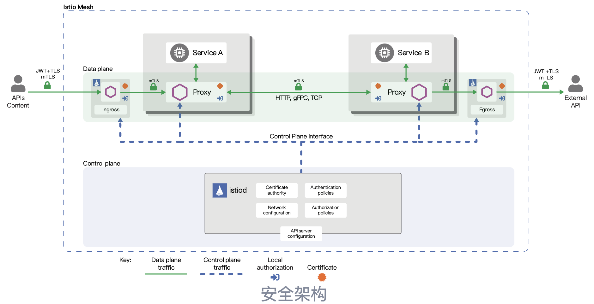
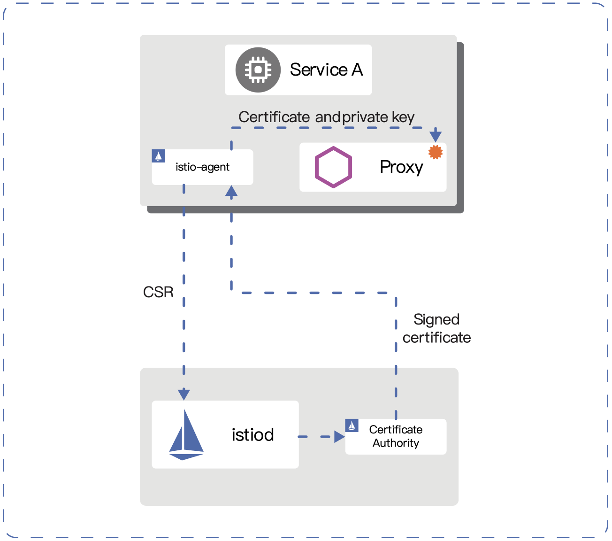
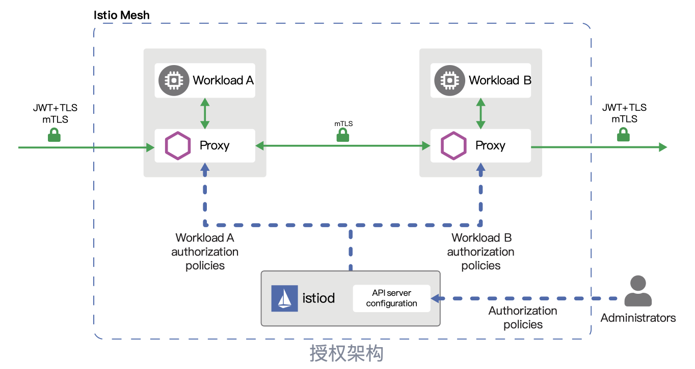
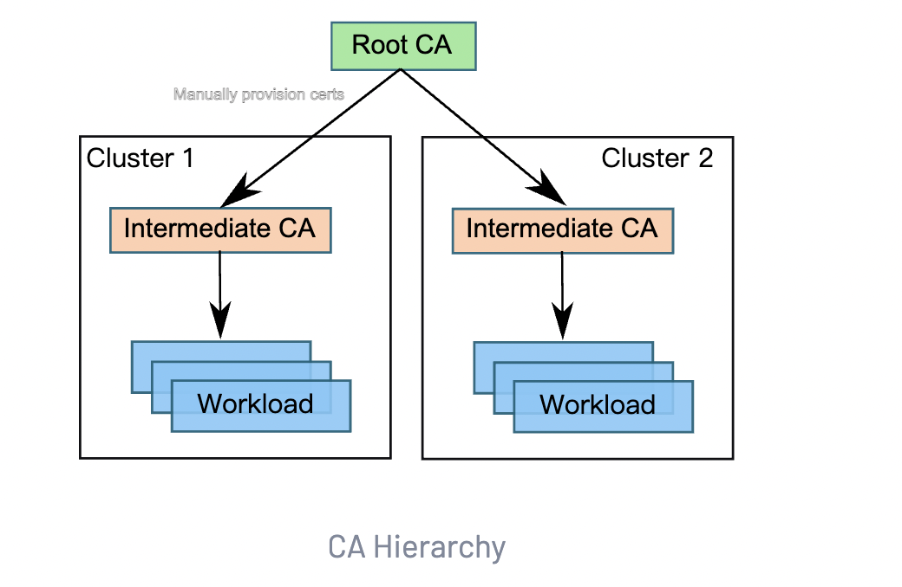

# 概览

将单一应用程序分解为微服务可提供各种好处，包括更好的灵活性、可伸缩性以及服务复用的能力。但是，微服务也有特殊的安全需求：

- 为了抵御中间人攻击，需要流量加密。
- 为了提供灵活的服务访问控制，需要双向 TLS 和细粒度的访问策略。
- 要确定谁在什么时候做了什么，需要审计工具。

Istio 安全功能提供强大的身份，强大的策略，透明的 TLS 加密，认证，授权和审计（AAA）工具来保护你的服务和数据。Istio 安全的目标是：

- 默认安全：应用程序代码和基础设施无需更改
- 深度防御：与现有安全系统集成以提供多层防御
- 零信任网络：在不受信任的网络上构建安全解决方案

## 架构

Istio 中的安全性涉及多个组件：

- 用于密钥和证书管理的证书颁发机构（CA）
- 配置 API 服务器分发给代理：
  - [认证策略](https://istio.io/latest/zh/docs/concepts/security/#authentication-policies)
  - [授权策略](https://istio.io/latest/zh/docs/concepts/security/#authorization-policies)
  - [安全命名信息](https://istio.io/latest/zh/docs/concepts/security/#secure-naming)
- Sidecar 和边缘代理作为 [Policy Enforcement Points](https://www.jerichosystems.com/technology/glossaryterms/policy_enforcement_point.html)(PEPs) 以保护客户端和服务器之间的通信安全.
- 一组 Envoy 代理扩展，用于管理遥测和审计


控制面处理来自 API server 的配置，并且在数据面中配置 PEPs。PEPs 用 Envoy 实现。



## Istio 身份

身份是任何安全基础架构的基本概念。在工作负载间通信开始时，双方必须交换包含身份信息的凭证以进行双向验证。在客户端，根据[安全命名](https://istio.io/latest/zh/docs/concepts/security/#secure-naming)信息检查服务器的标识，以查看它是否是该服务的授权运行程序。在服务器端，服务器可以根据[授权策略](https://istio.io/latest/zh/docs/concepts/security/#authorization-policies)确定客户端可以访问哪些信息，审计谁在什么时间访问了什么，根据他们使用的工作负载向客户收费，并拒绝任何未能支付账单的客户访问工作负载。

Istio 身份模型使用 `service identity` （服务身份）来确定一个请求源端的身份。这种模型有极好的灵活性和粒度，可以用服务身份来标识人类用户、单个工作负载或一组工作负载。在没有服务身份的平台上，Istio 可以使用其它可以对服务实例进行分组的身份，例如服务名称。

下面的列表展示了在不同平台上可以使用的服务身份：

- Kubernetes: Kubernetes service account
- GKE/GCE: GCP service account
- 本地（非 Kubernetes）：用户帐户、自定义服务帐户、服务名称、Istio 服务帐户或 GCP 服务帐户。自定义服务帐户引用现有服务帐户，就像客户的身份目录管理的身份一样。

## 公钥基础设施 (PKI)

Istio PKI 使用 X.509 证书为每个工作负载都提供强大的身份标识。伴随着每个 Envoy 代理的 `istio-agent` 和 `istiod` 一起协作来大规模进行自动化密钥和证书轮换。下图显示了这个机制的运行流程。



Istio 供应身份是通过 secret discovery service（SDS）来实现的，具体流程如下：

1. `istiod` 提供 gRPC 服务以接受[证书签名请求](https://en.wikipedia.org/wiki/Certificate_signing_request)（CSRs）。
2. 当工作负载启动时，Envoy 通过[秘密发现服务（SDS）](https://www.envoyproxy.io/docs/envoy/latest/configuration/security/secret#secret-discovery-service-sds)API 向同容器内的 `istio-agent` 发送证书和密钥请求。
3. 在收到 SDS 请求后，`istio-agent` 创建私钥和 CSR，然后将 CSR 及其凭据发送到 `istiod` CA 进行签名。
4. `istiod` CA 验证 CSR 中携带的凭据，成功验证后签署 CSR 以生成证书。
5. `Istio-agent` 通过 Envoy SDS API 将私钥和从 Istio CA 收到的证书发送给 Envoy。
6. `Istio-agent` 会监工作负载证书的有效期。上述 CSR 过程会周期性地重复，以处理证书和密钥轮换。

## 认证

Istio 提供两种类型的认证：

- Peer authentication：用于服务到服务的认证，以验证进行连接的客户端。Istio 提供[双向 TLS](https://en.wikipedia.org/wiki/Mutual_authentication) 作为传输认证的全栈解决方案，无需更改服务代码就可以启用它。这个解决方案：
  - 为每个服务提供强大的身份，表示其角色，以实现跨群集和云的互操作性。
  - 保护服务到服务的通信。
  - 提供密钥管理系统，以自动进行密钥和证书的生成，分发和轮换。
- Request authentication：用于最终用户认证，以验证附加到请求的凭据。 Istio 使用 JSON Web Token（JWT）验证启用请求级认证，并使用自定义认证实现或任何 OpenID Connect 的认证实现（例如下面列举的）来简化的开发人员体验。
  - [ORY Hydra](https://www.ory.sh/)
  - [Keycloak](https://www.keycloak.org/)
  - [Auth0](https://auth0.com/)
  - [Firebase Auth](https://firebase.google.com/docs/auth/)
  - [Google Auth](https://developers.google.com/identity/protocols/OpenIDConnect)

### 双向 TLS 认证

Istio 通过客户端和服务器端 PEPs 建立服务到服务的通信通道，PEPs 被实现为[Envoy 代理](https://envoyproxy.github.io/envoy/)。当一个工作负载使用双向 TLS 认证向另一个工作负载发送请求时，该请求的处理方式如下：

1. Istio 将出站流量从客户端重新路由到客户端的本地 sidecar Envoy。
2. 客户端 Envoy 与服务器端 Envoy 开始双向 TLS 握手。在握手期间，客户端 Envoy 还做了[安全命名](https://istio.io/latest/zh/docs/concepts/security/#secure-naming)检查，以验证服务器证书中显示的服务帐户是否被授权运行目标服务。
3. 客户端 Envoy 和服务器端 Envoy 建立了一个双向的 TLS 连接，Istio 将流量从客户端 Envoy 转发到服务器端 Envoy。
4. 授权后，服务器端 Envoy 通过本地 TCP 连接将流量转发到服务器服务。

Istio 将 `TLSv1_2` 作为最低 TLS 版本为客户端和服务器配置了如下的加密套件:

- `ECDHE-ECDSA-AES256-GCM-SHA384`
- `ECDHE-RSA-AES256-GCM-SHA384`
- `ECDHE-ECDSA-AES128-GCM-SHA256`
- `ECDHE-RSA-AES128-GCM-SHA256`
- `AES256-GCM-SHA384`
- `AES128-GCM-SHA256`

#### 宽容模式

Istio 双向 TLS 具有一个宽容模式（permissive mode），允许服务同时接受纯文本流量和双向 TLS 流量。这个功能极大的提升了双向 TLS 的入门体验。

在运维人员希望将服务移植到启用了双向 TLS 的 Istio 上时，许多非 Istio 客户端和非 Istio 服务端通信时会产生问题。通常情况下，运维人员无法同时为所有客户端安装 Istio sidecar，甚至没有这样做的权限。即使在服务端上安装了 Istio sidecar，运维人员也无法在不中断现有连接的情况下启用双向 TLS。

启用宽容模式后，服务可以同时接受纯文本和双向 TLS 流量。这个模式为入门提供了极大的灵活性。服务中安装的 Istio sidecar 立即接受双向 TLS 流量而不会打断现有的纯文本流量。因此，运维人员可以逐步安装和配置客户端 Istio sidecar 发送双向 TLS 流量。一旦客户端配置完成，运维人员便可以将服务端配置为仅 TLS 模式。更多信息请访问[双向 TLS 迁移向导](https://istio.io/latest/zh/docs/tasks/security/authentication/mtls-migration)。

#### 安全命名

服务器身份（Server identities）被编码在证书里，但服务名称（service names）通过服务发现或 DNS 被检索。安全命名信息将服务器身份映射到服务名称。身份 `A` 到服务名称 `B` 的映射表示“授权 `A` 运行服务 `B`“。控制平面监视 `apiserver`，生成安全命名映射，并将其安全地分发到 PEPs。 以下示例说明了为什么安全命名对身份验证至关重要。

假设运行服务 `datastore` 的合法服务器仅使用 `infra-team` 身份。恶意用户拥有 `test-team` 身份的证书和密钥。恶意用户打算模拟服务以检查从客户端发送的数据。恶意用户使用证书和 `test-team` 身份的密钥部署伪造服务器。假设恶意用户成功攻击了发现服务或 DNS，以将 `datastore` 服务名称映射到伪造服务器。

当客户端调用 `datastore` 服务时，它从服务器的证书中提取 `test-team` 身份，并用安全命名信息检查 `test-team` 是否被允许运行 `datastore`。客户端检测到 `test-team` 不允许运行 `datastore` 服务，认证失败。

对于非 HTTP/HTTPS 流量，安全命名不能保护其免于 DNS 欺骗，如攻击者劫持了 DNS 并修改了目的地的 IP 地址。这是因为 TCP 流量不包含主机名信息，Envoy 只能依靠目的地 IP 地址进行路由， 因此 Envoy 有可能将流量路由到劫持 IP 地址所在的服务上。而且甚至在客户端 Envoy 收到流量之前，也可能发生 DNS 劫持。

### 认证策略

本节中提供了更多 Istio 认证策略方面的细节。正如[认证架构](https://istio.io/latest/zh/docs/concepts/security/#authentication-architecture)中所说的，认证策略是对服务收到的请求生效的。要在双向 TLS 中指定客户端认证策略，需要在 `DetinationRule` 中设置 `TLSSettings`。[TLS 设置参考文档](https://istio.io/latest/zh/docs/reference/config/networking/destination-rule/#TLSSettings)中有更多这方面的信息。

和其他的 Istio 配置一样，可以用 `.yaml` 文件的形式来编写认证策略。部署策略使用 `kubectl`。 下面例子中的认证策略要求：与带有 `app:reviews` 标签的工作负载的传输层认证，必须使用双向 TLS：

```yaml
apiVersion: "security.istio.io/v1beta1"
kind: "PeerAuthentication"
metadata:
  name: "example-peer-policy"
  namespace: "foo"
spec:
  selector:
    matchLabels:
      app: reviews
  mtls:
    mode: STRICT
```

#### 策略存储

Istio 将网格范围的策略存储在根命名空间。这些策略使用一个空的 selector 适用于网格中的所有工作负载。具有名称空间范围的策略存储在相应的名称空间中。它们仅适用于其命名空间内的工作负载。如果你配置了 `selector` 字段，则认证策略仅适用于与您配置的条件匹配的工作负载。

Peer 和 request 认证策略用 kind 字段区分，分别是 `PeerAuthentication` 和 `RequestAuthentication`。

#### Selector 字段

Peer 和 request 认证策略使用 `selector` 字段来指定该策略适用的工作负载的标签。以下示例显示适用于带有 `app：product-page` 标签的工作负载的策略的 selector 字段：

```yaml
selector:
  matchLabels:
    app: product-page
```


如果您没有为 `selector` 字段提供值，则 Istio 会将策略与策略存储范围内的所有工作负载进行匹配。因此，`selector` 字段可帮助您指定策略的范围：

- 网格范围策略：为根名称空间指定的策略，不带或带有空的 `selector` 字段。
- 命名空间范围的策略：为非root命名空间指定的策略，不带有或带有空的 `selector` 字段。
- 特定于工作负载的策略：在常规名称空间中定义的策略，带有非空 `selector` 字段。

Peer 和 request 认证策略对 `selector` 字段遵循相同的层次结构原则，但是 Istio 以略有不同的方式组合和应用它们。

只能有一个网格范围的 Peer 认证策略，每个命名空间也只能有一个命名空间范围的 Peer 认证策略。当您为同一网格或命名空间配置多个网格范围或命名空间范围的 Peer 认证策略时，Istio 会忽略较新的策略。当多个特定于工作负载的 Peer 认证策略匹配时，Istio 将选择最旧的策略。

Istio 按照以下顺序为每个工作负载应用最窄的匹配策略：

1. 特定于工作负载的
2. 命名空间范围
3. 网格范围

Istio 可以将所有匹配的 request 认证策略组合起来，就像它们来自单个 request 认证策略一样。因此，您可以在网格或名称空间中配置多个网格范围或命名空间范围的策略。但是，避免使用多个网格范围或命名空间范围的 request 认证策略仍然是一个好的实践。

#### Peer authentication

Peer 认证策略指定 Istio 对目标工作负载实施的双向 TLS 模式。支持以下模式：

- PERMISSIVE：工作负载接受双向 TLS 和纯文本流量。此模式在迁移因为没有 sidecar 而无法使用双向 TLS 的工作负载的过程中非常有用。一旦工作负载完成 sidecar 注入的迁移，应将模式切换为 STRICT。
- STRICT： 工作负载仅接收双向 TLS 流量。
- DISABLE：禁用双向 TLS。 从安全角度来看，除非您提供自己的安全解决方案，否则请勿使用此模式。

如果未设置模式，将继承父作用域的模式。未设置模式的网格范围的 peer 认证策略默认使用 `PERMISSIVE` 模式。

下面的 peer 认证策略要求命名空间 `foo` 中的所有工作负载都使用双向 TLS：

```yaml
apiVersion: "security.istio.io/v1beta1"
kind: "PeerAuthentication"
metadata:
  name: "example-policy"
  namespace: "foo"
spec:
  mtls:
    mode: STRICT
```

对于特定于工作负载的 peer 认证策略，可以为不同的端口指定不同的双向 TLS 模式。您只能将端口范围的双向 TLS 配置在工作负载声明过的端口上。以下示例为 `app:example-app` 工作负载禁用了端口80上的双向TLS，并对所有其他端口使用名称空间范围的 peer 认证策略的双向 TLS 设置：

```yaml
apiVersion: "security.istio.io/v1beta1"
kind: "PeerAuthentication"
metadata:
  name: "example-workload-policy"
  namespace: "foo"
spec:
  selector:
     matchLabels:
       app: example-app
  portLevelMtls:
    80:
      mode: DISABLE
```

上面的 peer 认证策略仅在有如下 Service 定义时工作，将流向 `example-service` 服务的请求绑定到 `example-app` 工作负载的 `80` 端口

```yaml
apiVersion: v1
kind: Service
metadata:
  name: example-service
  namespace: foo
spec:
  ports:
  - name: http
    port: 8000
    protocol: TCP
    targetPort: 80
  selector:
    app: example-app
```

#### Request authentication

Request 认证策略指定验证 JSON Web Token（JWT）所需的值。 这些值包括：

- token 在请求中的位置
- 请求的 issuer
- 公共 JSON Web Key Set（JWKS）

Istio 会根据 request 认证策略中的规则检查提供的令牌（如果已提供），并拒绝令牌无效的请求。当请求不带有令牌时，默认情况下将接受它们。要拒绝没有令牌的请求，请提供授权规则，该规则指定对特定操作（例如，路径或操作）的限制。

如果 Request 认证策略使用唯一的位置，则它们可以指定多个JWT。当多个策略与工作负载匹配时，Istio 会将所有规则组合起来，就好像它们被指定为单个策略一样。此行为对于开发接受来自不同 JWT 提供者的工作负载时很有用。但是，不支持具有多个有效 JWT 的请求，因为此类请求的输出主体未定义。

#### Principals

使用 peer 认证策略和双向 TLS 时，Istio 将身份从 peer 认证提取到 `source.principal` 中。同样，当您使用 request 认证策略时，Istio 会将 JWT 中的身份赋值给 `request.auth.principal`。使用这些 principals 设置授权策略和作为遥测的输出。

### 更新认证策略

您可以随时更改认证策略，Istio 几乎实时将新策略推送到工作负载。但是，Istio 无法保证所有工作负载都同时收到新政策。以下建议有助于避免在更新认证策略时造成干扰：

- 将 peer 认证策略的模式从 `DISABLE` 更改为 `STRICT` 时，请使用 `PERMISSIVE` 模式来过渡，反之亦然。当所有工作负载成功切换到所需模式时，您可以将策略应用于最终模式。您可以使用 Istio 遥测技术来验证工作负载已成功切换。
- 将 request 认证策略从一个 JWT 迁移到另一个 JWT 时，将新 JWT 的规则添加到该策略中，而不删除旧规则。这样，工作负载接受两种类型的 JWT，当所有流量都切换到新的 JWT 时，您可以删除旧规则。但是，每个 JWT 必须使用不同的位置。

## 授权

Istio 的授权功能为网格中的工作负载提供网格、命名空间和工作负载级别的访问控制。这种控制层级提供了以下优点：

- 工作负载间和最终用户到工作负载的授权。
- 一个简单的 API：它包括一个单独的并且很容易使用和维护的 [`AuthorizationPolicy` CRD](https://istio.io/latest/zh/docs/reference/config/security/authorization-policy/)。
- 灵活的语义：运维人员可以在 Istio 属性上定义自定义条件，并使用 DENY 和 ALLOW 动作。
- 高性能：Istio 授权是在 Envoy 本地强制执行的。
- 高兼容性：原生支持 HTTP、HTTPS 和 HTTP2，以及任意普通 TCP 协议。

### 授权架构

每个 Envoy 代理都运行一个授权引擎，该引擎在运行时授权请求。当请求到达代理时，授权引擎根据当前授权策略评估请求上下文，并返回授权结果 `ALLOW` 或 `DENY`。 运维人员使用 `.yaml` 文件指定 Istio 授权策略。



### 隐式启用

您无需显式启用 Istio 的授权功能。只需将授权策略应用于工作负载即可实施访问控制。对于未应用授权策略的工作负载，Istio 不会执行访问控制，放行所有请求。

授权策略支持 `ALLOW` 和 `DENY` 动作。 拒绝策略优先于允许策略。如果将任何允许策略应用于工作负载，则默认情况下将拒绝对该工作负载的访问，除非策略中的规则明确允许。当您将多个授权策略应用于相同的工作负载时，Istio 会累加地应用它们。

### 授权策略

要配置授权策略，请创建一个 [`AuthorizationPolicy` 自定义资源](https://istio.io/latest/zh/docs/reference/config/security/authorization-policy/)。 一个授权策略包括选择器（selector），动作（action） 和一个规则（rules）列表：

- `selector` 字段指定策略的目标

- `action` 字段指定允许还是拒绝请求

- ```
  rules指定何时触发动作
  ```

  - `rules` 下的 `from` 字段指定请求的来源
  - `rules` 下的 `to` 字段指定请求的操作
  - `rules` 下的 `when` 字段指定应用规则所需的条件

以下示例显示了一个授权策略，该策略允许两个源（服务帐号 `cluster.local/ns/default/sa/sleep` 和命名空间 `dev`），在使用有效的 JWT 令牌发送请求时，可以访问命名空间 foo 中的带有标签 `app: httpbin` 和 `version: v1` 的工作负载。

```yaml
apiVersion: security.istio.io/v1beta1
kind: AuthorizationPolicy
metadata:
 name: httpbin
 namespace: foo
spec:
 selector:
   matchLabels:
     app: httpbin
     version: v1
 action: ALLOW
 rules:
 - from:
   - source:
       principals: ["cluster.local/ns/default/sa/sleep"]
   - source:
       namespaces: ["dev"]
   to:
   - operation:
       methods: ["GET"]
   when:
   - key: request.auth.claims[iss]
     values: ["https://accounts.google.com"]
```

下例显示了一个授权策略，如果请求来源不是命名空间 `foo`，请求将被拒绝。

```yaml
apiVersion: security.istio.io/v1beta1
kind: AuthorizationPolicy
metadata:
 name: httpbin-deny
 namespace: foo
spec:
 selector:
   matchLabels:
     app: httpbin
     version: v1
 action: DENY
 rules:
 - from:
   - source:
       notNamespaces: ["foo"]
```

拒绝策略优先于允许策略。如果请求同时匹配上允许策略和拒绝策略，请求将被拒绝。Istio 首先评估拒绝策略，以确保允许策略不能绕过拒绝策略。

#### 策略目标

您可以通过 `metadata/namespace` 字段和可选的 `selector` 字段来指定策略的范围或目标。`metadata/namespace` 告诉该策略适用于哪个命名空间。如果将其值设置为根名称空间，则该策略将应用于网格中的所有名称空间。根命名空间的值是可配置的，默认值为 `istio-system`。如果设置为任何其他名称空间，则该策略仅适用于指定的名称空间。

您可以使用 `selector` 字段来进一步限制策略以应用于特定工作负载。`selector` 使用标签选择目标工作负载。`slector` 包含 `{key: value}`对的列表，其中 `key` 是标签的名称。如果未设置，则授权策略将应用于与授权策略相同的命名空间中的所有工作负载。

以下示例策略 `allow-read` 允许对 `default` 命名空间中带有标签 `app: products` 的工作负载的 `"GET"` 和 `"HEAD"` 访问。

```yaml
apiVersion: security.istio.io/v1beta1
kind: AuthorizationPolicy
metadata:
  name: allow-read
  namespace: default
spec:
  selector:
    matchLabels:
      app: products
  action: ALLOW
  rules:
  - to:
    - operation:
         methods: ["GET", "HEAD"]
```

#### 值匹配

授权策略中的大多数字段都支持以下所有匹配模式：

- 完全匹配：即完整的字符串匹配。
- 前缀匹配：`"*"` 结尾的字符串。例如，`"test.abc.*"` 匹配 `"test.abc.com"`、`"test.abc.com.cn"`、`"test.abc.org"` 等等。
- 后缀匹配：`"*"` 开头的字符串。例如，`"*.abc.com"` 匹配 `"eng.abc.com"`、`"test.eng.abc.com"` 等等。
- 存在匹配：`*` 用于指定非空的任意内容。您可以使用格式 `fieldname: ["*"]` 指定必须存在的字段。这意味着该字段可以匹配任意内容，但是不能为空。请注意这与不指定字段不同，后者意味着匹配包括空的任意内容。

有一些例外。 例如，以下字段仅支持完全匹配：

- `when` 部分下的 `key` 字段
- `source` 部分下 的 `ipBlocks`
- `to` 部分下的 `ports` 字段

以下示例策略允许访问前缀为 `/test/*` 或后缀为 `*/info` 的路径。

```yaml
apiVersion: security.istio.io/v1beta1
kind: AuthorizationPolicy
metadata:
  name: tester
  namespace: default
spec:
  selector:
    matchLabels:
      app: products
  action: ALLOW
  rules:
  - to:
    - operation:
        paths: ["/test/*", "*/info"]
```

#### 排除匹配

为了匹配诸如 `when` 字段中的 `notValues`，`source` 字段中的 `notIpBlocks`，`to` 字段中的 `notPorts` 之类的否定条件，Istio 支持排除匹配。

以下示例：如果请求路径不是 `/healthz`，则要求从请求的 JWT 认证中导出的主体是有效的。 因此，该策略从 JWT 身份验证中排除对 `/healthz` 路径的请求：

```yaml
apiVersion: security.istio.io/v1beta1
kind: AuthorizationPolicy
metadata:
  name: disable-jwt-for-healthz
  namespace: default
spec:
  selector:
    matchLabels:
      app: products
  action: ALLOW
  rules:
  - to:
    - operation:
        notPaths: ["/healthz"]
    from:
    - source:
        requestPrincipals: ["*"]
```

下面的示例拒绝到 `/admin` 路径且不带请求主体的请求：

```yaml
apiVersion: security.istio.io/v1beta1
kind: AuthorizationPolicy
metadata:
  name: enable-jwt-for-admin
  namespace: default
spec:
  selector:
    matchLabels:
      app: products
  action: DENY
  rules:
  - to:
    - operation:
        paths: ["/admin"]
    from:
    - source:
        notRequestPrincipals: ["*"]
```

#### 全部允许和默认全部拒绝授权策略

以下示例显示了一个简单的 `allow-all` 授权策略，该策略允许完全访问 `default` 命名空间中的所有工作负载。

```yaml
apiVersion: security.istio.io/v1beta1
kind: AuthorizationPolicy
metadata:
  name: allow-all
  namespace: default
spec:
  action: ALLOW
  rules:
  - {}
```

以下示例显示了一个策略，该策略不允许任何对 `admin` 命名空间工作负载的访问。

```yaml
apiVersion: security.istio.io/v1beta1
kind: AuthorizationPolicy
metadata:
  name: deny-all
  namespace: admin
spec:
  {}
```

#### 自定义条件

您还可以使用 `when` 部分指定其他条件。 例如，下面的 `AuthorizationPolicy` 定义包括以下条件：`request.headers [version]` 是 `v1` 或 `v2`。 在这种情况下，key 是 `request.headers [version]`，它是 Istio 属性 `request.headers`（是个字典）中的一项。

```yaml
apiVersion: security.istio.io/v1beta1
kind: AuthorizationPolicy
metadata:
 name: httpbin
 namespace: foo
spec:
 selector:
   matchLabels:
     app: httpbin
     version: v1
 action: ALLOW
 rules:
 - from:
   - source:
       principals: ["cluster.local/ns/default/sa/sleep"]
   to:
   - operation:
       methods: ["GET"]
   when:
   - key: request.headers[version]
     values: ["v1", "v2"]
```

##### 自定义匹配条件

| 名称                           | 描述                                                     | 支持的协议   | 示例                                                         |
| ------------------------------ | -------------------------------------------------------- | ------------ | ------------------------------------------------------------ |
| `request.headers`              | `HTTP` 请求头，需要用 `[]` 括起来                        | HTTP only    | `key: request.headers[User-Agent]` `values: ["Mozilla/*"]`   |
| `source.ip`                    | 源 `IP` 地址，支持单个 `IP` 或 `CIDR`                    | HTTP and TCP | `key: source.ip` `values: ["10.1.2.3"]`                      |
| `source.namespace`             | 源负载实例命名空间，需启用双向 TLS                       | HTTP and TCP | `key: source.namespace` `values: ["default"]`                |
| `source.principal`             | 源负载的标识，需启用双向 TLS                             | HTTP and TCP | `key: source.principal` `values: ["cluster.local/ns/default/sa/productpage"]` |
| `request.auth.principal`       | 已认证过 `principal` 的请求。                            | HTTP only    | `key: request.auth.principal` `values: ["accounts.my-svc.com/104958560606"]` |
| `request.auth.audiences`       | 此身份验证信息的目标主体                                 | HTTP only    | `key: request.auth.audiences` `values: ["my-svc.com"]`       |
| `request.auth.presenter`       | 证书的颁发者                                             | HTTP only    | `key: request.auth.presenter` `values: ["123456789012.my-svc.com"]` |
| `request.auth.claims`          | `Claims` 来源于 `JWT`。需要用 `[]` 括起来                | HTTP only    | `key: request.auth.claims[iss]` `values: ["*@foo.com"]`      |
| `destination.ip`               | 目标 `IP` 地址，支持单个 `IP` 或 `CIDR`                  | HTTP and TCP | `key: destination.ip` `values: ["10.1.2.3", "10.2.0.0/16"]`  |
| `destination.port`             | 目标 `IP` 地址上的端口，必须在 `[0，65535]` 范围内       | HTTP and TCP | `key: destination.port` `values: ["80", "443"]`              |
| `connection.sni`               | 服务器名称指示，需启用双向 TLS                           | HTTP and TCP | `key: connection.sni` `values: ["www.example.com"]`          |
| `experimental.envoy.filters.*` | 用于过滤器的实验性元数据匹配，包装的值 `[]` 作为列表匹配 | HTTP and TCP | `key: experimental.envoy.filters.network.mysql_proxy[db.table]` `values: ["[update]"]` |

#### 认证与未认证身份

如果要使工作负载可公开访问，则需要将 `source` 部分留空。这允许来自所有（经过认证和未经认证）的用户和工作负载的源，例如：

```yaml
apiVersion: security.istio.io/v1beta1
kind: AuthorizationPolicy
metadata:
 name: httpbin
 namespace: foo
spec:
 selector:
   matchLabels:
     app: httpbin
     version: v1
 action: ALLOW
 rules:
 - to:
   - operation:
       methods: ["GET", "POST"]
```

要仅允许经过认证的用户，请将 `principal` 设置为 `"*"`，例如：

```yaml
apiVersion: security.istio.io/v1beta1
kind: AuthorizationPolicy
metadata:
 name: httpbin
 namespace: foo
spec:
 selector:
   matchLabels:
     app: httpbin
     version: v1
 action: ALLOW
 rules:
 - from:
   - source:
       principals: ["*"]
   to:
   - operation:
       methods: ["GET", "POST"]
```

### 在普通 TCP 协议上使用 Istio 授权

Istio 授权支持工作负载使用任意普通 TCP 协议，如 MongoDB。 在这种情况下，您可以按照与 HTTP 工作负载相同的方式配置授权策略。 不同之处在于某些字段和条件仅适用于 HTTP 工作负载。 这些字段包括：

- 授权策略对象 `source` 部分中的 `request_principals` 字段
- 授权策略对象 `operation` 部分中的 `hosts`、`methods` 和 `paths` 字段

如果您在授权策略中对 TCP 工作负载使用了任何只适用于 HTTP 的字段，Istio 将会忽略它们。

假设您在端口 `27017` 上有一个 MongoDB 服务，下例配置了一个授权策略，只允许 Istio 网格中的 `bookinfo-ratings-v2` 服务访问该 MongoDB 工作负载。

```yaml
apiVersion: "security.istio.io/v1beta1"
kind: AuthorizationPolicy
metadata:
  name: mongodb-policy
  namespace: default
spec:
 selector:
   matchLabels:
     app: mongodb
 action: ALLOW
 rules:
 - from:
   - source:
       principals: ["cluster.local/ns/default/sa/bookinfo-ratings-v2"]
   to:
   - operation:
       ports: ["27017"]
```

### 对双向 TLS 的依赖

Istio 使用双向 TLS 将某些信息从客户端安全地传递到服务器。在使用授权策略中的以下任何字段之前，必须先启用双向 TLS：

- `source` 部分下的 `principals` 字段
- `source` 部分下的 `namespaces` 字段
- `source.principal` 自定义条件
- `source.namespace` 自定义条件
- `connection.sni` 自定义条件

如果您不使用授权策略中的上述任何字段，则双向 TLS 不是必须的。

# 认证

管控网格服务间的双向 TLS 和终端用户的身份认证。

## 认证策略

### 开始之前

- 理解 Istio [认证策略](https://istio.io/latest/zh/docs/concepts/security/#authentication-policies)和[双向 TLS 认证](https://istio.io/latest/zh/docs/concepts/security/#mutual-TLS-authentication)相关概念。
- 参照[安装步骤](https://istio.io/latest/zh/docs/setup/getting-started)，使用 `default` 模板在 Kubernetes 集群中安装 Istio。

```
$ istioctl install --set profile=default
```

### 设置

我们将在 `foo` 和 `bar`命名空间下各自创建带有 Envoy 代理(sidecar)的 `httpbin` 和 `sleep`服务。我们还会在 `legacy` 命名空间下创建不带 Envoy 代理(sidecar)的 `httpbin` 和 `sleep` 服务。如果您希望使用相同的示例来完成这些任务，执行如下命令：

```
$ kubectl create ns foo
$ kubectl apply -f <(istioctl kube-inject -f samples/httpbin/httpbin.yaml) -n foo
$ kubectl apply -f <(istioctl kube-inject -f samples/sleep/sleep.yaml) -n foo
$ kubectl create ns bar
$ kubectl apply -f <(istioctl kube-inject -f samples/httpbin/httpbin.yaml) -n bar
$ kubectl apply -f <(istioctl kube-inject -f samples/sleep/sleep.yaml) -n bar
$ kubectl create ns legacy
$ kubectl apply -f samples/httpbin/httpbin.yaml -n legacy
$ kubectl apply -f samples/sleep/sleep.yaml -n legacy
```

现在您可以在 `foo`、`bar` 或 `legacy` 三个命名空间下的任意 `sleep` pod 使用 `curl`向 `httpbin.foo`、`httpbin.bar` 或 `httpbin.legacy` 发送 HTTP 请求来验证部署结果。所有请求都应该成功返回 HTTP 200。

例如，一个检查 `sleep.bar` 到 `httpbin.foo` 可达性的指令如下：

```
$ kubectl exec "$(kubectl get pod -l app=sleep -n bar -o jsonpath={.items..metadata.name})" -c sleep -n bar -- curl http://httpbin.foo:8000/ip -s -o /dev/null -w "%{http_code}\n"

200
```

您也可以使用一行指令检查所有可能的组合：

```
$ for from in "foo" "bar" "legacy"; do for to in "foo" "bar" "legacy"; do kubectl exec "$(kubectl get pod -l app=sleep -n ${from} -o jsonpath={.items..metadata.name})" -c sleep -n ${from} -- curl -s "http://httpbin.${to}:8000/ip" -s -o /dev/null -w "sleep.${from} to httpbin.${to}: %{http_code}\n"; done; done

sleep.foo to httpbin.foo: 200
sleep.foo to httpbin.bar: 200
sleep.foo to httpbin.legacy: 200
sleep.bar to httpbin.foo: 200
sleep.bar to httpbin.bar: 200
sleep.bar to httpbin.legacy: 200
sleep.legacy to httpbin.foo: 200
sleep.legacy to httpbin.bar: 200
sleep.legacy to httpbin.legacy: 200
```

使用以下指令确认系统中没有对等身份验证策略：

```
$ kubectl get peerauthentication --all-namespaces

No resources found
```

最后同样重要的是，确认验证示例服务没有应用 destination rule。您可以检查现有 destination rule 中的 `host:` 值并确保它们不匹配。例如：

```
$ kubectl get destinationrules.networking.istio.io --all-namespaces -o yaml | grep "host:"
```

### 自动双向 TLS

默认情况下，Istio 会跟踪迁移到 Istio 代理的服务器工作负载并配置客户端代理，将双向 TLS 流量自动发送到这些工作负载，并将 plain-text 流量发送到没有 sidecar 的工作负载。

因此，您无需做额外操作，具有代理的工作负载之间的所有流量即可启用双向 TLS。例如检查请求 `httpbin/header` 的响应。 使用双向 TLS 时，代理会将 `X-Forwarded-Client-Cert` 标头注入到后端的上游请求。存在该标头则说启用了双向 TLS。例如：

```
$ kubectl exec "$(kubectl get pod -l app=sleep -n foo -o jsonpath={.items..metadata.name})" -c sleep -n foo -- curl -s http://httpbin.foo:8000/headers -s | grep X-Forwarded-Client-Cert | sed 's/Hash=[a-z0-9]*;/Hash=<redacted>;/'

"X-Forwarded-Client-Cert": "By=spiffe://cluster.local/ns/foo/sa/httpbin;Hash=<redacted>;Subject=\"\";URI=spiffe://cluster.local/ns/foo/sa/sleep"
```

当服务器没有 sidecar 时， `X-Forwarded-Client-Cert` 标头将不会存在，这意味着请求是 plain-text 的。

```
$ kubectl exec "$(kubectl get pod -l app=sleep -n foo -o jsonpath={.items..metadata.name})" -c sleep -n foo -- curl http://httpbin.legacy:8000/headers -s | grep X-Forwarded-Client-Cert
```

### 全局以严格模式启用 Istio 双向 TLS

当 Istio 自动将代理和工作负载之间的所有流量升级到双向 TLS 时，工作负载仍然可以接收 plain-text 流量。为了阻止整个网格的服务以非双向 TLS 通信，需要将整个服务网格的对等认证策略设置为 `STRICT` 模式。 在整个服务网格范围内，对等认证策略不应该有一个 `selector`，它必须应用于 **根命名空间**，例如:

```
$ kubectl apply -f - <<EOF
apiVersion: security.istio.io/v1beta1
kind: PeerAuthentication
metadata:
  name: "default"
  namespace: "istio-system"
spec:
  mtls:
    mode: STRICT
EOF
```

该示例假定命名空间 `istio-system` 是根命名空间。如果在安装过程中使用了不同的值，请将 `istio-system` 替换为所使用的值。

此对等身份验证策略将工作负载配置为仅接受使用 TLS 加密的请求。由于未对 `selector` 字段指定值，因此该策略适用于服务网格中的所有工作负载。

再次运行测试指令：

```
$ for from in "foo" "bar" "legacy"; do for to in "foo" "bar" "legacy"; do kubectl exec "$(kubectl get pod -l app=sleep -n ${from} -o jsonpath={.items..metadata.name})" -c sleep -n ${from} -- curl "http://httpbin.${to}:8000/ip" -s -o /dev/null -w "sleep.${from} to httpbin.${to}: %{http_code}\n"; done; done

sleep.foo to httpbin.foo: 200
sleep.foo to httpbin.bar: 200
sleep.foo to httpbin.legacy: 200
sleep.bar to httpbin.foo: 200
sleep.bar to httpbin.bar: 200
sleep.bar to httpbin.legacy: 200
sleep.legacy to httpbin.foo: 000
command terminated with exit code 56
sleep.legacy to httpbin.bar: 000
command terminated with exit code 56
sleep.legacy to httpbin.legacy: 200
```

您会发现除了从没有 sidecar 的服务(`sleep.legacy`) 到有 sidecar 的服务(`httpbin.foo` 或 `httpbin.bar`) 的请求外，其他请求依然是返回成功的。

### 为每个命名空间或者工作负载启用双向 TLS

#### 命名空间级别策略

如果要将特定命名空间内的所有工作负载更改双向 TLS，请使用命名空间级别策略。该策略的规范与整个服务网格级别规范相同，但是您可以在 `metadata` 字段指定命名空间的名称。例如，以下对等身份验证策略在 `foo` 命名空间上启用了严格的双向 TLS：

```
$ kubectl apply -f - <<EOF
apiVersion: security.istio.io/v1beta1
kind: PeerAuthentication
metadata:
  name: "default"
  namespace: "foo"
spec:
  mtls:
    mode: STRICT
EOF
```

由于这些策略只应用于命名空间 `foo` 中的服务，您会看到只有从没有 sidecar 的客户端(`sleep.legacy`)到有 sidecar 的客户端(`httpbin.foo`)的请求会失败。

```
$ for from in "foo" "bar" "legacy"; do for to in "foo" "bar" "legacy"; do kubectl exec "$(kubectl get pod -l app=sleep -n ${from} -o jsonpath={.items..metadata.name})" -c sleep -n ${from} -- curl "http://httpbin.${to}:8000/ip" -s -o /dev/null -w "sleep.${from} to httpbin.${to}: %{http_code}\n"; done; done

sleep.foo to httpbin.foo: 200
sleep.foo to httpbin.bar: 200
sleep.foo to httpbin.legacy: 200
sleep.bar to httpbin.foo: 200
sleep.bar to httpbin.bar: 200
sleep.bar to httpbin.legacy: 200
sleep.legacy to httpbin.foo: 000
command terminated with exit code 56
sleep.legacy to httpbin.bar: 200
sleep.legacy to httpbin.legacy: 200
```

#### 为每个工作负载启用双向 TLS

要为特定工作负载设置对等身份验证策略，必须配置 `selector` 字段并指定与所需工作负载匹配的标签。例如，以下对等身份验证策略和 destination rule 将为 `httpbin.bar` 服务启用严格的双向 TLS：

```
$ cat <<EOF | kubectl apply -n bar -f -
apiVersion: security.istio.io/v1beta1
kind: PeerAuthentication
metadata:
  name: "httpbin"
  namespace: "bar"
spec:
  selector:
    matchLabels:
      app: httpbin
  mtls:
    mode: STRICT
EOF
```

再次执行探查命令。跟预期一样，从 `sleep.legacy` 到 `httpbin.bar` 的请求因为同样的原因失败。

```
$ for from in "foo" "bar" "legacy"; do for to in "foo" "bar" "legacy"; do kubectl exec "$(kubectl get pod -l app=sleep -n ${from} -o jsonpath={.items..metadata.name})" -c sleep -n ${from} -- curl "http://httpbin.${to}:8000/ip" -s -o /dev/null -w "sleep.${from} to httpbin.${to}: %{http_code}\n"; done; done

sleep.foo to httpbin.foo: 200
sleep.foo to httpbin.bar: 200
sleep.foo to httpbin.legacy: 200
sleep.bar to httpbin.foo: 200
sleep.bar to httpbin.bar: 200
sleep.bar to httpbin.legacy: 200
sleep.legacy to httpbin.foo: 000
command terminated with exit code 56
sleep.legacy to httpbin.bar: 000
command terminated with exit code 56
sleep.legacy to httpbin.legacy: 200
...
sleep.legacy to httpbin.bar: 000
command terminated with exit code 56
```

要优化每个端口的 双向 TLS 设置，必须配置 `portLevelMtls` 字段。 例如，以下对等身份验证策略要求在除 `80` 端口以外的所有端口上都使用双向 TLS：

```
$ cat <<EOF | kubectl apply -n bar -f -
apiVersion: security.istio.io/v1beta1
kind: PeerAuthentication
metadata:
  name: "httpbin"
  namespace: "bar"
spec:
  selector:
    matchLabels:
      app: httpbin
  mtls:
    mode: STRICT
  portLevelMtls:
    80:
      mode: DISABLE
EOF
```

1. 对等身份验证策略中的端口值为容器的端口。destination rule 的值是服务的端口。
2. 如果端口绑定到服务则只能使用 `portLevelMtls` 配置，其他配置将被 Istio 忽略。

```
$ for from in "foo" "bar" "legacy"; do for to in "foo" "bar" "legacy"; do kubectl exec "$(kubectl get pod -l app=sleep -n ${from} -o jsonpath={.items..metadata.name})" -c sleep -n ${from} -- curl "http://httpbin.${to}:8000/ip" -s -o /dev/null -w "sleep.${from} to httpbin.${to}: %{http_code}\n"; done; done

sleep.foo to httpbin.foo: 200
sleep.foo to httpbin.bar: 200
sleep.foo to httpbin.legacy: 200
sleep.bar to httpbin.foo: 200
sleep.bar to httpbin.bar: 200
sleep.bar to httpbin.legacy: 200
sleep.legacy to httpbin.foo: 000
command terminated with exit code 56
sleep.legacy to httpbin.bar: 200
sleep.legacy to httpbin.legacy: 200
```

#### 策略优先级

为了演示特定服务策略比命名空间范围的策略优先级高，您可以像下面一样为 `httpbin.foo` 添加一个禁用双向 TLS 的策略。 注意您已经为所有在命名空间 `foo` 中的服务创建了命名空间范围的策略来启用双向 TLS 并观察到从 `sleep.legacy` 到 `httpbin.foo` 的请求都会失败（如上所示）。

```
$ cat <<EOF | kubectl apply -n foo -f -
apiVersion: security.istio.io/v1beta1
kind: PeerAuthentication
metadata:
  name: "overwrite-example"
  namespace: "foo"
spec:
  selector:
    matchLabels:
      app: httpbin
    mtls:
      mode: DISABLE
EOF
```

重新执行来自 `sleep.legacy` 的请求，您应该又会看到请求成功返回 200 代码，证明了特定服务策略覆盖了命名空间范围的策略。

```
$ kubectl exec "$(kubectl get pod -l app=sleep -n legacy -o jsonpath={.items..metadata.name})" -c sleep -n legacy -- curl http://httpbin.foo:8000/ip -s -o /dev/null -w "%{http_code}\n"

200
```

### 终端用户认证

为了体验这个特性，您需要一个有效的 JWT。该 JWT 必须和您用于该示例的 JWKS 终端对应。在这个教程中，我们使用来自 Istio 代码基础库的 [JWT test](https://raw.githubusercontent.com/istio/istio/release-1.12/security/tools/jwt/samples/demo.jwt) 和 [JWKS endpoint](https://raw.githubusercontent.com/istio/istio/release-1.12/security/tools/jwt/samples/jwks.json) 同时为了方便访问我们将通过 `ingressgateway` 暴露 `httpbin.foo` 服务(详细细节请查看 [ingress 任务](https://istio.io/latest/zh/docs/tasks/traffic-management/ingress/))。

```
$ kubectl apply -f - <<EOF
apiVersion: networking.istio.io/v1alpha3
kind: Gateway
metadata:
  name: httpbin-gateway
  namespace: foo
spec:
  selector:
    istio: ingressgateway # 使用 Istio 的默认网关实现
  servers:
  - port:
      number: 80
      name: http
      protocol: HTTP
    hosts:
    - "*"
EOF
```

```
$ kubectl apply -f - <<EOF
apiVersion: networking.istio.io/v1alpha3
kind: VirtualService
metadata:
  name: httpbin
  namespace: foo
spec:
  hosts:
  - "*"
  gateways:
  - httpbin-gateway
  http:
  - route:
    - destination:
        port:
          number: 8000
        host: httpbin.foo.svc.cluster.local
EOF
```

参考[确定 ingress IP 和端口](https://istio.io/latest/zh/docs/tasks/traffic-management/ingress/ingress-control/#determining-the-ingress-ip-and-ports)章节配置环境变量 `INGRESS_HOST` 和 `INGRESS_PORT` 的值。

执行测试指令

```
$ curl "$INGRESS_HOST:$INGRESS_PORT/headers" -s -o /dev/null -w "%{http_code}\n"

200
```

现在添加一个身份验证策略，该策略要求入口网关需要指定终端用户的 JWT。

```
$ kubectl apply -f - <<EOF
apiVersion: security.istio.io/v1beta1
kind: RequestAuthentication
metadata:
  name: "jwt-example"
  namespace: istio-system
spec:
  selector:
    matchLabels:
      istio: ingressgateway
  jwtRules:
  - issuer: "testing@secure.istio.io"
    jwksUri: "https://raw.githubusercontent.com/istio/istio/release-1.12/security/tools/jwt/samples/jwks.json"
EOF
```

如果您在授权标头（默认位置）中提供了令牌，则 Istio 将使用 [public key set](https://raw.githubusercontent.com/istio/istio/release-1.12/security/tools/jwt/samples/jwks.json) 验证令牌，`bearer` 令牌无效会被拒绝，然而没有 `bearer` 令牌的请求会被接收。因此要观察此行为，请在没有令牌，令牌错误和有效令牌的情况下重试请求：

```
$ curl "$INGRESS_HOST:$INGRESS_PORT/headers" -s -o /dev/null -w "%{http_code}\n"

200
```

```
$ curl --header "Authorization: Bearer deadbeef" "$INGRESS_HOST:$INGRESS_PORT/headers" -s -o /dev/null -w "%{http_code}\n"

401
```

```
$ TOKEN=$(curl https://raw.githubusercontent.com/istio/istio/release-1.12/security/tools/jwt/samples/demo.jwt -s)
$ curl --header "Authorization: Bearer $TOKEN" "$INGRESS_HOST:$INGRESS_PORT/headers" -s -o /dev/null -w "%{http_code}\n"

200
```

为了观察 JWT 验证的其它方面，使用脚本 [`gen-jwt.py`](https://github.com/istio/istio/tree/release-1.12/security/tools/jwt/samples/gen-jwt.py) 生成新 tokens 带上不同的发行人、受众、有效期等等进行测试。可以从 Istio 库下载此脚本：

```
$ wget --no-verbose https://raw.githubusercontent.com/istio/istio/release-1.12/security/tools/jwt/samples/gen-jwt.py
```

您还需要 `key.pem` 文件：

```
$ wget --no-verbose https://raw.githubusercontent.com/istio/istio/release-1.12/security/tools/jwt/samples/key.pem
```

如果您的系统尚未安装 `jwcrypto` 库，你需要从 [jwcrypto](https://pypi.org/project/jwcrypto) 下载并安装。

JWT 认证有 60 秒的时钟偏移（clock skew），这意味着 JWT 令牌会比其配置 `nbf` 早 60 秒成为有效的，其配置 `exp`后 60 秒后仍然有效。

例如，下面的命令创建一个令牌，该令牌在5秒钟后过期。 如您所见，Istio 会一直通过认证直到 65 秒后才拒绝这些令牌：

```
$ TOKEN=$(python3 ./gen-jwt.py ./key.pem --expire 5)
$ for i in $(seq 1 10); do curl --header "Authorization: Bearer $TOKEN" "$INGRESS_HOST:$INGRESS_PORT/headers" -s -o /dev/null -w "%{http_code}\n"; sleep 10; done

200
200
200
200
200
200
200
401
401
401
```

您也可以给一个 `ingress gateway` 添加一个 JWT 策略（例如，服务 `istio-ingressgateway.istio-system.svc.cluster.local`）。 这个常用于为绑定到这个 gateway 的所有服务定义一个 JWT 策略而不是为单独的服务绑定策略。

#### 提供有效令牌

拒绝没有有效的令牌的请求，需要增加名为 `DENY` 认证策略，可参考以下例子中的 `notRequestPrincipals:["*"]` 配置。仅当提供有效的JWT令牌时请求主体才可用，因此该规则将拒绝没有有效令牌的请求。

```
$ kubectl apply -f - <<EOF
apiVersion: security.istio.io/v1beta1
kind: AuthorizationPolicy
metadata:
  name: "frontend-ingress"
  namespace: istio-system
spec:
  selector:
    matchLabels:
      istio: ingressgateway
  action: DENY
  rules:
  - from:
    - source:
      notRequestPrincipals: ["*"]
EOF
```

再次尝试不使用 token 请求服务，结果返回 `403`

```
$ curl "$INGRESS_HOST:$INGRESS_PORT/headers" -s -o /dev/null -w "%{http_code}\n"

403
```

#### 按路径提供有效令牌

为了按路径(路径指 host、path 或者 method)提供有效令牌我们需要在其认证策略中指定这些路径，如下列配置中的 `/headers`。待规则生效后，对`$INGRESS_HOST:$INGRESS_PORT/headers` 的请求将失败，错误代码为 `403`。而到其他所有路径的请求 —— 例如：`$INGRESS_HOST:$INGRESS_PORT/ip` —— 都会成功。

```
$ kubectl apply -f - <<EOF
apiVersion: security.istio.io/v1beta1
kind: AuthorizationPolicy
metadata:
  name: "frontend-ingress"
  namespace: istio-system
spec:
  selector:
    matchLabels:
      istio: ingressgateway
  action: DENY
  rules:
  - from:
    - source:
      notRequestPrincipals: ["*"]
      to:
    - operation:
      paths: ["/headers"]
EOF
```

```
$ curl "$INGRESS_HOST:$INGRESS_PORT/headers" -s -o /dev/null -w "%{http_code}\n"

403
```

```
$ curl "$INGRESS_HOST:$INGRESS_PORT/ip" -s -o /dev/null -w "%{http_code}\n"

200
```

## 双向 TLS 迁移

本任务阐述如何将 Istio 服务的请求从明文模式平滑过渡至双向 TLS 模式，并确保在整个迁移过程中不干扰在线流量的正常通信。

针对多服务跨网络通信的应用场景，通常希望逐步将所有服务迁移到 Istio 网格中。如此一来，在迁移过程中，将出现只有部分服务注入了 Envoy sidecar 的情况。对于一个已注入 sidecar 的服务而言，一旦开启服务的双向 TLS 通信模式，那么传统客户端（即：没有 Envoy 的客户端）将无法与之通信，因为这些客户端没有注入 Envoy sidecar 和客户端证书。为了解决这个问题，Istio 认证策略提供了一种 “PERMISSIVE” 模式。当启用 “PERMISSIVE” 模式时，服务可以同时接收 HTTP 和双向 TLS 请求。

这样，便可以将 Istio 服务的通信模式配置为双向 TLS，与此同时，不干扰其与传统服务之间的通信。此外，可以使用 [Grafana dashboard](https://istio.io/latest/zh/docs/tasks/observability/metrics/using-istio-dashboard/) 检查哪些服务仍然向 “PERMISSIVE” 模式的服务发送明文请求，然后选择在这些服务迁移结束后关闭目标服务的 “PERMISSIVE” 模式，将其锁定为只接收双向 TLS 请求。

### 开始之前

- 理解 Istio [认证策略](https://istio.io/latest/zh/docs/concepts/security/#authentication-policies)以及相关的[双向 TLS 认证](https://istio.io/latest/zh/docs/concepts/security/#mutual-TLS-authentication)概念。
- 准备一个 Kubernetes 集群并部署好 Istio，不要开启全局双向 TLS （如：可以使用[安装步骤](https://istio.io/latest/zh/docs/setup/getting-started)中提供的 demo 配置 profile，或者将安装选项 `global.mtls.enabled` 设置为 false）。
- demo 准备
  - 创建如下命名空间并在其中都部署上 [httpbin](https://github.com/istio/istio/tree/release-1.12/samples/httpbin) 和 [sleep](https://github.com/istio/istio/tree/release-1.12/samples/sleep)，注入 sidecar。
    - `foo`
    - `bar`
  - 创建如下命名空间并在其中部署 [sleep](https://github.com/istio/istio/tree/release-1.12/samples/sleep)，不注入 sidecar
    - `legacy`

- ```
  $ kubectl create ns foo
  $ kubectl apply -f <(istioctl kube-inject -f samples/httpbin/httpbin.yaml) -n foo
  $ kubectl apply -f <(istioctl kube-inject -f samples/sleep/sleep.yaml) -n foo
  $ kubectl create ns bar
  $ kubectl apply -f <(istioctl kube-inject -f samples/httpbin/httpbin.yaml) -n bar
  $ kubectl apply -f <(istioctl kube-inject -f samples/sleep/sleep.yaml) -n bar
  $ kubectl create ns legacy
  $ kubectl apply -f samples/sleep/sleep.yaml -n legacy
  ```

- （使用 curl 命令）从每个 sleep pod （命名空间为 `foo`，`bar` 或 `legacy`）分别向 `httpbin.foo` 发送 http 请求。所有请求都应成功响应，返回 HTTP code 200。

  ```
  $ for from in "foo" "bar" "legacy"; do kubectl exec $(kubectl get pod -l app=sleep -n ${from} -o jsonpath={.items..metadata.name}) -c sleep -n ${from} -- curl http://httpbin.foo:8000/ip -s -o /dev/null -w "sleep.${from} to httpbin.foo: %{http_code}\n"; done
  
  sleep.foo to httpbin.foo: 200
  sleep.bar to httpbin.foo: 200
  sleep.legacy to httpbin.foo: 200
  ```

验证没有在系统中设置认证策略或目标规则（控制面板除外）：

```
$ kubectl get policies.authentication.istio.io --all-namespaces

NAMESPACE      NAME                          AGE
istio-system   grafana-ports-mtls-disabled   3m
```

```
$ kubectl get destinationrule --all-namespaces

NAMESPACE      NAME                                 HOST                                             AGE
istio-system   istio-multicluster-destinationrule   *.global                                         35s
istio-system   istio-policy                         istio-policy.istio-system.svc.cluster.local      35s
istio-system   istio-telemetry                      istio-telemetry.istio-system.svc.cluster.local   33s
```

### 配置客户端发送双向 TLS 请求

设置 `DestinationRule`，配置 Istio 服务发送双向 TLS 请求。

```
$ cat <<EOF | kubectl apply -n foo -f -
apiVersion: "networking.istio.io/v1alpha3"
kind: "DestinationRule"
metadata:
  name: "example-httpbin-istio-client-mtls"
spec:
  host: httpbin.foo.svc.cluster.local
  trafficPolicy:
    tls:
      mode: ISTIO_MUTUAL
EOF
```

`sleep.foo` 和 `sleep.bar` 开始向 `httpbin.foo` 发送双向 TLS 请求。因为 `sleep.legacy` 没有注入 sidecar，`DestinationRule` 不会对其起作用，所以 `sleep.legacy` 仍然向 `httpbin.foo` 发送明文请求。

现在，我们确认一下，所有发送至 `httpbin.foo` 的请求仍会响应成功。

```
$ for from in "foo" "bar" "legacy"; do kubectl exec $(kubectl get pod -l app=sleep -n ${from} -o jsonpath={.items..metadata.name}) -c sleep -n ${from} -- curl http://httpbin.foo:8000/ip -s -o /dev/null -w "sleep.${from} to httpbin.foo: %{http_code}\n"; done

sleep.foo to httpbin.foo: 200
sleep.bar to httpbin.foo: 200
sleep.legacy to httpbin.foo: 200
```

也可以指定一部分客户端使用 [`DestinationRule`](https://istio.io/latest/zh/docs/reference/config/networking/destination-rule/) 中设置的 `ISTIO_MUTUAL` 双向 TLS 通信模式。 检查 [Grafana to monitor](https://istio.io/latest/zh/docs/tasks/observability/metrics/using-istio-dashboard/) 验证设置起效后，再扩大作用范围，最终应用到所有的 Istio 客户端服务。

### 锁定为双向 TLS

当所有客户端服务都成功迁移至 Istio 之后，注入 Envoy sidecar，便可以锁定 `httpbin.foo` 只接收双向 TLS 请求。

```
$ cat <<EOF | kubectl apply -n foo -f -
apiVersion: "security.istio.io/v1beta1"
kind: "PeerAuthentication"
metadata:
  name: "default"
spec:
  mtls:
    mode: STRICT
EOF
```

此时，源自 `sleep.legacy` 的请求将响应失败。

```
$ for from in "foo" "bar" "legacy"; do kubectl exec $(kubectl get pod -l app=sleep -n ${from} -o jsonpath={.items..metadata.name}) -c sleep -n ${from} -- curl http://httpbin.foo:8000/ip -s -o /dev/null -w "sleep.${from} to httpbin.foo: %{http_code}\n"; done

sleep.foo to httpbin.foo: 200
sleep.bar to httpbin.foo: 200
sleep.legacy to httpbin.foo: 503
```

如果你安装 Istio 时带有参数 `values.global.proxy.privileged=true`，那么你可以使用 `tcpdump` 来验证流量是否被加密。

```
$ kubectl exec -nfoo "$(kubectl get pod -nfoo -lapp=httpbin -ojsonpath={.items..metadata.name})" -c istio-proxy -it -- sudo tcpdump dst port 80  -A

tcpdump: verbose output suppressed, use -v or -vv for full protocol decode
listening on eth0, link-type EN10MB (Ethernet), capture size 262144 bytes
```

当分别从 `sleep.legacy` 和 `sleep.foo` 发送请求时，您将在输出中看到纯文本和加密文本。

若无法将所有服务迁移至 Istio （注入 Envoy sidecar），则必须开启 `PERMISSIVE` 模式。 然而，开启 `PERMISSIVE` 模式时，系统默认不对明文请求进行认证或授权检查。 推荐使用 [Istio 授权](https://istio.io/latest/zh/docs/tasks/security/authorization/authz-http/)来为不同的请求路径配置不同的授权策略。

# 证书管理

## 插入 CA 证书

默认情况下，Istio CA 会生成一个自签名的根证书和密钥，并使用它们来签署工作负载证书。为了保护根 CA 密钥，您应该使用在安全机器上离线运行的根 CA，并使用根 CA 向运行在每个集群上的 Istio CA 签发中间证书。Istio CA 可以使用管理员指定的证书和密钥来签署工作负载证书，并将管理员指定的根证书作为信任根分配给工作负载。



### 在集群中插入证书和密钥

1. 在 Istio 安装包的顶层目录下，创建一个目录来存放证书和密钥：

```
$ mkdir -p certs
$ pushd certs
```

2. 生成根证书和密钥：

```
$ make -f ../tools/certs/Makefile.selfsigned.mk root-ca
```

将会生成以下文件：

- `root-cert.pem`：生成的根证书
- `root-key.pem`：生成的根密钥
- `root-ca.conf`：生成根证书的 `openssl` 配置
- `root-cert.csr`：为根证书生成的 CSR

3. 对于每个集群，为 Istio CA 生成一个中间证书和密钥。 以下是集群 `cluster1` 的例子：

```
$ make -f ../tools/certs/Makefile.selfsigned.mk cluster1-cacerts
```

运行以上命令，将会在名为 `cluster1` 的目录下生成以下文件：

- `ca-cert.pem`：生成的中间证书
- `ca-key.pem`：生成的中间密钥
- `cert-chain.pem`：istiod 使用的生成的证书链
- `root-cert.pem`：根证书

您可以使用一个您选择的字符串来替换 `cluster1`。例如，使用 `cluster2-cacerts` 参数，您可以在一个名为 `cluster2` 的目录中创建证书和密钥。

如果您正在离线机器上进行此操作，请将生成的目录复制到可以访问集群的机器上。

4. 在每个集群中，创建一个私密 `cacerts`，包括所有输入文件 `ca-cert.pem`，`ca-key.pem`，`root-cert.pem` 和 `cert-chain.pem`。例如，在 `cluster1` 集群上：

```
$ kubectl create namespace istio-system
$ kubectl create secret generic cacerts -n istio-system \
      --from-file=cluster1/ca-cert.pem \
      --from-file=cluster1/ca-key.pem \
      --from-file=cluster1/root-cert.pem \
      --from-file=cluster1/cert-chain.pem
```

5. 返回 Istio 安装的顶层目录：

```
$ popd
```

### 部署 Istio

1. 使用 `demo` 配置文件部署 Istio。

   Istio 的 CA 将会从私密安装文件中读取证书和密钥。

   ```
   $ istioctl install --set profile=demo
   ```

### 部署实例服务

1. 部署 `httpbin` 和 `sleep` 示例服务。

   ```
   $ kubectl create ns foo
   $ kubectl apply -f <(istioctl kube-inject -f samples/httpbin/httpbin.yaml) -n foo
   $ kubectl apply -f <(istioctl kube-inject -f samples/sleep/sleep.yaml) -n foo
   ```

2. 为 `foo` 命名空间中的工作负载部署一个策略，使其只接受相互的 TLS 流量。

   ```
   $ kubectl apply -n foo -f - <<EOF
   apiVersion: security.istio.io/v1beta1
   kind: PeerAuthentication
   metadata:
     name: "default"
   spec:
     mtls:
       mode: STRICT
   EOF
   ```

### 验证证书

本节中，验证工作负载证书是否已通过插入到 CA 中的证书签署。验证的前提要求机器上安装有 `openssl`。

1. 在检索 `httpbin` 的证书链之前，请等待 20 秒使mTLS策略生效。由于本例中使用的 CA 证书是自签的，所以可以预料 openssl 命令返回 `verify error:num=19:self signed certificate in certificate chain`。

   ```
   $ sleep 20; kubectl exec "$(kubectl get pod -l app=sleep -n foo -o jsonpath={.items..metadata.name})" -c istio-proxy -n foo -- openssl s_client -showcerts -connect httpbin.foo:8000 > httpbin-proxy-cert.txt
   ```

2. 解析证书链上的证书。

   ```
   $ sed -n '/-----BEGIN CERTIFICATE-----/{:start /-----END CERTIFICATE-----/!{N;b start};/.*/p}' httpbin-proxy-cert.txt > certs.pem
   $ awk 'BEGIN {counter=0;} /BEGIN CERT/{counter++} { print > "proxy-cert-" counter ".pem"}' < certs.pem
   ```

3. 确认根证书与管理员指定的证书是否相同：

   ```
   $ openssl x509 -in certs/cluster1/root-cert.pem -text -noout > /tmp/root-cert.crt.txt
   $ openssl x509 -in ./proxy-cert-3.pem -text -noout > /tmp/pod-root-cert.crt.txt
   $ diff -s /tmp/root-cert.crt.txt /tmp/pod-root-cert.crt.txt
   
   Files /tmp/root-cert.crt.txt and /tmp/pod-root-cert.crt.txt are identical
   ```

4. 验证 CA 证书与管理员指定的证书是否相同：

   ```
   $ openssl x509 -in certs/cluster1/ca-cert.pem -text -noout > /tmp/ca-cert.crt.txt
   $ openssl x509 -in ./proxy-cert-2.pem -text -noout > /tmp/pod-cert-chain-ca.crt.txt
   $ diff -s /tmp/ca-cert.crt.txt /tmp/pod-cert-chain-ca.crt.txt
   
   Files /tmp/ca-cert.crt.txt and /tmp/pod-cert-chain-ca.crt.txt are identical
   ```

5. 验证从根证书到工作负载证书的证书链：

   ```
   $ openssl verify -CAfile <(cat certs/cluster1/ca-cert.pem certs/cluster1/root-cert.pem) ./proxy-cert-1.pem
   
   ./proxy-cert-1.pem: OK
   ```

## DNS 证书管理

Chiron 是一个与 Istiod 相连的轻量型组件，使用 Kubernetes 的 CA API 签发证书，无需管理私钥。优势如下：

- 与 Istiod 不同, 这种方式无需维护签发的私钥，增强了安全性。
- 简化了将根证书分发到 TLS 客户端。客户端不再需要等待 Istiod 生成和分发其 CA 证书。

### 开始之前

通过 `istioctl` 安装 Istio，并配置 DNS 证书。当 Istio 启动后会读取该配置。

```
$ cat <<EOF > ./istio.yaml
apiVersion: install.istio.io/v1alpha1
kind: IstioOperator
spec:
  meshConfig:
    certificates:
      - secretName: dns.example1-service-account
        dnsNames: [example1.istio-system.svc, example1.istio-system]
      - secretName: dns.example2-service-account
        dnsNames: [example2.istio-system.svc, example2.istio-system]
EOF
$ istioctl install -f ./istio.yaml
```

### DNS 证书的提供和管理

Istio 根据用户的配置，为 DNS 证书提供 DNS 名称和 Secret 名称。DNS 证书 通过 Kubernetes CA 签发，并根据配置保存到 Secret 中。Istio 也管理 DNS 证书的生命周期，包括证书的滚动和重新生成。

## 配置 DNS 证书

在 `istioctl install`命令中使用 `IstioOperator` 自定义资源用于配置Istio。`IstioOperator` 自定义资源包括 DNS 证书配置的例子。其中，`dnsNames` 字段定义证书中 DNS 名称，`secretName` 字段定义用于存储证书和私钥的 Kubernetes Secret 名称。

## 检查 DNS 证书的提供

在配置 Istio 生成 DNS 证书和保存证书到 Secret 后，您可以校验证书是够已经生成并正常运行。

为了校验例子中 Istio 的配置 `dns.example1-service-account` 生成的 DNS 证书，和校验证书是否包含 配置的 DNS 名称，需要获取 Kubernetes 的 Secret 进行解析解码，通过以下命令查看具体内容：

```
$ kubectl get secret dns.example1-service-account -n istio-system -o jsonpath="{.data['cert-chain\.pem']}" | base64 --decode | openssl x509 -in /dev/stdin -text -noout
```

输出内容包括：

```plain
X509v3 Subject Alternative Name:
    DNS:example1.istio-system.svc, DNS:example1.istio-system
```

## 重新生成 DNS 证书

Istio 还可以在重新生成被误删的 DNS 证书。接下来，将会演示如何删除最近配置的证书，并校验 Istio 自动重新生成证书。

1. 删除前面保存的配置 DNS 证书的 Secret：

   ```
   $ kubectl delete secret dns.example1-service-account -n istio-system
   ```

2. 校验 Istio 重新生成已删除 DNS 证书，且证书包含配置的 DNS 名称，您需要获取 Kubernetes 的 Secret进行解析解码，通过以下命令查看详细内容：

   ```
   $ sleep 10; kubectl get secret dns.example1-service-account -n istio-system -o jsonpath="{.data['cert-chain\.pem']}" | base64 --decode | openssl x509 -in /dev/stdin -text -noout
   ```

输出内容包括：

```plain
X509v3 Subject Alternative Name:
    DNS:example1.istio-system.svc, DNS:example1.istio-system
```

## Kubernetes CSR 自定义 CA 集成

提供工作负载证书的自定义证书颁发机构[Kubernetes CSR API](https://kubernetes.io/docs/reference/access-authn-authz/certificate-signing-requests/)。这个特性利用了[Chiron](https://istio.io/latest/zh/blog/2019/dns-cert/)，一个轻量级组件与Istiod链接，使用 Kubernetes CSR API 签署证书。

这项任务分为两部分。第一部分演示了如何使用 Kubernetes CA 本身来签署工作负载证书。第二部分演示了如何使用与 Kubernetes CSR API 集成的自定义 CA 来为证书签名。

### 第一部分: 使用 Kubernetes CA

#### 使用 Kubernetes CA 部署 Istio

1. 使用 `istioctl` 在集群上部署 Istio，配置如下。

   ```
   $ cat <<EOF > ./istio.yaml
     apiVersion: install.istio.io/v1alpha1
     kind: IstioOperator
     spec:
       pilot:
         k8s:
           env:
           # Indicate to Istiod that we use a Custom Certificate Authority
           - name: EXTERNAL_CA
             value: ISTIOD_RA_KUBERNETES_API
           # Tells Istiod to use the Kubernetes legacy CA Signer
           - name: K8S_SIGNER
             value: kubernetes.io/legacy-unknown
     EOF
   $ istioctl install --set profile=demo -f ./istio.yaml
   ```

2. 在 bookinfo 命名空间中部署 `bookinfo` 示例应用程序。确保在 Istio 根目录下执行以下命令。

   ```
   $ kubectl create ns bookinfo
   $ kubectl apply -f <(istioctl kube-inject -f samples/bookinfo/platform/kube/bookinfo.yaml) -n bookinfo
   ```

#### 验证安装的证书是否正确

在部署工作负载时，它们会向 Istiod 发送 CSR 请求，Istiod 将它们转发到 Kubernetes CA 进行签名。如果一切顺利，签名的证书将被发送回安装它们的工作负载。要验证它们是否已由 Kubernetes CA 签名，您需要先提取已签名的证书。

1. 获取在命名空间中运行的所有 pod。

   ```
   $ kubectl get pods -n bookinfo
   ```

   为下一步选择任何一个正在运行的 Pod。

2. 获取 Istio 代理用于 mTLS 的证书链和 CA 根证书。

   ```
   $ istioctl pc secret <pod-name> -o json > proxy_secret
   ```

   proxy_secret json 文件在 `trustedCA` 字段中包含 mTLS 的 CA 根证书。请注意，此证书是 base64 编码的。

3. Kubernetes CA 使用的证书（特别是 `kubernetes.io/legacy-unknown`）被加载到与 bookinfo 命名空间中的每个服务帐号关联的密钥上。

   ```
   $ kubectl get secrets -n bookinfo
   ```

   选择与任何服务帐号关联的 secrets 名称。它们的名称中有一个 “token”。

   ```
   $ kubectl get secrets -n bookinfo <secret-name> -o json
   ```

   输出中的 `ca.crt` 字段包含 base64 编码的 Kubernetes CA 证书。

4. 将上一步获得的 `ca.cert` 与上一步中 `TrustedCA` 字段的内容进行比较。这两个应该是一样的。

5. （可选）按照[bookinfo 示例](https://istio.io/latest/zh/docs/examples/bookinfo/)中的其余步骤确保服务之间的通信按预期进行。

### 第二部分: 使用自定义 CA

假设自定义 CA 实现了一个控制器，该控制器具有读取和签署 Kubernetes CSR 请求的必要权限。 更多细节请参考[Kubernetes CSR 文档](https://kubernetes.io/docs/reference/access-authn-authz/certificate-signing-requests/)。请注意，以下步骤取决于外部源并且可能会发生变化。

#### 在 Kubernetes 集群中部署自定义 CA 控制器

1. 对于此示例，我们使用[开源证书颁发机构实现](https://github.com/cert-manager/signer-ca)。此代码构建了一个控制器，该控制器读取 Kubernetes 集群上的 CSR 资源并使用本地密钥创建证书。按照页面上的说明进行操作:

   1. 构建 Certificate-Controller docker 镜像
   2. 将镜像上传到 Docker Registry
   3. 生成 Kubernetes manifest 以进行部署

2. 将在上一步中生成的 Kubernetes 清单部署到 signer-ca-system 命名空间中的本地集群上。

   ```
   $ kubectl apply -f local-ca.yaml
   ```

确认所有的服务都在运行。

```unknown
$ kubectl get services -n signer-ca-system
  NAME                                           TYPE        CLUSTER-IP   EXTERNAL-IP   PORT(S)    AGE
  signer-ca-controller-manager-metrics-service   ClusterIP   10.8.9.25    none        8443/TCP   72s
```

1. 获取 CA 的公钥。这是在 signer-ca-system 命名空间中的 “signer-ca-*” secrets 中编码的。

   ```
   $ kubectl get secrets signer-ca-5hff5h74hm -o json
   ```

   `tls.crt` 字段包含 base64 编码的公钥文件。记录下来以备将来使用。

### 将 CA 根证书加载到 istiod 可以访问的 secret

1. 将 secret 加载到 istiod 命名空间中。

   ```
   $ cat <<EOF > ./external-ca-secret.yaml
     apiVersion: v1
     kind: Secret
     metadata:
       name: external-ca-cert
       namespace: istio-system
     data:
     root-cert.pem: <tls.cert from the step above>
     EOF
   $ kubectl apply -f external-ca-secret.yaml
   ```

   Istio 需要此步骤来验证工作负载证书是否已由正确的证书颁发机构签名，并将根证书添加到信任包以使 mTLS 正常工作。

#### 部署 Istio

1. 使用 `istioctl` 在集群上部署 Istio，配置如下。

   ```
   $ cat <<EOF > ./istio.yaml
   apiVersion: install.istio.io/v1alpha1
   kind: IstioOperator
   spec:
     components:
       base:
         k8s:
           overlays:
             # Amend ClusterRole to add permission for istiod to approve certificate signing by custom signer
             - kind: ClusterRole
               name: istiod-istio-system
               patches:
                 - path: rules[-1]
                   value: |
                     apiGroups:
                     - certificates.k8s.io
                     resourceNames:
                     # Name of k8s external Signer in this example
                     - example.com/foo
                     resources:
                     - signers
                     verbs:
                     - approve
       pilot:
         k8s:
           env:
             # Indicate to Istiod that we use an external signer
             - name: EXTERNAL_CA
               value: ISTIOD_RA_KUBERNETES_API
             # Indicate to Istiod the external k8s Signer Name
             - name: K8S_SIGNER
               value: example.com/foo
           overlays:
           - kind: Deployment
             name: istiod
             patches:
               - path: spec.template.spec.containers[0].volumeMounts[-1]
                 value: |
                   # Mount external CA certificate into Istiod
                   name: external-ca-cert
                   mountPath: /etc/external-ca-cert
                   readOnly: true
               - path: spec.template.spec.volumes[-1]
                 value: |
                   name: external-ca-cert
                   secret:
                     secretName: external-ca-cert
                     optional: true
   EOF
   $ istioctl install --set profile=demo -f ./istio.yaml
   ```

2. 在 bookinfo 命名空间中部署 `bookinfo` 示例应用程序。

   ```
   $ kubectl create ns bookinfo
   $ kubectl apply -f <(istioctl kube-inject -f samples/bookinfo/platform/kube/bookinfo.yaml) -n bookinfo
   ```

### 验证安装的自定义 CA 证书是否正确

在部署工作负载时，它们会向 Istiod 发送 CSR 请求，Istiod 将它们转发到 Kubernetes CA 进行签名。如果一切顺利，签名的证书将被发送回安装它们的工作负载。要验证它们确实已由 Kubernetes CA 签名，您需要首先提取已签名的证书。

1. 获取在命名空间中运行的所有 pod。

   ```
   $ kubectl get pods -n bookinfo
   ```

为下一步选择任何正在运行的 Pod。

1. 获取 Istio 代理用于 mTLS 的证书链和 CA 根证书。

   ```
   $ istioctl pc secret <pod-name> -o json > proxy_secret
   ```

`proxy_secret` json 文件在 `trustedCA` 字段中包含 mTLS 的 CA 根证书。请注意，此证书是 base64 编码的。

1. 将上述步骤中获得的 CA 根证书与 external-ca-cert 中的 ”root-cert.pem“ 值进行比较。这两个应该是一样的。
2. （可选）按照[bookinfo 示例](https://istio.io/latest/zh/docs/examples/bookinfo/)中的其余步骤确保服务之间的通信按预期进行。

# 授权

## HTTP 流量授权

### 开始之前

本任务假设您已经：

- 阅读了[授权概念](https://istio.io/latest/zh/docs/concepts/security/#authorization)。
- 遵照 [Istio 安装指南](https://istio.io/latest/zh/docs/setup/install/istioctl/)安装完成 Istio 并启用了双向 TLS。
- 部署了 [Bookinfo](https://istio.io/latest/zh/docs/examples/bookinfo/#deploying-the-application) 示例应用。

部署 Bookinfo 应用后通过 `http://$GATEWAY_URL/productpage` 访问 product 页面，可以看到如下内容：

- **Book Details** 在左下方，包括：图书类型，页数，出版社等。
- **Book Reviews** 在页面右下方。

### 为 HTTP 流量的工作负载配置访问控制

使用 Istio，您可以轻松地为网格中的workloads设置访问控制。本任务向您展示如何使用 Istio 授权设置访问控制。首先，配置一个简单的 `deny-all` 策略，来拒绝工作负载的所有请求，然后逐渐地、增量地授予对工作负载更多的访问权。

1. 运行下面的命令在 `default` 命名空间里创建一个 `deny-all` 策略。该策略没有 `selector` 字段，它会把策略应用于 `default` 命名空间中的每个工作负载。`spec:` 字段为空值 `{}`，意思是不允许任何流量，有效地拒绝所有请求。

   ```
   $ kubectl apply -f - <<EOF
   apiVersion: security.istio.io/v1beta1
   kind: AuthorizationPolicy
   metadata:
     name: deny-all
     namespace: default
   spec:
     {}
   EOF
   ```

   打开浏览器访问 Bookinfo 的 `productpage` (`http://$GATEWAY_URL/productpage`) 页面。您将会看到 `"RBAC: access denied"`。该错误表明配置的 `deny-all` 策略按期望生效了，并且 Istio 没有任何规则允许对网格中的工作负载进行任何访问。

2. 运行下面的命令创建一个 `productpage-viewer` 策略以容许通过 `GET` 方法访问 `productpage` 工作负载。该策略没有在 `rules` 中设置 `from` 字段，这意味着所有的请求源都被容许访问，包括所有的用户和工作负载：

   ```
   $ kubectl apply -f - <<EOF
   apiVersion: "security.istio.io/v1beta1"
   kind: "AuthorizationPolicy"
   metadata:
     name: "productpage-viewer"
     namespace: default
   spec:
     selector:
       matchLabels:
         app: productpage
     rules:
     - to:
       - operation:
           methods: ["GET"]
   EOF
   ```

   在浏览器里访问 Bookinfo 的 `productpage` (`http://$GATEWAY_URL/productpage`)。您将看到 “Bookinfo Sample” 页面，但会发现页面中有如下的错误：

   - `Error fetching product details`
   - `Error fetching product reviews`

   这些错误是预期的，因为我们没有授权 `productpage` 工作负载去访问 `details` 和 `reviews` 工作负载。接下来，您需要配置一个策略来容许访问其他工作负载。

3. 运行下面的命令创建一个 `details-viewer` 策略以容许 `productpage` 工作负载以 `GET` 方式，通过使用 `cluster.local/ns/default/sa/bookinfo-productpage` ServiceAccount 去访问 `details` 工作负载：

   ```
   $ kubectl apply -f - <<EOF
   apiVersion: "security.istio.io/v1beta1"
   kind: "AuthorizationPolicy"
   metadata:
     name: "details-viewer"
     namespace: default
   spec:
     selector:
       matchLabels:
         app: details
     rules:
     - from:
       - source:
           principals: ["cluster.local/ns/default/sa/bookinfo-productpage"]
       to:
       - operation:
           methods: ["GET"]
   EOF
   ```

4. 运行下面的命令创建一个 `reviews-viewer` 策略以容许 `productpage` 工作负载以 `GET` 方式，通过使用 `cluster.local/ns/default/sa/bookinfo-productpage` ServiceAccount 去访问 `reviews` 工作负载：

   ```
   $ kubectl apply -f - <<EOF
   apiVersion: "security.istio.io/v1beta1"
   kind: "AuthorizationPolicy"
   metadata:
     name: "reviews-viewer"
     namespace: default
   spec:
     selector:
       matchLabels:
         app: reviews
     rules:
     - from:
       - source:
           principals: ["cluster.local/ns/default/sa/bookinfo-productpage"]
       to:
       - operation:
           methods: ["GET"]
   EOF
   ```

   在浏览器访问 Bookinfo `productpage` (`http://$GATEWAY_URL/productpage`)。现在您将看到 “Bookinfo Sample” 页面，“Book Details” 在左下方，“Book Reviews” 在右下方。但是在 “Book Reviews” 部分有 `Ratings service currently unavailable` 的错误。

   这是因为 `reviews` 工作负载没有权限访问 `ratings` 工作负载。为修复这个问题，您需要授权 `reviews` 工作负载可以访问 `ratings` 工作负载。下一步我们配置一个策略来容许 `reviews` 工作负载访问。

5. 运行下面的命令创建一个 `ratings-viewer` 策略以容许 `reviews` 工作负载以 `GET` 方式，通过使用 `cluster.local/ns/default/sa/bookinfo-reviews` ServiceAccount 去访问 `ratings` 工作负载：

   ```
   $ kubectl apply -f - <<EOF
   apiVersion: "security.istio.io/v1beta1"
   kind: "AuthorizationPolicy"
   metadata:
     name: "ratings-viewer"
     namespace: default
   spec:
     selector:
       matchLabels:
         app: ratings
     rules:
     - from:
       - source:
           principals: ["cluster.local/ns/default/sa/bookinfo-reviews"]
       to:
       - operation:
           methods: ["GET"]
   EOF
   ```

   在浏览器访问 Bookinfo `productpage` (`http://$GATEWAY_URL/productpage`)。您会在 “Book Reviews” 部分看到“黑色”和“红色”评分。

   **恭喜！** 您成功地应用了授权策略为使用 HTTP 流量的工作负载进行了访问控制。

## TCP 流量

### 开始之前

在您开始之前，请先完成以下内容：

- 阅读[Istio 授权概念](https://istio.io/latest/zh/docs/concepts/security/#authorization)。

- 按照 [Istio 安装指南](https://istio.io/latest/zh/docs/setup/install/istioctl/)安装 Istio。

- 在命名空间例如 `foo` 中部署两个工作负载，`sleep` 和 `tcp-echo`。 这两个工作负载每个前面都会运行一个 Envoy 代理。 `tcp-echo` 工作负载会监听端口 9000、9001 和 9002，并以前缀 `hello` 输出它收到的所有流量。 例如，如果你发送 “world” 给 `tcp-echo`，那么它将会回复 `hello world`。 `tcp-echo` 的 Kubernetes 服务对象只声明了端口 9000 和 9001，而省略了端口 9002。直通过滤器链将处理端口 9002 的流量。 使用以下命令部署示例命名空间和工作负载：

  ```
  $ kubectl create ns foo
  $ kubectl apply -f <(istioctl kube-inject -f samples/tcp-echo/tcp-echo.yaml) -n foo
  $ kubectl apply -f <(istioctl kube-inject -f samples/sleep/sleep.yaml) -n foo
  ```

- 使用以下命令确认 `sleep` 可以成功与 `tcp-echo` 的端口 9000 和 9001 交互：

  ```
  $ kubectl exec "$(kubectl get pod -l app=sleep -n foo -o jsonpath={.items..metadata.name})" -c sleep -n foo -- sh -c 'echo "port 9000" | nc tcp-echo 9000' | grep "hello" && echo 'connection succeeded' || echo 'connection rejected'
  
  hello port 9000
  connection succeeded
  ```

  ```
  $ kubectl exec "$(kubectl get pod -l app=sleep -n foo -o jsonpath={.items..metadata.name})" -c sleep -n foo -- sh -c 'echo "port 9001" | nc tcp-echo 9001' | grep "hello" && echo 'connection succeeded' || echo 'connection rejected'
  
  hello port 9001
  connection succeeded
  ```

- 确认 `sleep` 可以成功与 `tcp-echo` 的端口 9002 交互。 您需要将流量直接发送到 `tcp-echo` 的 pod IP，因为在 `tcp-echo` 的 Kubernetes 服务对象中未定义端口 9002。 使用以下命令获取 pod IP 地址并发送请求：

  ```
  $ TCP_ECHO_IP=$(kubectl get pod "$(kubectl get pod -l app=tcp-echo -n foo -o jsonpath={.items..metadata.name})" -n foo -o jsonpath="{.status.podIP}")
  $ kubectl exec "$(kubectl get pod -l app=sleep -n foo -o jsonpath={.items..metadata.name})" -c sleep -n foo -- sh -c "echo \"port 9002\" | nc $TCP_ECHO_IP 9002" | grep "hello" && echo 'connection succeeded' || echo 'connection rejected'
  
  hello port 9002
  connection succeeded
  ```

### 配置 TCP 工作负载的访问控制

1. 在 `foo` 命名空间中为 `tcp-echo` 工作负载创建 `tcp-policy` 授权策略。 运行以下命令来应用策略以允许请求到端口 9000 和 9001：

   ```
   $ kubectl apply -f - <<EOF
   apiVersion: security.istio.io/v1beta1
   kind: AuthorizationPolicy
   metadata:
     name: tcp-policy
     namespace: foo
   spec:
     selector:
       matchLabels:
         app: tcp-echo
     action: ALLOW
     rules:
     - to:
       - operation:
          ports: ["9000", "9001"]
   EOF
   ```

2. 使用以下命令验证是否允许请求端口 9000：

   ```
   $ kubectl exec "$(kubectl get pod -l app=sleep -n foo -o jsonpath={.items..metadata.name})" -c sleep -n foo -- sh -c 'echo "port 9000" | nc tcp-echo 9000' | grep "hello" && echo 'connection succeeded' || echo 'connection rejected'
   
   hello port 9000
   connection succeeded
   ```

3. 使用以下命令验证是否允许请求端口 9001：

   ```
   $ kubectl exec "$(kubectl get pod -l app=sleep -n foo -o jsonpath={.items..metadata.name})" -c sleep -n foo -- sh -c 'echo "port 9001" | nc tcp-echo 9001' | grep "hello" && echo 'connection succeeded' || echo 'connection rejected'
   
   hello port 9001
   connection succeeded
   ```

4. 验证对端口 9002 的请求是否被拒绝。即使未在 `tcp-echo` Kubernetes 服务对象中显式声明的端口，授权策略也将其应用于直通过滤器链。 运行以下命令并验证输出：

   ```
   $ kubectl exec "$(kubectl get pod -l app=sleep -n foo -o jsonpath={.items..metadata.name})" -c sleep -n foo -- sh -c "echo \"port 9002\" | nc $TCP_ECHO_IP 9002" | grep "hello" && echo 'connection succeeded' || echo 'connection rejected'
   
   connection rejected
   ```

5. 使用以下命令为端口 9000 添加一个名为 `methods` 的 HTTP-only 字段来更新策略：

   ```
   $ kubectl apply -f - <<EOF
   apiVersion: security.istio.io/v1beta1
   kind: AuthorizationPolicy
   metadata:
     name: tcp-policy
     namespace: foo
   spec:
     selector:
       matchLabels:
         app: tcp-echo
     action: ALLOW
     rules:
     - to:
       - operation:
           methods: ["GET"]
           ports: ["9000"]
   EOF
   ```

6. 验证对端口 9000 的请求是否被拒绝。发生这种情况是因为该规则在对 TCP 流量使用了 HTTP-only 字段（`methods`），这会导致规则无效。Istio 会忽略无效的 ALLOW 规则。 最终结果是该请求被拒绝，因为它与任何 ALLOW 规则都不匹配。 运行以下命令并验证输出：

   ```
   $ kubectl exec "$(kubectl get pod -l app=sleep -n foo -o jsonpath={.items..metadata.name})" -c sleep -n foo -- sh -c 'echo "port 9000" | nc tcp-echo 9000' | grep "hello" && echo 'connection succeeded' || echo 'connection rejected'
   
   connection rejected
   ```

7. 验证对端口 9001 的请求是否被拒绝。 发生这种情况是因为请求与任何 ALLOW 规则都不匹配。 运行以下命令并验证输出：

   ```
   $ kubectl exec "$(kubectl get pod -l app=sleep -n foo -o jsonpath={.items..metadata.name})" -c sleep -n foo -- sh -c 'echo "port 9001" | nc tcp-echo 9001' | grep "hello" && echo 'connection succeeded' || echo 'connection rejected'
   
   connection rejected
   ```

8. 使用以下命令将策略更新为 DENY 策略：

   ```
   $ kubectl apply -f - <<EOF
   apiVersion: security.istio.io/v1beta1
   kind: AuthorizationPolicy
   metadata:
     name: tcp-policy
     namespace: foo
   spec:
     selector:
       matchLabels:
         app: tcp-echo
     action: DENY
     rules:
     - to:
       - operation:
           methods: ["GET"]
           ports: ["9000"]
   EOF
   ```

9. 验证对端口 9000 的请求是否被拒绝。发生这种情况是因为 Istio 忽略了无效的 DENY 规则中的 HTTP-only 字段。这与无效的 ALLOW 规则不同，ALLOW 规则会导致 Istio 忽略整个规则。这里最终的结果是 Istio 仅使用 `ports` 字段来判断，请求会被拒绝正是因为它们与 `ports` 匹配：

   ```
   $ kubectl exec "$(kubectl get pod -l app=sleep -n foo -o jsonpath={.items..metadata.name})" -c sleep -n foo -- sh -c 'echo "port 9000" | nc tcp-echo 9000' | grep "hello" && echo 'connection succeeded' || echo 'connection rejected'
   
   connection rejected
   ```

10. 验证是否允许对端口 9001 的请求。发生这种情况是因为请求与 DENY 策略中的 `ports` 不匹配：

    ```
    $ kubectl exec "$(kubectl get pod -l app=sleep -n foo -o jsonpath={.items..metadata.name})" -c sleep -n foo -- sh -c 'echo "port 9001" | nc tcp-echo 9001' | grep "hello" && echo 'connection succeeded' || echo 'connection rejected'
    
    hello port 9001
    connection succeeded
    ```

## 基于 JWT 授权

### 开始之前

在开始这个任务之前，请先完成以下操作：

- 阅读[授权](https://istio.io/latest/zh/docs/concepts/security/#authorization)和[身份验证](https://istio.io/latest/zh/docs/concepts/security/#authentication)的相关内容。

- 参照 [Istio 安装向导](https://istio.io/latest/zh/docs/setup/install/istioctl/) 安装 Istio。

- 部署两个工作负载（workload）：`httpbin` 和 `sleep`。将它们部署在同一个命名空间中，例如 `foo`。每个工作负载都在前面运行一个 Envoy 代理。 你可以使用以下命令来部署它们：

  ```
  $ kubectl create ns foo
  $ kubectl apply -f <(istioctl kube-inject -f samples/httpbin/httpbin.yaml) -n foo
  $ kubectl apply -f <(istioctl kube-inject -f samples/sleep/sleep.yaml) -n foo
  ```

- 使用下面的命令验证 `sleep` 能够正常访问 `httpbin` 服务：

  ```
  $ kubectl exec "$(kubectl get pod -l app=sleep -n foo -o jsonpath={.items..metadata.name})" -c sleep -n foo -- curl http://httpbin.foo:8000/ip -sS -o /dev/null -w "%{http_code}\n"
  
  200
  ```

### 允许包含有效 JWT 和 列表类型声明的请求

1. 以下命令为 `foo` 命名空间下的 `httpbin` 工作负载创建一个名为 `jwt-example` 的身份验证策略。这个策略使得 `httpbin` 工作负载接收 Issuer 为 `testing@secure.istio.io` 的 JWT 令牌：

   ```
   $ kubectl apply -f - <<EOF
   apiVersion: "security.istio.io/v1beta1"
   kind: "RequestAuthentication"
   metadata:
     name: "jwt-example"
     namespace: foo
   spec:
     selector:
       matchLabels:
         app: httpbin
     jwtRules:
     - issuer: "testing@secure.istio.io"
       jwksUri: "https://raw.githubusercontent.com/istio/istio/release-1.12/security/tools/jwt/samples/jwks.json"
   EOF
   ```

2. 验证使用无效 JWT 的请求被拒绝：

   ```
   $ kubectl exec "$(kubectl get pod -l app=sleep -n foo -o jsonpath={.items..metadata.name})" -c sleep -n foo -- curl "http://httpbin.foo:8000/headers" -sS -o /dev/null -H "Authorization: Bearer invalidToken" -w "%{http_code}\n"
   
   401
   ```

3. 验证没有 JWT 令牌的请求被允许，因为以上策略不包含授权策略：

   ```
   $ kubectl exec "$(kubectl get pod -l app=sleep -n foo -o jsonpath={.items..metadata.name})" -c sleep -n foo -- curl "http://httpbin.foo:8000/headers" -sS -o /dev/null -w "%{http_code}\n"
   
   200
   ```

4. 以下命令为 `foo` 命名空间下的 `httpbin` 工作负载创建一个名为 `require-jwt` 的授权策略。 这个策略要求所有发往 `httpbin` 服务的请求都要包含一个将 `requestPrincipal` 设置为 `testing@secure.istio.io/testing@secure.istio.io` 的有效 JWT。Istio 使用 `/` 连接 JWT 令牌的 `iss` 和 `sub` 以组成 `requestPrincipal` 字段。

   ```
   $ kubectl apply -f - <<EOF
   apiVersion: security.istio.io/v1beta1
   kind: AuthorizationPolicy
   metadata:
     name: require-jwt
     namespace: foo
   spec:
     selector:
       matchLabels:
         app: httpbin
     action: ALLOW
     rules:
     - from:
       - source:
          requestPrincipals: ["testing@secure.istio.io/testing@secure.istio.io"]
   EOF
   ```

5. 获取 `iss` 和 `sub` 都为 `testing@secure.istio.io` 的 JWT。这会让 Istio 生成的 `requestPrincipal` 属性值为 `testing@secure.istio.io/testing@secure.istio.io`：

   ```
   $ TOKEN=$(curl https://raw.githubusercontent.com/istio/istio/release-1.12/security/tools/jwt/samples/demo.jwt -s) && echo "$TOKEN" | cut -d '.' -f2 - | base64 --decode -
   
   {"exp":4685989700,"foo":"bar","iat":1532389700,"iss":"testing@secure.istio.io","sub":"testing@secure.istio.io"}
   ```

6. 验证使用有效 JWT 的请求被允许：

   ```
   $ kubectl exec "$(kubectl get pod -l app=sleep -n foo -o jsonpath={.items..metadata.name})" -c sleep -n foo -- curl "http://httpbin.foo:8000/headers" -sS -o /dev/null -H "Authorization: Bearer $TOKEN" -w "%{http_code}\n"
   
   200
   ```

7. 验证没有 JWT 的请求被拒绝：

   ```
   $ kubectl exec "$(kubectl get pod -l app=sleep -n foo -o jsonpath={.items..metadata.name})" -c sleep -n foo -- curl "http://httpbin.foo:8000/headers" -sS -o /dev/null -w "%{http_code}\n"
   
   403
   ```

8. 以下命令更新 `require-jwt` 授权策略，使其同时要求 JWT 包含一个名为 `groups` 值为 `group1` 的声明：

   ```
   $ kubectl apply -f - <<EOF
   apiVersion: security.istio.io/v1beta1
   kind: AuthorizationPolicy
   metadata:
     name: require-jwt
     namespace: foo
   spec:
     selector:
       matchLabels:
         app: httpbin
     action: ALLOW
     rules:
     - from:
       - source:
          requestPrincipals: ["testing@secure.istio.io/testing@secure.istio.io"]
       when:
       - key: request.auth.claims[groups]
         values: ["group1"]
   EOF
   ```

   除非声明本身包含引号，否则请勿在 `request.auth.claims` 字段包含引号。

9. 获取 `groups` 声明列表为 `group1` 和 `group2` 的 JWT：

   ```
   $ TOKEN_GROUP=$(curl https://raw.githubusercontent.com/istio/istio/release-1.12/security/tools/jwt/samples/groups-scope.jwt -s) && echo "$TOKEN_GROUP" | cut -d '.' -f2 - | base64 --decode -
   
   {"exp":3537391104,"groups":["group1","group2"],"iat":1537391104,"iss":"testing@secure.istio.io","scope":["scope1","scope2"],"sub":"testing@secure.istio.io"}
   ```

10. 验证包含 JWT 且 JWT 中包含名为 `groups` 值为 `group1` 声明的请求被允许：

    ```
    $ kubectl exec "$(kubectl get pod -l app=sleep -n foo -o jsonpath={.items..metadata.name})" -c sleep -n foo -- curl "http://httpbin.foo:8000/headers" -sS -o /dev/null -H "Authorization: Bearer $TOKEN_GROUP" -w "%{http_code}\n"
    
    200
    ```

11. 验证包含 JWT，但 JWT 不包含 `groups` 声明的请求被拒绝：

    ```
    $ kubectl exec "$(kubectl get pod -l app=sleep -n foo -o jsonpath={.items..metadata.name})" -c sleep -n foo -- curl "http://httpbin.foo:8000/headers" -sS -o /dev/null -H "Authorization: Bearer $TOKEN" -w "%{http_code}\n"
    
    403
    ```

## 明确拒绝

### 开始之前

在您开始之前，请执行以下操作：

- 阅读 [Istio 授权概念](https://istio.io/latest/zh/docs/concepts/security/#authorization)。

- 根据 [Istio 安装指南](https://istio.io/latest/zh/docs/setup/install/istioctl/)安装 Istio.

- 部署工作负载：

  该任务使用两个工作负载，httpbin 和 sleep，部署在一个命名空间 foo。这两个工作负载都在每个工作负载前都有一个 Envoy 代理。使用以下命令部署示例命名空间和工作负载：

  ```
  $ kubectl create ns foo
  $ kubectl apply -f <(istioctl kube-inject -f samples/httpbin/httpbin.yaml) -n foo
  $ kubectl apply -f <(istioctl kube-inject -f samples/sleep/sleep.yaml) -n foo
  ```

- 使用以下命令校验 `sleep` 任务与 `httpbin` 的对话。

```
$ kubectl exec "$(kubectl get pod -l app=sleep -n foo -o jsonpath={.items..metadata.name})" -c sleep -n foo -- curl http://httpbin.foo:8000/ip -sS -o /dev/null -w "%{http_code}\n"

200
```

### 明确拒绝请求

1. 以下命令为 `foo` 命名空间中的 `httpbin` 工作负载创建 `deny-method-get` 授权策略。该授权将 `action` 设置为 `DENY`，以拒绝满足 `rules` 部分设置的条件的请求。该类型策略被称为“拒绝策略”。在这种情况下，如果请求方式是 `GET`，策略会拒绝请求。

   ```
   $ kubectl apply -f - <<EOF
   apiVersion: security.istio.io/v1beta1
   kind: AuthorizationPolicy
   metadata:
     name: deny-method-get
     namespace: foo
   spec:
     selector:
       matchLabels:
         app: httpbin
     action: DENY
     rules:
     - to:
       - operation:
           methods: ["GET"]
   EOF
   ```

2. 检查 `GET` 请求是否被拒绝：

   ```
   $ kubectl exec "$(kubectl get pod -l app=sleep -n foo -o jsonpath={.items..metadata.name})" -c sleep -n foo -- curl "http://httpbin.foo:8000/get" -X GET -sS -o /dev/null -w "%{http_code}\n"
   
   403
   ```

3. 检查是否允许 `POST` 请求：

   ```
   $ kubectl exec "$(kubectl get pod -l app=sleep -n foo -o jsonpath={.items..metadata.name})" -c sleep -n foo -- curl "http://httpbin.foo:8000/post" -X POST -sS -o /dev/null -w "%{http_code}\n"
   
   200
   ```

4. 更新 `deny-method-get` 授权策略，只有当 HTTP 头中 `x-token` 值不是 `admin` 时才会拒绝 `GET` 请求。以下的策略示例将 `notValues` 字段的值设置为 `["admin"]`，以拒绝 HTTP 头中 `x-token` 值为非`admin` 的请求：

   ```
   $ kubectl apply -f - <<EOF
   apiVersion: security.istio.io/v1beta1
   kind: AuthorizationPolicy
   metadata:
     name: deny-method-get
     namespace: foo
   spec:
     selector:
       matchLabels:
         app: httpbin
     action: DENY
     rules:
     - to:
       - operation:
           methods: ["GET"]
       when:
       - key: request.headers[x-token]
         notValues: ["admin"]
   EOF
   ```

5. 检查是否允许 HTTP 头 `x-token: admin` 的 `GET` 请求：

   ```
   $ kubectl exec "$(kubectl get pod -l app=sleep -n foo -o jsonpath={.items..metadata.name})" -c sleep -n foo -- curl "http://httpbin.foo:8000/get" -X GET -H "x-token: admin" -sS -o /dev/null -w "%{http_code}\n"
   
   200
   ```

6. 检查 HTTP 头 `x-token: guest` 的 GET 请求是否被拒绝：

   ```
   $ kubectl exec "$(kubectl get pod -l app=sleep -n foo -o jsonpath={.items..metadata.name})" -c sleep -n foo -- curl "http://httpbin.foo:8000/get" -X GET -H "x-token: guest" -sS -o /dev/null -w "%{http_code}\n"
   
   403
   ```

7. 以下命令创建 `allow-path-ip` 授权策略，允许以 `/ip` 路径向 `httpbin` 工作负载发出请求。该授权策略设置 `action` 字段为 `ALLOW`。该类型的策略被称为“允许策略”。

   ```
   $ kubectl apply -f - <<EOF
   apiVersion: security.istio.io/v1beta1
   kind: AuthorizationPolicy
   metadata:
     name: allow-path-ip
     namespace: foo
   spec:
     selector:
       matchLabels:
         app: httpbin
     action: ALLOW
     rules:
     - to:
       - operation:
           paths: ["/ip"]
   EOF
   ```

8. 检查 `/ip` 中 HTTP 头中 `x-token: guest` 的 `GET` 请求会否被 `deny-method-get` 策略拒绝。“拒绝策略”优先级高于“允许策略”：

   ```
   $ kubectl exec "$(kubectl get pod -l app=sleep -n foo -o jsonpath={.items..metadata.name})" -c sleep -n foo -- curl "http://httpbin.foo:8000/ip" -X GET -H "x-token: guest" -s -o /dev/null -w "%{http_code}\n"
   
   403
   ```

9. 检查 `/ip` 路径中 HTTP 头 `x-token: admin` 的 `GET` 请求是否被 `allow-path-ip` 策略允许：

   ```
   $ kubectl exec "$(kubectl get pod -l app=sleep -n foo -o jsonpath={.items..metadata.name})" -c sleep -n foo -- curl "http://httpbin.foo:8000/ip" -X GET -H "x-token: admin" -s -o /dev/null -w "%{http_code}\n"
   
   200
   ```

10. 检查 `/get` 路径的 HTTP 头 `x-token: admin` 的 `GET` 请求是否被拒绝，因为它们与 `allow-path-ip` 策略不匹配：

    ```
    $ kubectl exec "$(kubectl get pod -l app=sleep -n foo -o jsonpath={.items..metadata.name})" -c sleep -n foo -- curl "http://httpbin.foo:8000/get" -X GET -H "x-token: admin" -s -o /dev/null -w "%{http_code}\n"
    
    403
    ```

## 信任域迁移

在 Istio 1.4 中，我们引入了一个 alpha 特性以支持授权策略 trust domain migration。 这意味着如果一个 Istio 网格需要改变它的 trust domain，其授权策略是不需要手动更新的。 在 Istio 中，如果一个 workload 运行在命名空间 `foo` 中，服务账户为 `bar`，系统的信任域为 `my-td`，那么该工作负载的身份就是 `spiffe://my-td/ns/foo/sa/bar`。 默认情况下，Istio 网格的信任域是 `cluster.local`，除非您在安装时另外指定了。

### 开始之前

在您开始任务之前，请完成以下内容：

1. 阅读 [授权](https://istio.io/latest/zh/docs/concepts/security/#authorization) 指南。

2. 安装 Istio，自定义信任域，并启用双向 TLS。

   ```
   $ istioctl install --set profile=demo --set meshConfig.trustDomain=old-td
   ```

3. 将 [httpbin](https://github.com/istio/istio/tree/release-1.12/samples/httpbin) 示例部署于 `default` 命名空间中，将 [sleep](https://github.com/istio/istio/tree/release-1.12/samples/sleep) 示例部署于 `default` 和 `sleep-allow` 命名空间中：

   ```
   $ kubectl label namespace default istio-injection=enabled
   $ kubectl apply -f samples/httpbin/httpbin.yaml
   $ kubectl apply -f samples/sleep/sleep.yaml
   $ kubectl create namespace sleep-allow
   $ kubectl label namespace sleep-allow istio-injection=enabled
   $ kubectl apply -f samples/sleep/sleep.yaml -n sleep-allow
   ```

4. 应用如下授权策略以拒绝所有到 `httpbin` 的请求，除了来自 `sleep-allow` 命名空间的 `sleep` 服务。

   ```
   $ kubectl apply -f - <<EOF
   apiVersion: security.istio.io/v1beta1
   kind: AuthorizationPolicy
   metadata:
     name: service-httpbin.default.svc.cluster.local
     namespace: default
   spec:
     rules:
     - from:
       - source:
           principals:
           - old-td/ns/sleep-allow/sa/sleep
       to:
       - operation:
           methods:
           - GET
     selector:
       matchLabels:
         app: httpbin
   ---
   EOF
   ```

请注意授权策略传播到 sidecars 大约需要几十秒。

1. 验证从以下请求源发送至 `httpbin` 的请求：

   - 来自 `default` 命名空间的 `sleep` 服务的请求被拒绝。

   ```
   $ kubectl exec "$(kubectl get pod -l app=sleep -o jsonpath={.items..metadata.name})" -c sleep -- curl http://httpbin.default:8000/ip -sS -o /dev/null -w "%{http_code}\n"
   
   403
   ```

   - 来自 `sleep-allow` 命名空间的 `sleep` 服务的请求通过了。

   ```
   $ kubectl exec "$(kubectl -n sleep-allow get pod -l app=sleep -o jsonpath={.items..metadata.name})" -c sleep -n sleep-allow -- curl http://httpbin.default:8000/ip -sS -o /dev/null -w "%{http_code}\n"
   
   200
   ```

### 迁移信任域但不使用别名

1. 使用一个新的信任域安装 Istio。

   ```
   $ istioctl install --set profile=demo --set meshConfig.trustDomain=new-td
   ```

2. 重新部署 istiod 以使信任域更改。

   ```
   $ kubectl rollout restart deployment -n istio-system istiod
   ```

   Istio 网格现在运行于一个新的信任域 `new-td` 了。

3. 重新部署 `httpbin` 和 `sleep` 应用以从新的 Istio 控制平面获取更新。

   ```
   $ kubectl delete pod --all
   ```

   ```
   $ kubectl delete pod --all -n sleep-allow
   ```

4. 验证来自 `default` 和 `sleep-allow` 命名空间的 `sleep` 到 `httpbin` 的访问都被拒绝。

   ```
   $ kubectl exec "$(kubectl get pod -l app=sleep -o jsonpath={.items..metadata.name})" -c sleep -- curl http://httpbin.default:8000/ip -sS -o /dev/null -w "%{http_code}\n"
   
   403
   ```

   ```
   $ kubectl exec "$(kubectl -n sleep-allow get pod -l app=sleep -o jsonpath={.items..metadata.name})" -c sleep -n sleep-allow -- curl http://httpbin.default:8000/ip -sS -o /dev/null -w "%{http_code}\n"
   
   403
   ```

   这是因为我们指定了一个授权策略，它会拒绝所有到 `httpbin` 的请求，除非请求来源的身份是 `old-td/ns/sleep-allow/sa/sleep`，而这个身份是 `sleep-allow` 命名空间的 `sleep` 的旧身份。 当我们迁移到一个新的信任域，即 `new-td`，`sleep` 应用的身份就变成 `new-td/ns/sleep-allow/sa/sleep`，与 `old-td/ns/sleep-allow/sa/sleep` 不同。 因此，`sleep-allow` 命名空间中的 `sleep` 应用之前的请求被放行，但现在被拒绝。 在 Istio 1.4 之前，修复该问题的唯一方式就是手动调整授权策略。 而在 Istio 1.4 中，我们引入了一种更简单的方法，如下所示。

### 使用别名迁移信任域

1. 使用一个新的信任域和信任域别名安装 Istio。

   ```
   $ cat <<EOF > ./td-installation.yaml
   apiVersion: install.istio.io/v1alpha2
   kind: IstioControlPlane
   spec:
     meshConfig:
       trustDomain: new-td
       trustDomainAliases:
         - old-td
   EOF
   $ istioctl install --set profile=demo -f td-installation.yaml -y
   ```

2. 不调整授权策略，验证到 `httpbin` 的请求：

   - 来自 `default` 命名空间的 `sleep` 的请求被拒绝。

   ```
   $ kubectl exec "$(kubectl get pod -l app=sleep -o jsonpath={.items..metadata.name})" -c sleep -- curl http://httpbin.default:8000/ip -sS -o /dev/null -w "%{http_code}\n"
   
   403
   ```

   - 来自 `sleep-allow` 命名空间的 `sleep` 通过了。

   ```
   $ kubectl exec "$(kubectl -n sleep-allow get pod -l app=sleep -o jsonpath={.items..metadata.name})" -c sleep -n sleep-allow -- curl http://httpbin.default:8000/ip -sS -o /dev/null -w "%{http_code}\n"
   
   200
   ```

## 最佳实践

从 Istio 1.4 起，在编辑授权策略时，您应该在策略中的信任域部分使用 `cluster.local`。 例如，应该是 `cluster.local/ns/sleep-allow/sa/sleep`，而不是 `old-td/ns/sleep-allow/sa/sleep`。 请注意，在这种情况下，`cluster.local` 并不是 Istio 网格的信任域（信任域依然是 `old-td`）。 在策略中，`cluster.local` 是一个指针，指向当前信任域，即 `old-td`（后来是 `new-td`）及其别名。 通过在授权策略中使用 `cluster.local`，当您迁移到新的信任域时，Istio 将检测到此情况，并将新的信任域视为旧的信任域，而无需包含别名。

