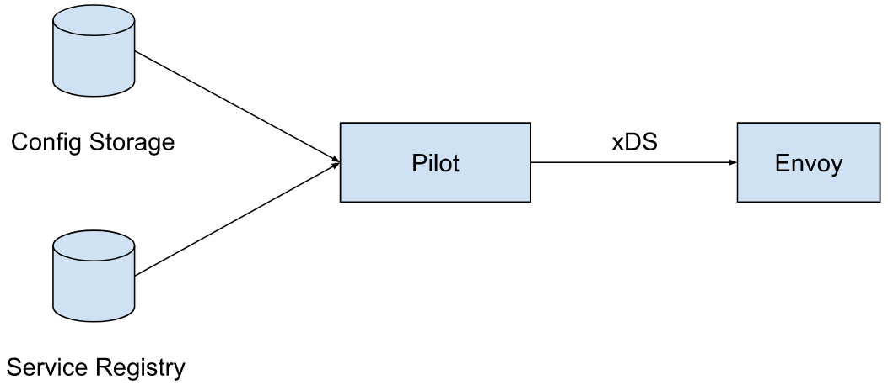
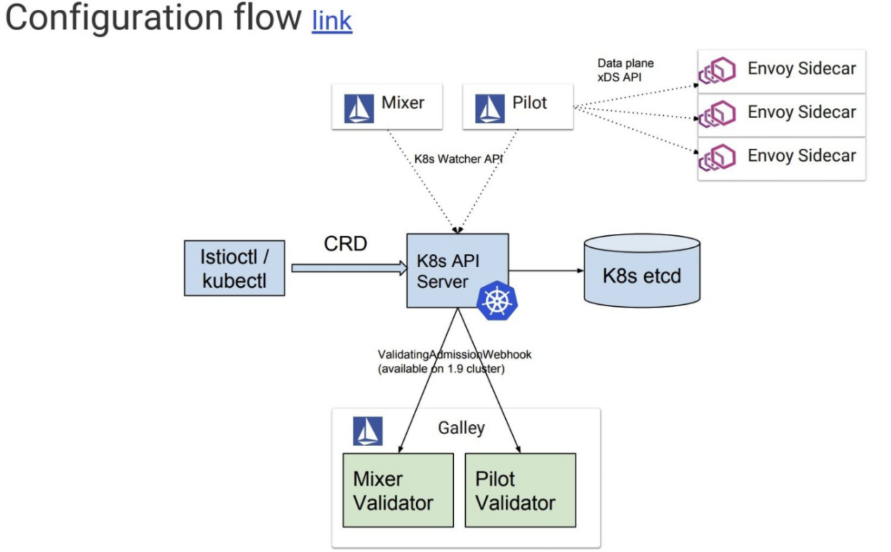
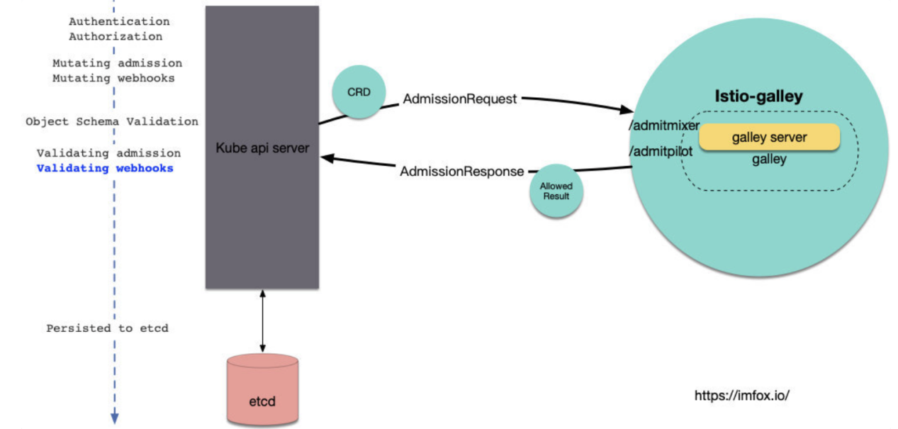

# 架构演进

## istio1.1 架构

Istio 服务网格逻辑上分为数据平面和控制平面。

* 数据平面由一组以 sidecar 方式部署的智能代理（Envoy）组成。这些代理可以调节和控制微服务及 Mixer 之间所有的网络通信。

* 控制平面负责管理和配置代理来路由流量。此外控制平面配置 Mixer 以实施策略和收集遥测数据。


### Envoy

Istio 使用 Envoy 代理的扩展版本，Envoy 是以 C++ 开发的高性能代理，用于调解服务网格中所有服务的所有入站和出站流量。Envoy 的许多内置功能被 Istio 发扬光大，例如：

* 动态服务发现
* 负载均衡
* TLS 终止
* HTTP/2 & gRPC 代理
* 熔断器
* 健康检查、基于百分比流量拆分的灰度发布
* 故障注入
* 丰富的度量指标

### Mixer

Mixer 是一个独立于平台的组件，负责在服务网格上执行访问控制和使用策略，并从 Envoy 代理和其他服务收集遥测数据。代理提取请求级属性，发送到 Mixer 进行评估。有关属性提取和策略评估的更多信息，请参见 Mixer 配置。

Mixer 中包括一个灵活的插件模型，使其能够接入到各种主机环境和基础设施后端，从这些细节中抽象出 Envoy 代理和 Istio 管理的服务。

### Pilot

Pilot 为 Envoy sidecar 提供服务发现功能，为智能路由（例如 A/B 测试、金丝雀部署等）和弹性（超时、重试、熔断器等）提供流量管理功能。它将控制流量行为的高级路由规则转换为特定于 Envoy 的配置，并在运行时将它们传播到 sidecar。

Pilot 将平台特定的服务发现机制抽象化并将其合成为符合 Envoy 数据平面 API 的任何 sidecar 都可以使用的标准格式。这种松散耦合使得 Istio 能够在多种环境下运行（例如，Kubernetes、Consul、Nomad），同时保持用于流量管理的相同操作界面。

### Citadel

Citadel 通过内置身份和凭证管理赋能强大的服务间和最终用户身份验证。可用于升级服务网格中未加密的流量，并为运维人员提供基于服务标识而不是网络控制的强制执行策略的能力。从 0.5 版本开始，Istio 支持基于角色的访问控制，以控制谁可以访问您的服务，而不是基于不稳定的三层或四层网络标识。

### Galley

Galley 代表其他的 Istio 控制平面组件，用来验证用户编写的 Istio API 配置。随着时间的推移，Galley 将接管 Istio 获取配置、处理和分配组件的顶级责任。它将负责将其他的 Istio 组件与从底层平台（例如 Kubernetes）获取用户配置的细节中隔离开来。

## istio1.5 架构


# 组件深度剖析

## Pilot

Pilot将服务信息和配置数据转换为xDS接口的标准数据结构，通过gRPC下发到数据面的Envoy。如果把Pilot看成一个处理数据的黑盒，则其有两个输入，一个输出：



目前Pilot的输入包括两部分数据来源：

* 服务数据： 来源于各个服务注册表(Service Registry)，例如Kubernetes中注册的Service，Consul Catalog中的服务等。
* 配置规则： 各种配置规则，包括路由规则及流量管理规则等，通过Kubernetes CRD(Custom Resources Definition)形式定义并存储在Kubernetes中。

Pilot的输出为符合xDS接口的数据面配置数据，并通过gRPC Streaming接口将配置数据推送到数据面的Envoy中。

### Config Controller

Config Controller用于管理各种配置数据，包括用户创建的流量管理规则和策略。Istio目前支持三种类型的Config Controller：

* Kubernetes：使用Kubernetes来作为配置数据的存储，该方式直接依附于Kubernetes强大的CRD机制来存储配置数据，简单方便，是Istio最开始使用的配置存储方案。
* MCP (Mesh Configuration Protocol)：使用Kubernetes来存储配置数据导致了Istio和Kubernetes的耦合，限制了Istio在非Kubernetes环境下的运用。为了解决该耦合，Istio社区提出了MCP，MCP定义了一个向Istio控制面下发配置数据的标准协议，Istio Pilot作为MCP Client，任何实现了MCP协议的Server都可以通过MCP协议向Pilot下发配置，从而解除了Istio和Kubernetes的耦合。如果想要了解更多关于MCP的内容，请参考文后的链接。
* Memory：一个在内存中的Config Controller实现，主要用于测试。

目前Istio的配置包括：

* Virtual Service: 定义流量路由规则。
* Destination Rule: 定义和一个服务或者subset相关的流量处理规则，包括负载均衡策略，连接池大小，断路器设置，subset定义等等。
* Gateway: 定义入口网关上对外暴露的服务。
* Service Entry: 通过定义一个Service Entry可以将一个外部服务手动添加到服务网格中。
* Envoy Filter: 通过Pilot在Envoy的配置中添加一个自定义的Filter。

### Service Controller

Service Controller用于管理各种Service Registry，提出服务发现数据，目前Istio支持的Service Registry包括：

* Kubernetes：对接Kubernetes Registry，可以将Kubernetes中定义的Service和Instance采集到Istio中。
* Consul： 对接Consul Catalog，将Consul中定义的Service采集到Istio中。
* MCP： 和MCP config controller类似，从MCP Server中获取Service和Service Instance。
* Memory： 一个内存中的Service Controller实现，主要用于测试。

### Discovery Service

Discovery Service中主要包含下述逻辑：

* 启动gRPC Server并接收来自Envoy端的连接请求。
* 接收Envoy端的xDS请求，从Config Controller和Service Controller中获取配置和服务信息，生成响应消息发送给Envoy。
* 监听来自Config Controller的配置变化消息和来自Service Controller的服务变化消息，并将配置和服务变化内容通过xDS接口推送到Envoy。（备注：目前Pilot未实现增量变化推送，每次变化推送的是全量配置，在网格中服务较多的情况下可能会有性能问题）。

**创建gRPC Server并接收Envoy的连接请求**

Pilot Server创建了一个gRPC Server，用于监听和接收来自Envoy的xDS请求。pilot/pkg/proxy/envoy/v2/ads.go 中的 DiscoveryServer.StreamAggregatedResources方法被注册为gRPC Server的服务处理方法。

当gRPC Server收到来自Envoy的连接时，会调用DiscoveryServer.StreamAggregatedResources方法，在该方法中创建一个XdsConnection对象，并开启一个goroutine从该connection中接收客户端的xDS请求并进行处理；如果控制面的配置发生变化，Pilot也会通过该connection把配置变化主动推送到Envoy端。

**配置变化后向Envoy推送更新**

这是Pilot中最复杂的一个业务流程，主要是因为代码中采用了多个channel和queue对变化消息进行合并和转发。该业务流程如下：

* Config Controller或者Service Controller在配置或服务发生变化时通过回调方法通知Discovery Server，Discovery Server将变化消息放入到Push Channel中。
* Discovery Server通过一个goroutine从Push Channel中接收变化消息，将一段时间内连续发生的变化消息进行合并。如果超过指定时间没有新的变化消息，则将合并后的消息加入到一个队列Push Queue中。
* 另一个goroutine从Push Queue中取出变化消息，生成XdsEvent，发送到每个客户端连接的Push Channel中。
* 在DiscoveryServer.StreamAggregatedResources方法中从Push Channel中取出XdsEvent，然后根据上下文生成符合xDS接口规范的DiscoveryResponse，通过gRPC推送给Envoy端。（gRPC会为每个client连接单独分配一个goroutine来进行处理，因此不同客户端连接的StreamAggregatedResources处理方法是在不同goroutine中处理的）

**响应Envoy主动发起的xDS请求**

Pilot和Envoy之间建立的是一个双向的Streaming gRPC服务调用，因此Pilot可以在配置变化时向Envoy推送，Envoy也可以主动发起xDS调用请求获取配置。Envoy主动发起xDS请求的流程如下：

* Envoy通过创建好的gRPC连接发送一个DiscoveryRequest
* Discovery Server通过一个goroutine从XdsConnection中接收来自Envoy的DiscoveryRequest，并将请求发送到ReqChannel中
* Discovery Server的另一个goroutine从ReqChannel中接收DiscoveryRequest，根据上下文生成符合xDS接口规范的DiscoveryResponse，然后返回给Envoy。

## Galley

### Galley 架构

早期的Galley 仅仅负责对「配置」进行运行时验证, istio 控制面各个组件各组去list/watch 各自关注的「配置」。



越来越多且复杂的「配置」给istio 用户带来了诸多不便, 主要体现在:

* 「配置」的缺乏统一管理, 组件各自订阅, 缺乏统一回滚机制, 配置问题难以定位
* 「配置」可复用度低, 比如在1.1之前, 每个mixer adpater 就需要定义个新的CRD
* 「配置」的隔离, ACL 控制, 一致性, 抽象程度, 序列化等等问题都还不太令人满意

随着istio功能的演进, 可预见的istio CRD数量还会继续增加, 社区计划将Galley 强化为istio 「配置」控制层, Galley 除了继续提供「配置」验证功能外, 还将提供配置管理流水线, 包括输入, 转换, 分发, 以及适合istio控制面的「配置」分发协议(MCP)。

### Galley validate

Galley 使用了k8s提供的另一个Admission Webhooks: ValidatingWebhook, 来做配置的验证:



istio 需要一个关于ValidatingWebhook的配置项, 用于告诉k8s api server, 哪些crd应该发往哪个服务的哪个接口去做验证, 该配置名为istio-galley, 简化的内容如下:

```CLI
$ kubectl get ValidatingWebhookConfiguration istio-galley -oyaml

apiVersion: admissionregistration.k8s.io/v1beta1
kind: ValidatingWebhookConfiguration
metadata:
  name: istio-galley
webhooks:- clientConfig:
  ......
    service:
      name: istio-galley
      namespace: istio-system
      path: /admitpilot
  failurePolicy: Fail
  name: pilot.validation.istio.io
  rules:
  ...pilot关注的CRD...
    - gateways
    - virtualservices
  ......  
- clientConfig:
  ......
    service:
      name: istio-galley
      namespace: istio-system
      path: /admitmixer
  name: mixer.validation.istio.io
  rules:
  ...mixer关注的CRD...
    - rules
    - metrics
  ......  
```

可以看到, 该配置将pilot和mixer关注的CRD, 分别发到了服务istio-galley的/admitpilot和/admitmixer, 在Galley 源码中可以很容易找到这2个path Handler的入口。

### MCP 协议

MCP 提供了一套配置订阅和分发的API, 在MCP中, 可以抽象以下模型:

* source: 「配置」的提供端, 在Istio中Galley 即是source
* sink: 「配置」的消费端, 在isito中典型的sink包括Pilot和Mixer组件
* resource: source和sink关注的资源体, 也就是isito中的「配置」

当sink和source之间建立了对某些resource的订阅和分发关系后, source 会将指定resource的变化信息推送给sink, sink端可以选择接受或者不接受resource更新(比如格式错误的情况), 并对应返回ACK/NACK 给source端。

MCP 提供了gRPC 的实现, 其中包括2个services: ResourceSource 和 ResourceSink, 通常情况下, source 会作为 gRPC的server 端, 提供ResourceSource服务, sink 作为 gRPC的客户端, sink主动发起请求连接source; 不过有的场景下, source 会作为gRPC的client端, sink作为gRPC的server端提供ResourceSink服务, source主动发起请求连接sink。

以上2个服务, 内部功能逻辑都是一致的, 都是sink需要订阅source管理的resource, 区别仅仅是哪端主动发起的连接请求。

具体到istio的场景中:

* 在单k8s集群的istio mesh中, Galley默认实现了ResourceSource service, Pilot和Mixer会作为该service的client主动连接Galley进行配置订阅。
* Galley 可以配置去主动连接远程的其他sink, 比如说在多k8s集群的mesh中, 主集群中的Galley可以为多个集群的Pilot/Mixer提供配置管理, 跨集群的Pilot/Mixer无法主动连接主集群Galley, 这时候Galley就可以作为gRPC的client 主动发起连接, 跨集群的Pilot/Mixer作为gRPC server 实现ResourceSink服务。


## pilot-agent

pilot-agent跟envoy打包在同一个docker镜像里，镜像由Dockerfile.proxy定义。Makefile（include了tools/istio-docker.mk）把这个dockerfile build成了${HUB}/proxy:${TAG}镜像，也就是Kubernetes里跟应用放在同一个pod下的sidecar。非Kubernetes情况下需要把pilot-agent、envoy跟应用部署在一起，这个就有点“污染”应用的意思了。

在proxy镜像中，pilot-agent负责的工作包括：

* 生成envoy的配置
* 启动envoy
* 监控并管理envoy的运行状况，比如envoy出错时pilot-agent负责重启envoy，或者envoy配置变更后reload envoy

### 生成envoy配置

envoy的配置主要在pilot-agent的init方法与proxy命令处理流程的前半部分生成。其中init方法为pilot-agent二进制的命令行配置大量的flag与flag默认值，而proxy命令处理流程的前半部分负责将这些flag组装成为envoy的配置ProxyConfig对象。

**role**

pilot-agent有三种运行模式：

* “sidecar” 默认值，可以在启动pilot-agent，调用proxy命令时覆盖。Sidecar type is used for sidecar proxies in the application containers
* “ingress” Ingress type is used for cluster ingress proxies
* “router” Router type is used for standalone proxies acting as L7/L4 routers

**服务注册中心（service registry）**


