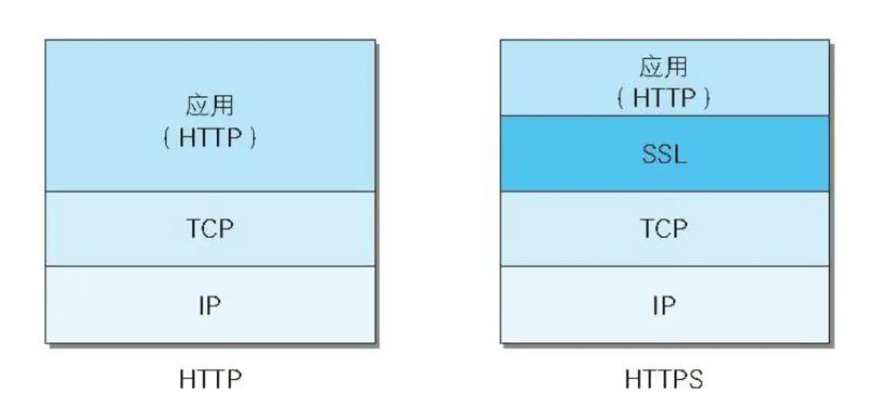

# 基本概念

## 公钥和私钥

**私钥加密算法 == 对称加密算法**

这种算法解密密钥和加密密钥是相同的，正是因为同一个密钥既用于加密又用于解密，所以密钥不能公开。

常见的对称加密算法有：AES、DES、3DES。

**公钥算法 == 非对称加密算法**

1. 公钥私钥成对出现
2. 公钥加密的数据只有对应的私钥能解，私钥加密的数据只有对应的公钥能解

常见的非对称加密算法有：RSA、DSA、ECC。

## 数字摘要

发送者的信息经过hash算法计算得到的digest摘要，数字摘要是HTTPS能确保数据的完整性和防篡改的根本原因。

## 数字签名
对传送数据生成摘要并使用私钥进行加密的过程就是生成了数字签名的过程，数字签名只能验证数据的完整性，数据本身是否加密不属于数字签名的控制范围。

数字签名有两种作用：

1. 确定消息是由发送方签名并发出来的
2. 确定消息的完整性

# TLS 证书生成和使用

**1. 生成 CA 私钥以及证书**

```CLI
# 生成 CA 私钥 ca.key.pem
openssl genrsa -out ca.key.pem 4096

# 生成 CA 证书 ca.cert.pem
openssl req -key ca.key.pem -new -x509 -days 7300 -sha256 -out ca.cert.pem -subj /CN=ca -extensions v3_ca
```

**2. 生成 Server 私钥及证书**

```CLI
# 生成 server 私钥 server.key.pem，命令方法同CA私钥
openssl genrsa -out server.key.pem 2048

# 生成 server 证书配置文件 server.cnf
cat <<EOF >  server.cnf
[ req ]
default_bits       = 2048
distinguished_name = req_distinguished_name
req_extensions     = req_ext
[ req_distinguished_name ]
[ req_ext ]
basicConstraints = CA:FALSE
subjectAltName = @alt_names
[ alt_names ]
DNS.1   = localhost
DNS.2   = *test-server-001
IP.1    = 127.0.0.1
EOF
# 生成 server 证书请求文件 server.csr.pem
openssl req -key server.key.pem -new -sha256 -out server.csr.pem -subj /CN=server -config server.cnf

# 生成 server 证书 server.cert.pem，公钥使用CA签发
openssl x509 -req -CA ca.cert.pem -CAkey ca.key.pem -CAcreateserial -in server.csr.pem -out server.cert.pem -days 365 -extensions req_ext -extfile server.cnf
```

**3. 生成 Client 私钥及证书**

```CLI
# 生成 client 私钥 client.key.pem
openssl genrsa -out client.key.pem 2048
# 生成 client 证书请求文件 client.csr.pem
openssl req -key client.key.pem -new -sha256 -out client.csr.pem -subj /CN=client
# 生成 client 证书 client.cert.pem，公钥使用CA签发
openssl x509 -req -CA ca.cert.pem -CAkey ca.key.pem -CAcreateserial -in client.csr.pem -out client.cert.pem -days 365
```

# HTTPS原理

由于HTTP 协议通信的不安全性，所以人们为了防止信息在传输过程中遭到泄漏或者篡改，就想出来对传输通道进行加密的方式https。https 是一种加密的超文本传输协议，它与HTTP 在协议差异在于对数据传输的过程中，https 对数据做了完全加密。由于http 协议或者https协议都是处于TCP 传输层之上，同时网络协议又是一个分层的结构，所以在tcp 协议层之上增加了一层SSL（Secure Socket Layer，安全层）或者TLS（Transport Layer Security） 安全层传输协议组合使用用于构造加密通道。



## HTTPS请求流程


流程说明：

1. 客户端访问：https://www.z.com，客户端主要向服务器提供以下信息：
  * 支持的协议版本，比如TLS 1.0版。
  * 一个客户端生成的随机数，稍后用于生成"对话密钥"。
  * 支持的加密方法，比如RSA公钥加密。
  * 支持的压缩方法。
2. https的监听端口是443端口，比如nginx服务器，nginx.conf 会有如下配置（简略配置）

```CLI
server
{
  listen 443;   # https 监听的是?443端口
  server_name www.z.com;

  ssl on;
  ssl_session_cache shared:SSL:10m;
  ssl_session_timeout 10m;

  ssl_certificate /etc/nginx/ssl_key/z.crt.crt;  # 公钥
  ssl_certificate_key /etc/nginx/ssl_key/z.crt.key;  # 私钥
}
```
nginx 会根据上面配置的ssl_certificate 的路径?/etc/nginx/ssl_key/z.crt.crt 找到www.z.com 域名证书的公钥，将公钥返回给客户端，以及其他信息：
  * 确认使用的加密通信协议版本，比如TLS 1.0版本。如果浏览器与服务器支持的版本不一致，服务器关闭加密通信。
  * 一个服务器生成的随机数，稍后用于生成"对话密钥"。
  * 确认使用的加密方法，比如RSA公钥加密。
3. 客户端接收到公钥后，会对公钥内容进行解析，校验，证书的验证过程如下：
  * CA机构在签发证书的时候，都会使用自己的私钥对证书进行签名，如果我们使用的是购买的证书，那么很有可能，颁发这个证书的CA机构的公钥已经预置在操作系统中。这样浏览器就可以使用CA机构的公钥对服务器的证书进行验签，验签之后得到的是CA机构使用sha256得到的证书摘要，客户端就会对服务器发送过来的证书使用sha256进行哈希计算得到一份摘要，然后对比之前由CA得出来的摘要，就可以知道这个证书是不是正确的，是否被修改过。
4. 校验通过后，客户端会随机生成一个randomKey（随机秘钥）
5. 客户端再使用z.crt.crt中的公钥，对?randomKey 进行加密，将加密后的内容发送给服务端
  * 编码改变通知，表示随后的信息都将用双方商定的加密方法和密钥发送。
  * 客户端握手结束通知，表示客户端的握手阶段已经结束。这一项同时也是前面发送的所有内容的hash值，用来供服务器校验
6. 服务端接收报文后，使用z.crt.key 中的私钥，对加密的内容的进行解密，然后得到?randomKey?
7. 这时，服务端会将请求域名的响应结果，使用?randomKey? 进行加密，返回客户端
  * 编码改变通知，表示随后的信息都将用双方商定的加密方法和密钥发送。
  * 服务器握手结束通知，表示服务器的握手阶段已经结束。这一项同时也是前面发送的所有内容的hash值，用来供客户端校验。
8. 客户端对服务端的加密报文使用randomKey?解密，然后就可以展示在浏览器上