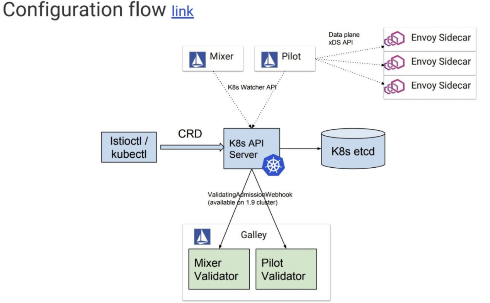
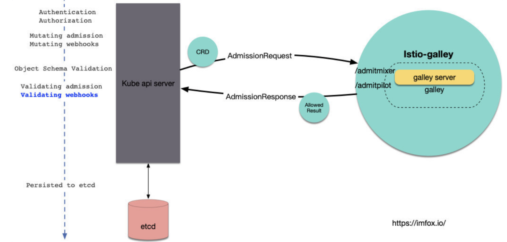

# 架构演进

## istio1.1 架构

Istio 服务网格逻辑上分为数据平面和控制平面。

* 数据平面由一组以 sidecar 方式部署的智能代理（Envoy）组成。这些代理可以调节和控制微服务及 Mixer 之间所有的网络通信。

* 控制平面负责管理和配置代理来路由流量。此外控制平面配置 Mixer 以实施策略和收集遥测数据。


### Envoy

Istio 使用 Envoy 代理的扩展版本，Envoy 是以 C++ 开发的高性能代理，用于调解服务网格中所有服务的所有入站和出站流量。Envoy 的许多内置功能被 Istio 发扬光大，例如：

* 动态服务发现
* 负载均衡
* TLS 终止
* HTTP/2 & gRPC 代理
* 熔断器
* 健康检查、基于百分比流量拆分的灰度发布
* 故障注入
* 丰富的度量指标

### Mixer

Mixer 是一个独立于平台的组件，负责在服务网格上执行访问控制和使用策略，并从 Envoy 代理和其他服务收集遥测数据。代理提取请求级属性，发送到 Mixer 进行评估。有关属性提取和策略评估的更多信息，请参见 Mixer 配置。

Mixer 中包括一个灵活的插件模型，使其能够接入到各种主机环境和基础设施后端，从这些细节中抽象出 Envoy 代理和 Istio 管理的服务。

### Pilot

Pilot 为 Envoy sidecar 提供服务发现功能，为智能路由（例如 A/B 测试、金丝雀部署等）和弹性（超时、重试、熔断器等）提供流量管理功能。它将控制流量行为的高级路由规则转换为特定于 Envoy 的配置，并在运行时将它们传播到 sidecar。

Pilot 将平台特定的服务发现机制抽象化并将其合成为符合 Envoy 数据平面 API 的任何 sidecar 都可以使用的标准格式。这种松散耦合使得 Istio 能够在多种环境下运行（例如，Kubernetes、Consul、Nomad），同时保持用于流量管理的相同操作界面。

### Citadel

Citadel 通过内置身份和凭证管理赋能强大的服务间和最终用户身份验证。可用于升级服务网格中未加密的流量，并为运维人员提供基于服务标识而不是网络控制的强制执行策略的能力。从 0.5 版本开始，Istio 支持基于角色的访问控制，以控制谁可以访问您的服务，而不是基于不稳定的三层或四层网络标识。

### Galley

Galley 代表其他的 Istio 控制平面组件，用来验证用户编写的 Istio API 配置。随着时间的推移，Galley 将接管 Istio 获取配置、处理和分配组件的顶级责任。它将负责将其他的 Istio 组件与从底层平台（例如 Kubernetes）获取用户配置的细节中隔离开来。

## istio1.5 架构


# 组件深度剖析

## galley

### galley 架构

早期的Galley 仅仅负责对「配置」进行运行时验证, istio 控制面各个组件各组去list/watch 各自关注的「配置」。



越来越多且复杂的「配置」给istio 用户带来了诸多不便, 主要体现在:

* 「配置」的缺乏统一管理, 组件各自订阅, 缺乏统一回滚机制, 配置问题难以定位
* 「配置」可复用度低, 比如在1.1之前, 每个mixer adpater 就需要定义个新的CRD
* 「配置」的隔离, ACL 控制, 一致性, 抽象程度, 序列化等等问题都还不太令人满意

随着istio功能的演进, 可预见的istio CRD数量还会继续增加, 社区计划将Galley 强化为istio 「配置」控制层, Galley 除了继续提供「配置」验证功能外, 还将提供配置管理流水线, 包括输入, 转换, 分发, 以及适合istio控制面的「配置」分发协议(MCP)。

### galley validate

Galley 使用了k8s提供的另一个Admission Webhooks: ValidatingWebhook, 来做配置的验证:



istio 需要一个关于ValidatingWebhook的配置项, 用于告诉k8s api server, 哪些crd应该发往哪个服务的哪个接口去做验证, 该配置名为istio-galley, 简化的内容如下:

```CLI
$ kubectl get ValidatingWebhookConfiguration istio-galley -oyaml

apiVersion: admissionregistration.k8s.io/v1beta1
kind: ValidatingWebhookConfiguration
metadata:
  name: istio-galley
webhooks:- clientConfig:
  ......
    service:
      name: istio-galley
      namespace: istio-system
      path: /admitpilot
  failurePolicy: Fail
  name: pilot.validation.istio.io
  rules:
  ...pilot关注的CRD...
    - gateways
    - virtualservices
  ......  
- clientConfig:
  ......
    service:
      name: istio-galley
      namespace: istio-system
      path: /admitmixer
  name: mixer.validation.istio.io
  rules:
  ...mixer关注的CRD...
    - rules
    - metrics
  ......  
```

可以看到, 该配置将pilot和mixer关注的CRD, 分别发到了服务istio-galley的/admitpilot和/admitmixer, 在Galley 源码中可以很容易找到这2个path Handler的入口。

### MCP 协议

MCP 提供了一套配置订阅和分发的API, 在MCP中, 可以抽象以下模型:

* source: 「配置」的提供端, 在Istio中Galley 即是source
* sink: 「配置」的消费端, 在isito中典型的sink包括Pilot和Mixer组件
* resource: source和sink关注的资源体, 也就是isito中的「配置」

当sink和source之间建立了对某些resource的订阅和分发关系后, source 会将指定resource的变化信息推送给sink, sink端可以选择接受或者不接受resource更新(比如格式错误的情况), 并对应返回ACK/NACK 给source端。

MCP 提供了gRPC 的实现, 其中包括2个services: ResourceSource 和 ResourceSink, 通常情况下, source 会作为 gRPC的server 端, 提供ResourceSource服务, sink 作为 gRPC的客户端, sink主动发起请求连接source; 不过有的场景下, source 会作为gRPC的client端, sink作为gRPC的server端提供ResourceSink服务, source主动发起请求连接sink。

以上2个服务, 内部功能逻辑都是一致的, 都是sink需要订阅source管理的resource, 区别仅仅是哪端主动发起的连接请求。

具体到istio的场景中:

* 在单k8s集群的istio mesh中, Galley默认实现了ResourceSource service, Pilot和Mixer会作为该service的client主动连接Galley进行配置订阅。
* Galley 可以配置去主动连接远程的其他sink, 比如说在多k8s集群的mesh中, 主集群中的Galley可以为多个集群的Pilot/Mixer提供配置管理, 跨集群的Pilot/Mixer无法主动连接主集群Galley, 这时候Galley就可以作为gRPC的client 主动发起连接, 跨集群的Pilot/Mixer作为gRPC server 实现ResourceSink服务。


