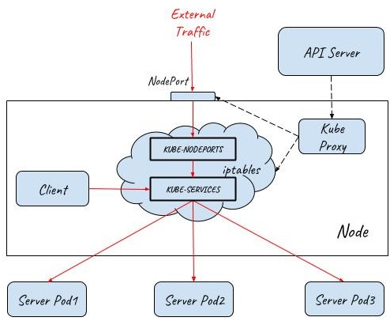

# Internal communication

## K8S ClusterIP

Kubernetes以Pod作为应用部署的最小单位。kubernetes会根据Pod的声明对其进行调度，包括创建、销毁、迁移、水平伸缩等，因此Pod 的IP地址不是固定的，不方便直接采用Pod IP对服务进行访问。

为解决该问题，Kubernetes提供了Service资源，Service对提供同一个服务的多个Pod进行聚合。一个Service提供一个虚拟的Cluster IP，后端对应一个或者多个提供服务的Pod。在集群中访问该Service时，采用Cluster IP即可，Kube-proxy负责将发送到Cluster IP的请求转发到后端的Pod上。

## Istio Sidecar Proxy

Cluster IP解决了服务之间相互访问的问题，但从上面Kube-proxy的三种模式可以看到，Cluster IP的方式只提供了服务发现和基本的LB功能。如果要为服务间的通信应用灵活的路由规则以及提供Metrics collection，distributed tracing等服务管控功能,就必须得依靠Istio提供的服务网格能力了。

在Kubernetes中部署Istio后，Istio通过iptables和Sidecar Proxy接管服务之间的通信，服务间的相互通信不再通过Kube-proxy，而是通过Istio的Sidecar Proxy进行。请求流程是这样的：Client发起的请求被iptables重定向到Sidecar Proxy，Sidecar Proxy根据从控制面获取的服务发现信息和路由规则，选择一个后端的Server Pod创建链接，代理并转发Client的请求。

Istio Sidecar Proxy和Kube-proxy的userspace模式的工作机制类似，都是通过在用户空间的一个代理来实现客户端请求的转发和后端多个Pod之间的负载均衡。两者的不同点是：Kube-Proxy工作在四层，而Sidecar Proxy则是一个七层代理，可以针对HTTP，GRPS等应用层的语义进行处理和转发，因此功能更为强大，可以配合控制面实现更为灵活的路由规则和服务管控功能。

# External communication

## K8S NodePort

Kubernetes的Pod IP和Cluster IP都只能在集群内部访问，而我们通常需要从外部网络上访问集群中的某些服务，Kubernetes提供了NodePort来为集群提供外部流量入口。

NodePort在集群中的每个主机节点上为Service提供一个代理端口，以允许从主机网络上对Service进行访问。

## K8S LoadBalance

NodePort提供了一种从外部网络访问Kubernetes集群内部Service的方法，但该方法存在下面一些限制，导致这种方式主要适用于程序开发，不适合用于产品部署。

* Kubernetes cluster host的IP必须是一个well-known IP，即客户端必须知道该IP。但Cluster中的host是被作为资源池看待的，可以增加删除，每个host的IP一般也是动态分配的，因此并不能认为host IP对客户端而言是well-known IP。
* 客户端访问某一个固定的host IP的方式存在单点故障。假如一台host宕机了，kubernetes cluster会把应用 reload到另一节点上，但客户端就无法通过该host的nodeport访问应用了。
* 通过一个主机节点作为网络入口，在网络流量较大时存在性能瓶颈。

为了解决这些问题，Kubernetes提供了LoadBalancer。通过将Service定义为LoadBalancer类型，Kubernetes在主机节点的NodePort前提供了一个四层的负载均衡器。该四层负载均衡器负责将外部网络流量分发到后面的多个节点的NodePort端口上。

下图展示了Kubernetes如何通过LoadBalancer方式对外提供流量入口，图中LoadBalancer后面接入了两个主机节点上的NodePort，后端部署了三个Pod提供服务。根据集群的规模，可以在LoadBalancer后面可以接入更多的主机节点，以进行负荷分担。

## K8S Ingress

LoadBalancer类型的Service提供的是四层负载均衡器，当只需要向外暴露一个服务的时候，采用这种方式是没有问题的。但当一个应用需要对外提供多个服务时，采用该方式则要求为每一个四层服务（IP+Port）都创建一个外部load balancer。

一般来说，同一个应用的多个服务/资源会放在同一个域名下，在这种情况下，创建多个Load balancer是完全没有必要的，反而带来了额外的开销和管理成本。另外直接将服务暴露给外部用户也会导致了前端和后端的耦合，影响了后端架构的灵活性，如果以后由于业务需求对服务进行调整会直接影响到客户端。为了解决该问题，可以通过使用Kubernetes Ingress来作为网络入口。

Kubernetes Ingress声明了一个应用层（OSI七层）的负载均衡器，可以根据HTTP请求的内容将来自同一个TCP端口的请求分发到不同的Kubernetes Service，其功能包括：

* 按HTTP请求的URL进行路由：同一个TCP端口进来的流量可以根据URL路由到Cluster中的不同服务
* 按HTTP请求的Host进行路由：同一个IP进来的流量可以根据HTTP请求的Host路由到Cluster中的不同服务

V流量从外部网络到达Pod的完整路径如下：

1. 外部请求先通过四层Load Balancer进入内部网络
2. Load Balancer将流量分发到后端多个主机节点上的NodePort (userspace转发)
3. 请求从NodePort进入到Ingress Controller (iptabes规则，Ingress Controller本身是一个NodePort类型的Service)
4. Ingress Controller根据Ingress rule进行七层分发，根据HTTP的URL和Host将请求分发给不同的Service (userspace转发)
5. Service将请求最终导入到后端提供服务的Pod中 (iptabes规则)

在0.8版本以前，Istio缺省采用K8s Ingress来作为Service Mesh的流量入口。K8s Ingress统一了应用的流量入口，但存在两个问题：

K8s Ingress是独立在Istio体系之外的，需要单独采用Ingress rule进行配置，导致系统入口和内部存在两套互相独立的路由规则配置，运维和管理较为复杂。

K8s Ingress rule的功能较弱，不能在入口处实现和网格内部类似的路由规则，也不具备网格sidecar的其它能力，导致难以从整体上为应用系统实现灰度发布、分布式跟踪等服务管控功能。

## Istio Gateway

Istio社区意识到了Ingress和Mesh内部配置割裂的问题，因此从0.8版本开始，社区采用了 Gateway 资源代替K8s Ingress来表示流量入口。

Istio Gateway资源本身只能配置L4-L6的功能，例如暴露的端口，TLS设置等；但Gateway可以和绑定一个VirtualService，在VirtualService 中可以配置七层路由规则，这些七层路由规则包括根据按照服务版本对请求进行导流，故障注入，HTTP重定向，HTTP重写等所有Mesh内部支持的路由规则。

Gateway和VirtualService用于表示Istio Ingress的配置模型，Istio Ingress的缺省实现则采用了和Sidecar相同的Envoy proxy。

通过该方式，Istio控制面用一致的配置模型同时控制了入口网关和内部的sidecar代理。这些配置包括路由规则，策略检查、Telementry收集以及其他服务管控功能。

## API Gateway

采用Gateway和VirtualService实现的Istio Ingress Gateway提供了网络入口处的基础通信功能，包括可靠的通信和灵活的路由规则。但对于一个服务化应用来说，网络入口除了基础的通讯功能之外，还有一些其他的应用层功能需求，例如：

* 第三方系统对API的访问控制
* 用户对系统的访问控制
* 修改请求/返回数据
* 服务API的生命周期管理
* 服务访问的SLA、限流及计费

API Gateway需求中很大一部分需要根据不同的应用系统进行定制，目前看来暂时不大可能被纳入K8s Ingress或者Istio Gateway的规范之中。为了满足这些需求，涌现出了各类不同的k8s Ingress Controller以及Istio Ingress Gateway实现，包括Ambassador ，Kong, Traefik,Solo等。

这些网关产品在实现在提供基础的K8s Ingress能力的同时，提供了强大的API Gateway功能，但由于缺少统一的标准，这些扩展实现之间相互之间并不兼容。而且遗憾的是，目前这些Ingress controller都还没有正式提供和Istio 控制面集成的能力。

## API Gateway + Sidecar Proxy

在目前难以找到一个同时具备API Gateway和Isito Ingress能力的网关的情况下，一个可行的方案是使用API Gateway和Sidecar Proxy一起为服务网格提供外部流量入口。

由于API Gateway已经具备七层网关的功能，Mesh Ingress中的Sidecar只需要提供VirtualService资源的路由能力，并不需要提供Gateway资源的网关能力，因此采用Sidecar Proxy即可。网络入口处的Sidecar Proxy和网格内部应用Pod中Sidecar Proxy的唯一一点区别是：该Sidecar只接管API Gateway向Mesh内部的流量，并不接管外部流向API Gateway的流量；而应用Pod中的Sidecar需要接管进入应用的所有流量。

采用API Gateway和Sidecar Proxy一起作为服务网格的流量入口，既能够通过对网关进行定制开发满足产品对API网关的各种需求，又可以在网络入口处利用服务网格提供的灵活的路由能力和分布式跟踪，策略等管控功能，是服务网格产品入口网关的一个理想方案。

性能方面的考虑：从上图可以看到，采用该方案后，外部请求的处理流程在入口处增加了Sidecar Proxy这一跳，因此该方式会带来少量的性能损失，但该损失是完全可以接受的。

对于请求时延而言，在服务网格中，一个外部请求本来就要经过较多的代理和应用进程的处理，在Ingress处增加一个代理对整体的时延影响基本忽略不计，而且对于绝大多数应用来说，网络转发所占的时间比例本来就很小，99%的耗时都在业务逻辑。如果系统对于增加的该时延非常敏感，则建议重新考虑该系统是否需要采用微服务架构和服务网格。

对于吞吐量而言，如果入口处的网络吞吐量存在瓶颈，则可以通过对API Gateway + Sidecar Proxy组成的Ingress整体进行水平扩展，来对入口流量进行负荷分担，以提高网格入口的网络吞吐量。

