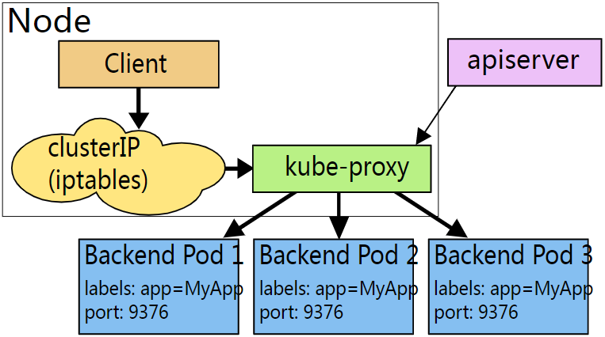
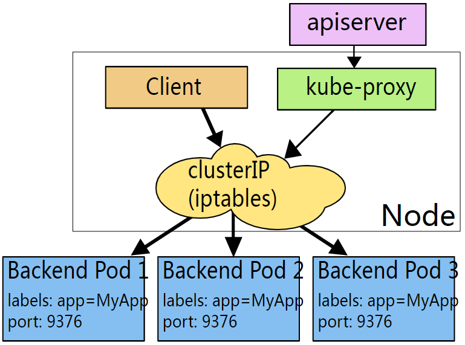
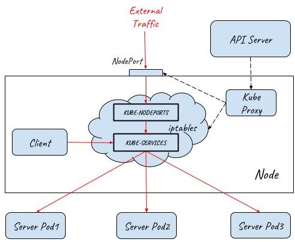
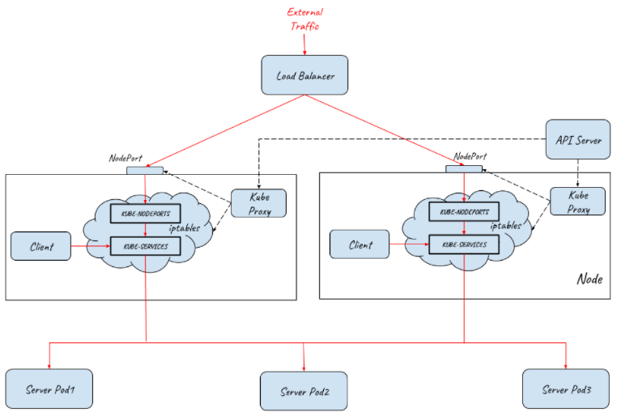
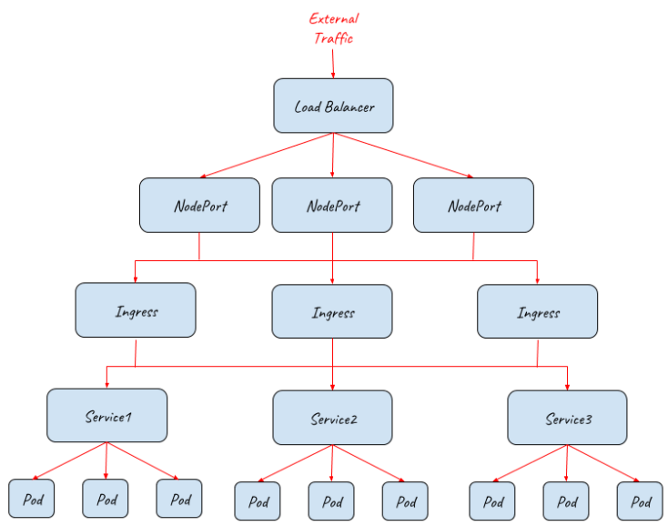
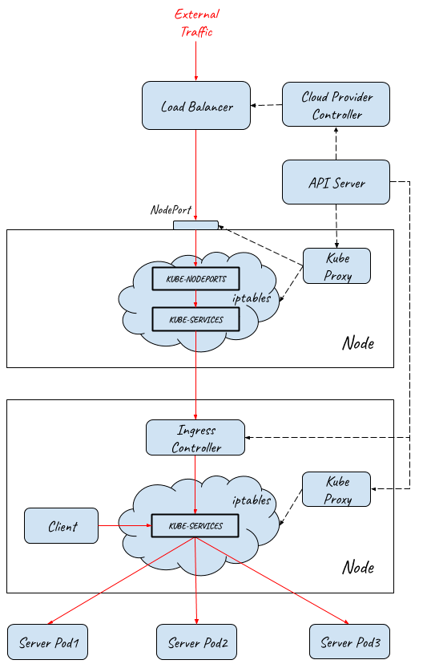

# Cluster IP

Kubernetes以Pod作为应用部署的最小单位。kubernetes会根据Pod的声明对其进行调度，包括创建、销毁、迁移、水平伸缩等，因此Pod 的IP地址不是固定的，不方便直接采用Pod IP对服务进行访问。

为解决该问题，Kubernetes提供了Service资源，Service对提供同一个服务的多个Pod进行聚合:

* 一个Service提供一个虚拟的Cluster IP，后端对应一个或者多个提供服务的Pod
* **在集群中**访问该Service时，采用Cluster IP即可，Kube-proxy负责将发送到Cluster IP的请求转发到后端的Pod上


## userspace

该模式下kube-proxy会为每一个Service创建一个监听端口。发向Cluster IP的请求被Iptables规则重定向到Kube-proxy监听的端口上，Kube-proxy根据LB算法选择一个提供服务的Pod并和其建立链接，以将请求转发到Pod上。

该模式下，Kube-proxy充当了一个四层Load balancer的角色。由于kube-proxy运行在userspace中，在进行转发处理时会增加两次内核和用户空间之间的数据拷贝，效率较另外两种模式低一些；好处是当后端的Pod不可用时，kube-proxy可以重试其他Pod。




## iptables

为了避免增加内核和用户空间的数据拷贝操作，提高转发效率，Kube-proxy提供了iptables模式。在该模式下，Kube-proxy为service后端的每个Pod创建对应的iptables规则，直接将发向Cluster IP的请求重定向到一个Pod IP。

该模式下Kube-proxy不承担四层代理的角色，只负责创建iptables规则。该模式的优点是较userspace模式效率更高，但不能提供灵活的LB策略，当后端Pod不可用时也无法进行重试。




## ipvs

该模式和iptables类似，kube-proxy监控Pod的变化并创建相应的ipvs rules。ipvs也是在kernel模式下通过netfilter实现的，但采用了hash table来存储规则，因此在规则较多的情况下，Ipvs相对iptables转发效率更高。除此以外，ipvs支持更多的LB算法。如果要设置kube-proxy为ipvs模式，必须在操作系统中安装IPVS内核模块。


# NodePort

Kubernetes的Pod IP和Cluster IP都只能在集群内部访问，而我们通常需要从外部网络上访问集群中的某些服务，Kubernetes提供了NodePort来为集群提供外部流量入口。

NodePort在**集群中的每个主机节点**上为Service提供一个代理端口，以允许从主机网络上对Service进行访问。


## NodePort资源

```CLI
# 创建service
master $ kubectl apply -f nodeport.yaml

# 查看服务
master $ kubectl get svc
NAME                   TYPE        CLUSTER-IP      EXTERNAL-IP   PORT(S)        AGE
kubernetes             ClusterIP   10.96.0.1       <none>        443/TCP        36m
webapp1-nodeport-svc   NodePort    10.103.188.73   <none>        80:30080/TCP   3m

# 查看服务pod
master $ kubectl get pod -o wide
NAME                                           READY     STATUS    RESTARTS   AGE       IPNODE      NOMINATED NODE
webapp1-nodeport-deployment-785989576b-cjc5b   1/1       Running   0          2m        10.32.0.3
webapp1-nodeport-deployment-785989576b-tpfqr   1/1       Running   0          2m        10.32.0.5
```


## NodePort原理

下面是Kube-proxy创建的相关iptables规则以及对应的说明。可以看到Kube-proxy为Nodeport创建了相应的IPtable规则，将发向30080这个主机端口上的流量重定向到了后端的两个Pod IP上。

```CLI
iptables-save > iptables-dump
# Generated by iptables-save v1.6.0 on Thu Mar 28 07:33:57 2019
*nat
# Nodeport规则链
:KUBE-NODEPORTS - [0:0]
# Service规则链
:KUBE-SERVICES - [0:0]
# Nodeport和Service共用的规则链
:KUBE-SVC-J2DWGRZTH4C2LPA4 - [0:0]
:KUBE-SEP-4CGFRVESQ3AECDE7 - [0:0]
:KUBE-SEP-YLXG4RMKAICGY2B3 - [0:0]

# 将host上30080端口的外部tcp流量转到KUBE-SVC-J2DWGRZTH4C2LPA4链
-A KUBE-NODEPORTS -p tcp -m comment --comment "default/webapp1-nodeport-svc:" -m tcp --dport 30080 -j KUBE-SVC-J2DWGRZTH4C2LPA4

#将发送到Cluster IP 10.103.188.73的内部流量转到KUBE-SVC-J2DWGRZTH4C2LPA4链
KUBE-SERVICES -d 10.103.188.73/32 -p tcp -m comment --comment "default/webapp1-nodeport-svc: cluster IP" -m tcp --dport 80 -j KUBE-SVC-J2DWGRZTH4C2LPA4

#将发送到webapp1-nodeport-svc的流量转交到第一个Pod（10.32.0.3）相关的规则链上，比例为50%
-A KUBE-SVC-J2DWGRZTH4C2LPA4 -m comment --comment "default/webapp1-nodeport-svc:" -m statistic --mode random --probability 0.50000000000 -j KUBE-SEP-YLXG4RMKAICGY2B3
#将发送到webapp1-nodeport-svc的流量转交到第二个Pod（10.32.0.5）相关的规则链上
-A KUBE-SVC-J2DWGRZTH4C2LPA4 -m comment --comment "default/webapp1-nodeport-svc:" -j KUBE-SEP-4CGFRVESQ3AECDE7

#将请求重定向到Pod 10.32.0.3
-A KUBE-SEP-YLXG4RMKAICGY2B3 -p tcp -m comment --comment "default/webapp1-nodeport-svc:" -m tcp -j DNAT --to-destination 10.32.0.3:80
#将请求重定向到Pod 10.32.0.5
-A KUBE-SEP-4CGFRVESQ3AECDE7 -p tcp -m comment --comment "default/webapp1-nodeport-svc:" -m tcp -j DNAT --to-destination 10.32.0.5:80
```

从上面的实验可以看到，通过将一个Service定义为NodePort类型，Kubernetes会通过集群中node上的Kube-proxy为该Service在主机网络上创建一个监听端口。Kube-proxy并不会直接接收该主机端口进入的流量，而是会创建相应的Iptables规则，并通过Iptables将从该端口收到的流量直接转发到后端的Pod中。

NodePort的流量转发机制和Cluster IP的iptables模式类似，唯一不同之处是在主机网络上开了一个“NodePort”来接受外部流量。从上面的规则也可以看出，在创建Nodeport时，Kube-proxy也会同时为Service创建Cluster IP相关的iptables规则。

在NodePort模式下，集群内外部的通讯如下图所示：




# LoadBalance

NodePort提供了一种从外部网络访问Kubernetes集群内部Service的方法，但该方法存在下面一些限制，导致这种方式主要适用于程序开发，不适合用于产品部署。

* Kubernetes cluster host的IP必须是一个well-known IP，即客户端必须知道该IP。但Cluster中的host是被作为资源池看待的，可以增加删除，每个host的IP一般也是动态分配的，因此并不能认为host IP对客户端而言是well-known IP。
* 客户端访问某一个固定的host IP的方式存在单点故障。假如一台host宕机了，kubernetes cluster会把应用 reload到另一节点上，但客户端就无法通过该host的nodeport访问应用了。
* 通过一个主机节点作为网络入口，在网络流量较大时存在性能瓶颈。

为了解决这些问题，Kubernetes提供了LoadBalancer。通过将Service定义为LoadBalancer类型，Kubernetes在主机节点的NodePort前提供了一个四层的负载均衡器。该四层负载均衡器负责将外部网络流量分发到后面的多个节点的NodePort端口上。

下图展示了Kubernetes如何通过LoadBalancer方式对外提供流量入口，图中LoadBalancer后面接入了两个主机节点上的NodePort，后端部署了三个Pod提供服务。根据集群的规模，可以在LoadBalancer后面可以接入更多的主机节点，以进行负荷分担。



LoadBalancer类型需要云服务提供商的支持，Service中的定义只是在Kubernetes配置文件中提出了一个要求，即为该Service创建Load Balancer，至于如何创建则是由Google Cloud或Amazon Cloud等云服务商提供的，创建的Load Balancer的过程不在Kubernetes Cluster的管理范围中。

目前WS, Azure, CloudStack, GCE 和 OpenStack 等主流的公有云和私有云提供商都可以为Kubernetes提供Load Balancer。一般来说，公有云提供商还会为Load Balancer提供一个External IP，以提供Internet接入。如果你的产品没有使用云提供商，而是自建Kubernetes Cluster，则需要自己提供LoadBalancer。


# Ingress

LoadBalancer类型的Service提供的是四层负载均衡器，当只需要向外暴露一个服务的时候，采用这种方式是没有问题的。但当一个应用需要对外提供多个服务时，采用该方式则要求为每一个四层服务（IP+Port）都创建一个外部load balancer。

一般来说，同一个应用的多个服务/资源会放在同一个域名下，在这种情况下，创建多个Load balancer是完全没有必要的，反而带来了额外的开销和管理成本。另外直接将服务暴露给外部用户也会导致了前端和后端的耦合，影响了后端架构的灵活性，如果以后由于业务需求对服务进行调整会直接影响到客户端。为了解决该问题，可以通过使用Kubernetes Ingress来作为网络入口。


## Ingress 功能介绍

Kubernetes Ingress声明了一个应用层（OSI七层）的负载均衡器，可以根据HTTP请求的内容将来自同一个TCP端口的请求分发到不同的Kubernetes Service，其功能包括：

* 按HTTP请求的URL进行路由：同一个TCP端口进来的流量可以根据URL路由到Cluster中的不同服务
* 按HTTP请求的Host进行路由：同一个IP进来的流量可以根据HTTP请求的Host路由到Cluster中的不同服务


## Ingres + LoadBalance

虽然Ingress Controller通过七层网关为后端的多个Service提供了统一的入口，但由于其部署在集群中，因此并不能直接对外提供服务。实际上Ingress需要配合NodePort和LoadBalancer才能提供对外的流量入口，如下图所示：



上图描述了如何采用Ingress配合NodePort和Load Balancer为集群提供外部流量入口，从该拓扑图中可以看到该架构的伸缩性非常好，在NodePort，Ingress，Pod等不同的接入层面都可以对系统进行水平扩展，以应对不同的外部流量要求。

上图只展示了逻辑架构，下面的图展示了具体的实现原理：



流量从外部网络到达Pod的完整路径如下：

1. 外部请求先通过四层Load Balancer进入内部网络
2. Load Balancer将流量分发到后端多个主机节点上的NodePort (userspace转发)
3. 请求从NodePort进入到Ingress Controller (iptabes规则，Ingress Controller本身是一个NodePort类型的Service)
4. Ingress Controller根据Ingress rule进行七层分发，根据HTTP的URL和Host将请求分发给不同的Service (userspace转发)
5. Service将请求最终导入到后端提供服务的Pod中 (iptabes规则)

从前面的介绍可以看到，K8S Ingress提供了一个基础的七层网关功能的抽象定义，其作用是对外提供一个七层服务的统一入口，并根据URL/HOST将请求路由到集群内部不同的服务上。

